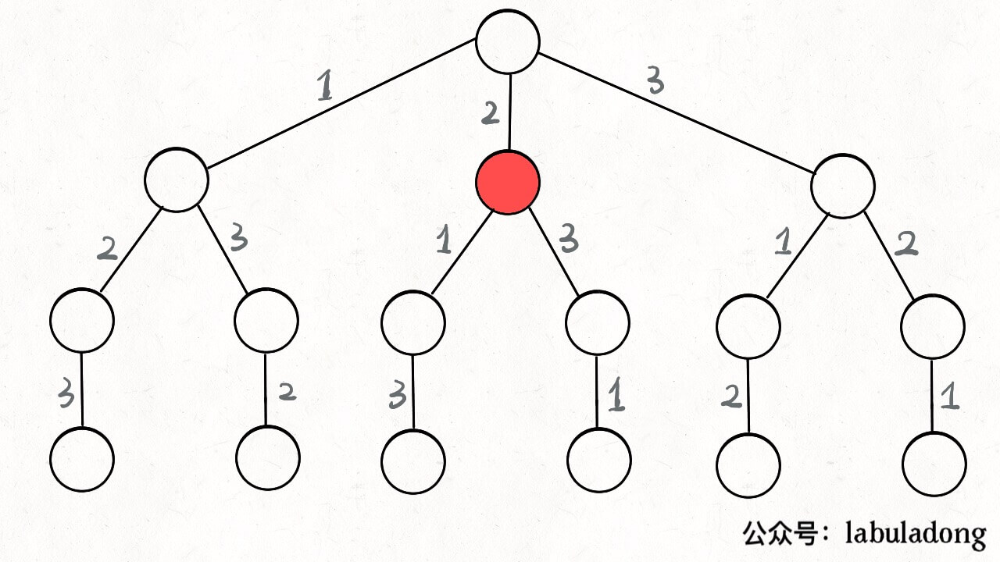
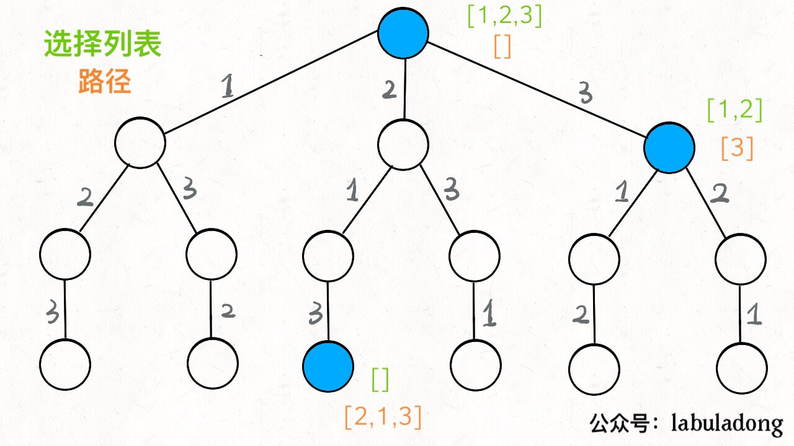
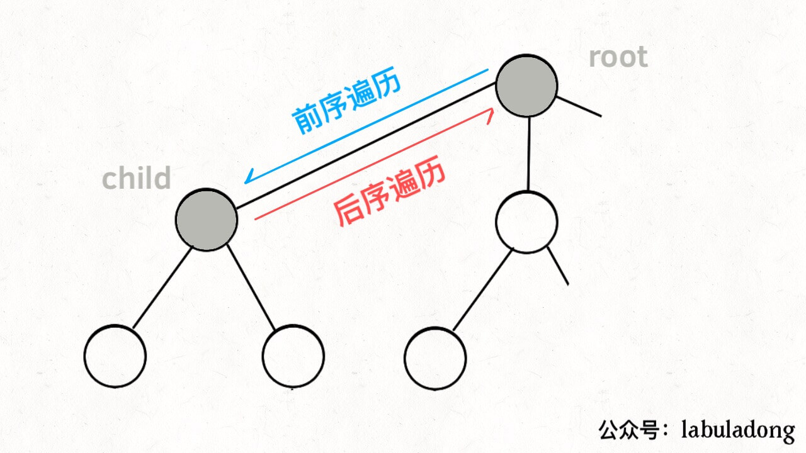
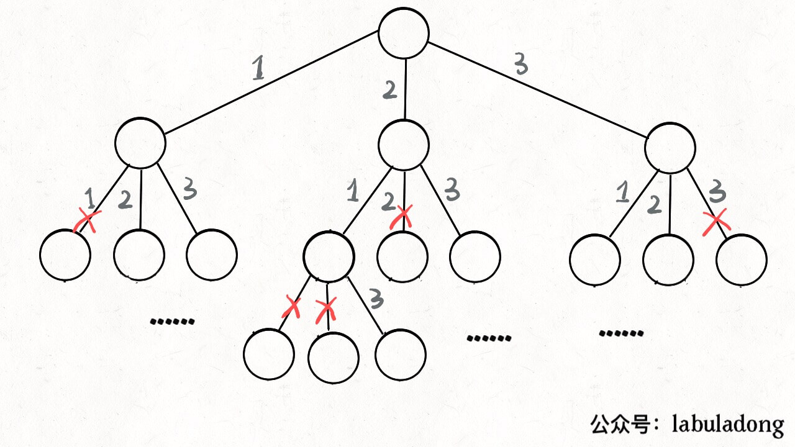

[46.全排列](https://leetcode-cn.com/problems/permutations)

[51.N皇后](https://leetcode-cn.com/problems/n-queens)

**回溯，实际上是决策树的遍历**。只需思考 3 点：

- **路径**：已做出的选择；

- **选择列表**：当前可做的选择；

- **结束条件**：到达决策树底层，无法再做选择；

```python
result = []
def backtrack(路径, 选择列表):
    if 满足结束条件:
        result.add(路径)
        return
    
    for 选择 in 选择列表:
        做选择
        backtrack(路径, 选择列表)
        撤销选择
```

**核心 ---- for 循环的递归：递归前「做选择」，递归后「撤销选择」**；

### 一、全排列问题

不包含重复数字；给定 `[1,2,3]`：先固定第一位 1，然后 2、 3；把第二位变成 3，再穷举……

- 算法的**回溯树**：从根遍历树，记录路径上的数字，获得全排列；


**每个节点都在做决策**。如红色节点：



**`[2]` 是「路径」：已做的选择；`[1,3]` 是「选择列表」，当前可做的选择；「结束条件」是遍历到树底，选择列表为空**；

- **把「路径」和「选择」列表作为决策树上每个节点的属性**：



**`backtrack` 函数: 像个指针在树上游走，同时维护每个节点的属性，走到树底的「路径」就是全排列**。

多叉树遍历框架：

```python
def traverse(TreeNode root)：
    for (child : root.children)：
        # 前序遍历位置
        traverse(child);
        # 后序遍历位置
```



**前序遍历：进入节点前执行；后序遍历：离开节点后执行**。

「路径」和「选择」是每个节点的属性，函数在树上游走：要维护节点属性，就要在两个位置（前序、后序）操作：


**递归前做选择，递归后撤销选择**：维护每个节点的属性（路径、选择列表）；

```python
res = []
def permute(nums): # 输入nums，返回全排列
    path = []   # 记录「路径」
    backtrack(nums, path)
    return res

# 路径： track
# 选择列表：nums 中不在 track 的元素
# 结束条件：nums 的元素全都在 track中
def backtrack(nums, track):
    if track.size() == nums.length: # 结束条件
        res.append(track.copy()) # 复制一份track（否则修改会影响res）
        return
    for (int i = 0; i < nums.length; i++):
        if nums[i] in track: continue # 排除不合法选择
        track.append(nums[i]) # 做选择
        backtrack(nums, track) # 进入下一层决策树
        track.pop(-1) # 撤销选择（回溯）
```

没有显式记录「选择列表」 ---- 用 `nums` 和 `track` 推导出选择列表：



算法不高效，判断nums[i] in track 是 O(N) 时间；但不管怎么优化，时间复杂度都不低于 O(N!)，因为穷举整棵决策树无法避免。**这是回溯算法的特点，不像dp存在重叠子问题**；

### 二、N 皇后问题

经典问题：一个 N×N 的棋盘，放置 N 个皇后，使它们不能互相攻击（皇后可以攻击同一行、同一列、左上左下右上右下四个方向）；

类似全排列：决策树的每层为棋盘上的每行；每个节点可做的选择：在该行的任意一列放置皇后；

套框架:

```python
res = []
def solveNQueens(n): # 输入棋盘边长 n，返回所有合法的放置(二维数组)
    vector<string> board(n, string(n, '.')) # 初始化空棋盘：'.' 表示空，'Q' 表示皇后
    backtrack(board, 0)
    return res

# 路径：board 中小于 row 的行（已放置皇后）
# 选择列表：row 行的所有列
# 结束条件：row 超过 board 的最后一行
def backtrack(vector<string>& board, int row):
    if (row == board.size()): # 结束条件
        res.append(board.copy())
        return
    n = board[row].size();
    for (int col = 0; col < n; col++):
        if (!isValid(board, row, col)) # 排除不合法选择
            continue;
        board[row][col] = 'Q' #做选择
        backtrack(board, row + 1) # 进入下一行决策
        board[row][col] = '.' #撤销选择（回溯）
```

`isValid` 函数：

```python
def isValid(vector<string>& board, int row, int col): # 是否可以在 board[row][col] 放置皇后
    n = board.size();
    for (int i = 0; i < n; i++): # 列：是否有冲突
        if (board[i][col] == 'Q'): return false
    for (int i = row - 1, j = col + 1, 
            i >= 0 && j < n; i--, j++): # 右上方：是否有冲突
        if (board[i][j] == 'Q'): return false
    for (int i = row - 1, j = col - 1;    
            i >= 0 && j >= 0; i--, j--): # 左上方：是否有冲突
        if (board[i][j] == 'Q'): return false
    return true
```

 `backtrack` 依然像决策树上游走的指针，用 `row` 和 `col` 遍历，`isValid` 剪枝（排除不符合的情况）：


虽有 `isValid` 剪枝，但最坏时间 O(N^(N+1))，且无法优化。 `N = 10` 已经很耗时了。

**有时并不想得到所有答案，只要一个答案，怎么办**？比如解数独：

```cpp
bool backtrack(vector<string>& board, int row)：// 找到一个答案就返回 true
    if (row == board.size())：// 结束条件
        res.push_back(board);
        return true;
    ...
    for (int col = 0; col < n; col++)：
        ...
        if (backtrack(board, row + 1)) // 找到一个答案，over
            return true;
    return false;
```

找到一个答案，for 循环就阻断 ---- 在 N 皇后框架上稍加修改，写一个解数独算法？

### 三、最后总结

回溯算法 == 多叉树的遍历，关键在前序遍历和后序遍历位置：

```python
    for 选择 in 选择列表:
        做选择
        backtrack(...)
        撤销选择
```

**`backtrack` 函数维护走过的「路径」和当前的「选择列表」，触发「结束条件」则记入结果集**。

**回溯算法和dp像吗？dp是「状态」「选择」「base case」，对应回溯：「路径」、「选择列表」、「结束条件」？**

某种程度上说，dp的暴力求解就是回溯。只是dp有重叠子问题，可用 dp table 或备忘录优化，将递归树大幅剪枝；而回溯问题没有重叠子问题，复杂度不可避免。

[ 51.N皇后](https://leetcode-cn.com/problems/n-queens)

用两个坐标点|(y1-y2)| == |(x1 - x2)|判定共斜线

```js
    const isValid = (row, col) => {    // 验证是否是有效的位置
        for (let i = 0; i < row; i++) { // 之前的行
            for (let j = 0; j < n; j++) { // 所有的列
                if (board[i][j] === 'Q' &&   // 发现了皇后，并且和自己同列/对角线
                    (j === col || i + j === row + col || i - j === row - col)) {
                    return false;             // 不是合法的选择
        return true;
```

