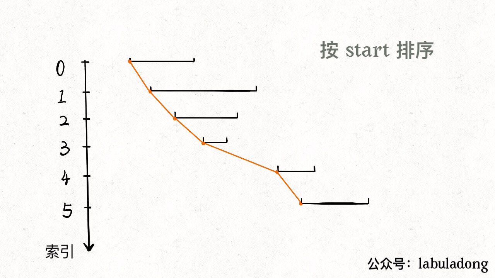
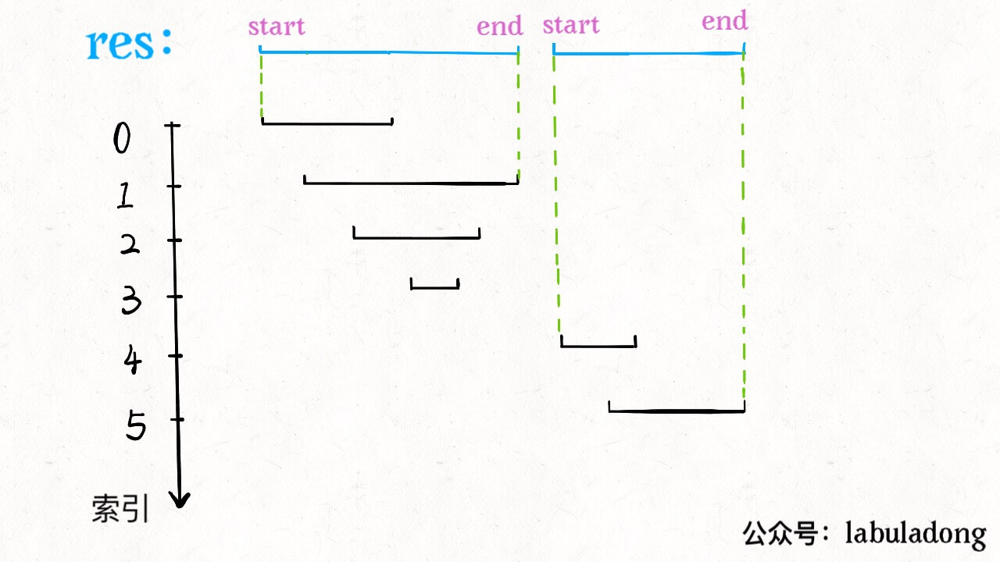
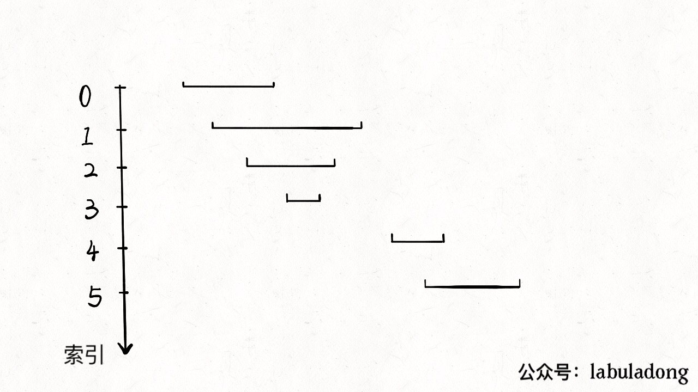

[56.合并区间](https://leetcode-cn.com/problems/merge-intervals)

思路：先排序，再观察规律。

### 一、思路

区间 `[start, end]`：对于区间合并，按 `end` 和 `start` 排序都行；本次按 `start` 排序：



**相交区间合并的结果区间 `x`，`x.start` 一定是区间中 `start` 最小的，`x.end` 一定是 `end` 最大的**



### 二、代码

```python
    if not intervals: return []
    intervals.sort(key=lambda intv: intv[0])    # 区间 start 升序排列
    res = []
    res.append(intervals[0])
    
    for i in range(1, len(intervals)):
        curr = intervals[i]
        last = res[-1]        # res 中最后一个元素
        if curr[0] <= last[1]:
            last[1] = max(last[1], curr[1])   # 找到最大 end
        else:
            res.append(curr)   # 处理下一个待合并区间
    return res
```

动画一目了然：

