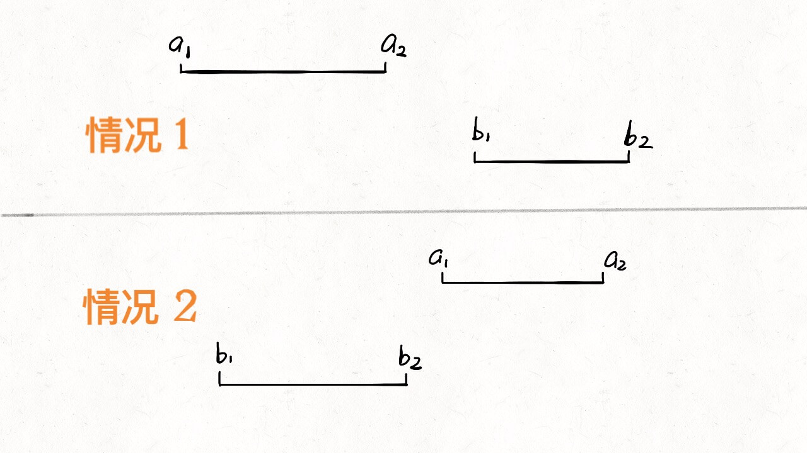
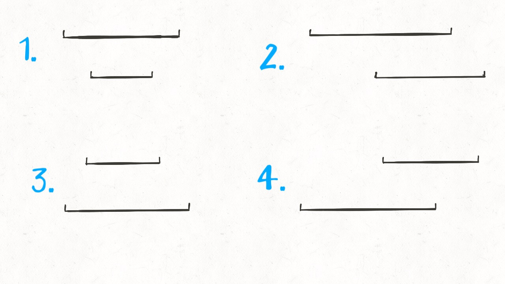
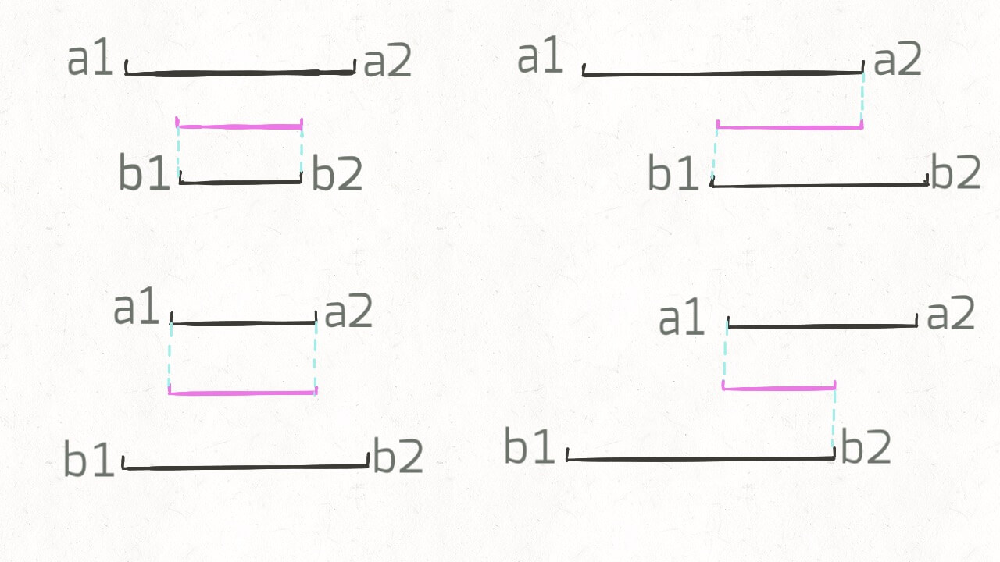
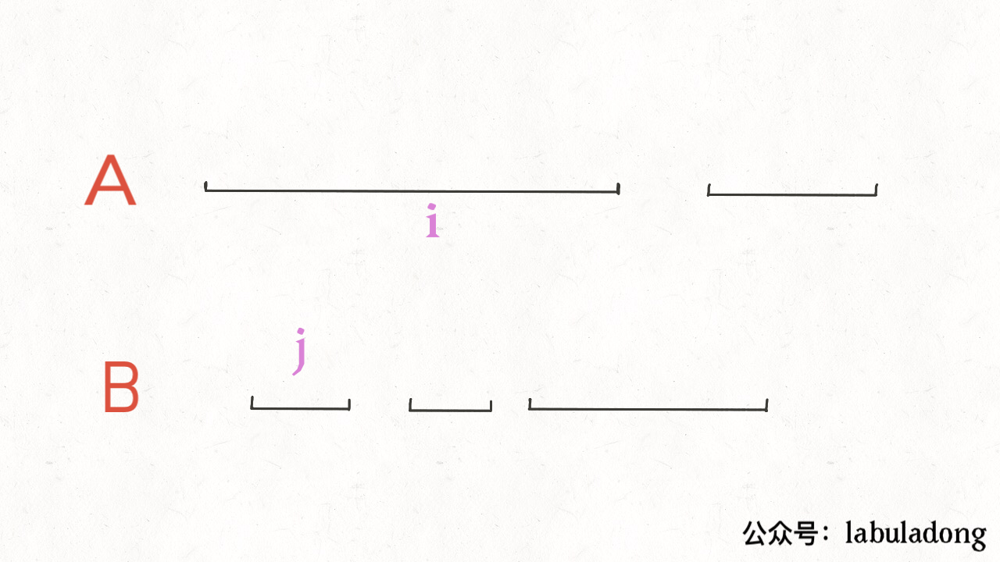

[986.区间列表的交集](https://leetcode-cn.com/problems/interval-list-intersections)

先排序（题目已经排好序），用双指针在 `A` 和 `B` 中游走，把交集找出来：

```python
def intervalIntersection(A, B):# A, B 形如 [[0,2],[5,10]...]
    i, j = 0, 0
    res = []
    while i < len(A) and j < len(B):
        # ...
        j += 1
        i += 1
    return res
```

首先，**对于两个区间**，用 `[a1,a2]` 和 `[b1,b2]` 表示两个区间，什么情况两个区间**没有交集**：



只有两种情况：

```python
if b2 < a1 or a2 < b1:
    [a1,a2] 和 [b1,b2] 无交集
```

什么情况下，两个区间存在交集？上面逻辑的否命题就是存在交集的条件：

```python
# 不等号取反，or 也要变成 and
if b2 >= a1 and a2 >= b1:
    [a1,a2] 和 [b1,b2] 存在交集
```

存在交集的情况有哪些？穷举：



就这四种情况而已。这几种情况，交集是否有共同点？



我们惊奇地发现，交集区间是有规律的！如果交集是 `[c1,c2]`，那么 `c1=max(a1,b1)`，`c2=min(a2,b2)`！这一点就是寻找交集的核心：

```python
while i < len(A) and j < len(B):
    a1, a2 = A[i][0], A[i][1]
    b1, b2 = B[j][0], B[j][1]
    if b2 >= a1 and a2 >= b1:
        res.append([max(a1, b1), min(a2, b2)])
    # ...
```

最后，指针 `i` 和 `j` 什么时候应该前进？



结合动画，是否前进只取决于 `a2` 和 `b2` 的大小关系：

```python
while i < len(A) and j < len(B):
    # ...
    if b2 < a2:
        j += 1
    else:
        i += 1
```

### 代码

```python
# A, B 形如 [[0,2],[5,10]...# A, B 形如 [[0,2],[5,10]...]
def intervalIntersection(A, B):
    i, j = 0, 0 # 双指针
    res = []
    while i < len(A) and j < len(B):
        a1, a2 = A[i][0], A[i][1]
        b1, b2 = B[j][0], B[j][1]
        # 两个区间存在交集
        if b2 >= a1 and a2 >= b1:
            # 计算出交集，加入 res
            res.append([max(a1, b1), min(a2, b2)])
        # 指针前进
        if b2 < a2: j += 1
        else:       i += 1
    return res
```

总结：区间类问题情况很多，但实际上通过观察各种不同情况之间的共性可以发现规律；

另外，区间问题没啥奇技淫巧，操作也朴实无华，但应用广泛。
