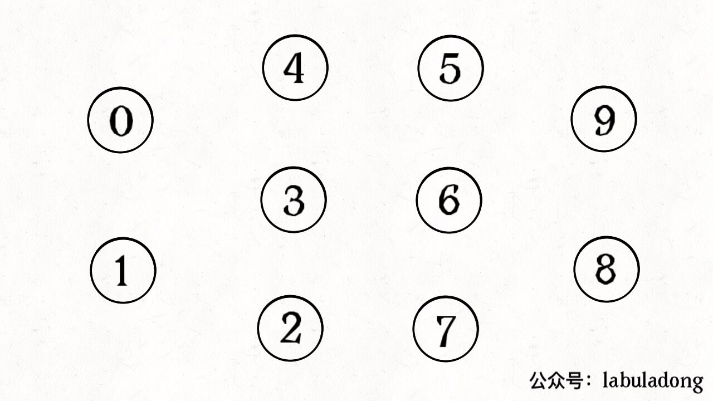
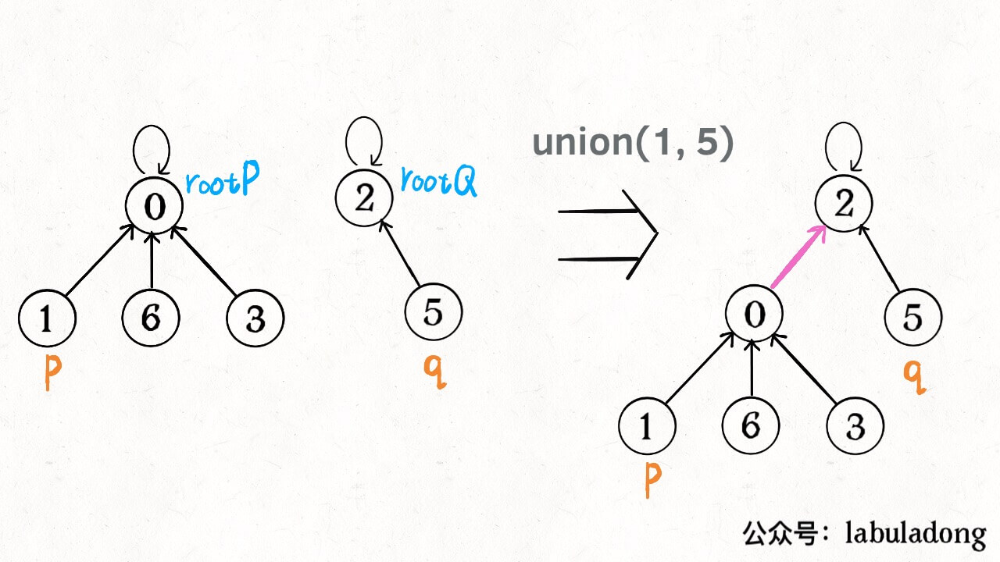
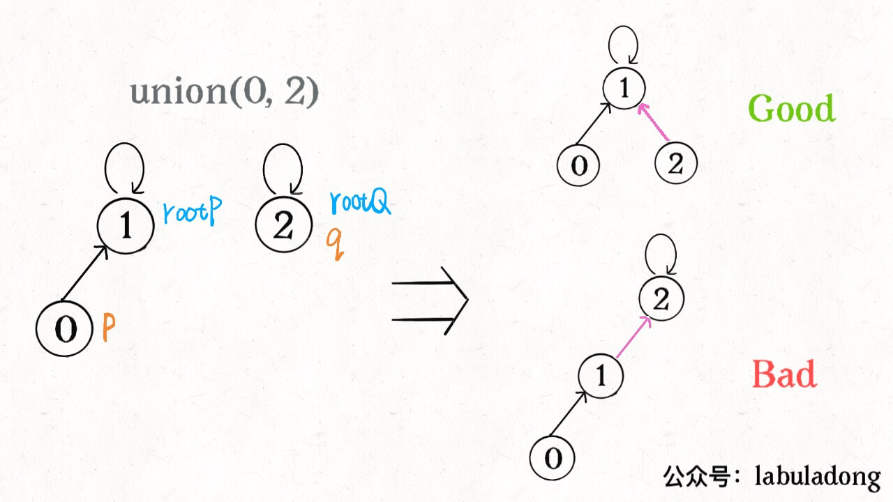

Union-Find 算法(并查集算法)，主要解决图「动态连通性」问题。名

 Union-Find算是「启蒙算法」，因为《算法4》的开头就介绍，好精妙！LeetCode并查集算法题都非常有意思，《算法4》的解法竟然还可以优化时间复杂度降到 O(1)；

### 一、问题介绍

动态连通性可抽象给一幅图连线。比如：图有 10 个节点，互不相连，用 0~9 标记：



Union-Find 算法主要实现两个 API：

```java
class UF {
    public void union(int p, int q); // 将 p 和 q 连接
    public boolean connected(int p, int q); // 判断 p 和 q 是否连通
    public int count(); // 图中有多少个连通分量
}
```

「连通」是一种等价关系，三个性质：

1、自反性：节点`p`和自身连通；

2、对称性：。。

3、传递性：。。

比如：图中0～9 任意两个**不同**的点都不连通，调用`connected`返回 false，连通分量为 10 个。

调用`union(0, 1)`，则 0 和 1 被连通，连通分量降为 9 个。

再调用`union(1, 2)`，则 0,1,2 都被连通，调用`connected(0, 2)`返回 true，连通分量变为 8 个。


「等价关系」非常实用，比如编译器社交网络中的朋友圈计算；

Union-Find 算法关键在于`union`和`connected`效率

### 二、思路

注：刚才把「模型」和具体的「数据结构」分开说，可用森林（若干棵树）表示图的动态连通性，用数组来具体实现；

设定：树的每个节点有指针指向父节点，根节点则指向自己。比如开始时没有相互连通（都指向自己）：


```java
class UF {
    private int count;    // 记录连通分量
    private int[] parent;     // x 的父节点 parent[x]

    public UF(int n) {    // 构造函数，n：图的节点数
        this.count = n; // 开始时，互不连通
        parent = new int[n]; // 父节点指向自己
        for (int i = 0; i < n; i++)
            parent[i] = i;
    }
}
```

**如果两个节点被连通，则其中（任意）一个节点的根节点接到另一个的根节点**：



```java
public void union(int p, int q) {
    int rootP = find(p);
    int rootQ = find(q);
    if (rootP == rootQ)
        return;
    parent[rootP] = rootQ;    // 将两棵树合并为一棵，也可parent[rootQ] = rootP
    count--; // 两个分量合二为一（连通分量减一）
}

private int find(int x) { //返回节点 x 的根节点
    while (parent[x] != x) // 根节点的 parent[x] == x
        x = parent[x];
    return x;
}

public int count() { 
    return count;
}
```

**如果节点`p`和`q`连通，则有相同的根节点**：


```java
public boolean connected(int p, int q) {
    int rootP = find(p);
    int rootQ = find(q);
    return rootP == rootQ;
}
```

Union-Find 算法就基本完成了。是不是很神奇？竟然用数组来模拟出一个森林，巧妙的解决复杂的问题！

算法的复杂度是多少？主要 API`connected`和`union`中的复杂度都是`find`函数造成的，所以复杂度和`find`一样。

`find`时间复杂度 == 树的高度。习惯性认为树高`logN`，但这不一定。`logN`高度只存在于平衡二叉树，一般的树可能不平衡，「树」退化成「链表」的最坏情况高度`N`。


所以上面解法的`find`,`union`,`connected`时间复杂度都是 O(N)。很不理想, 诸如社交网络数据规模巨大的问题，对`union`和`connected`的调用非常频繁，线性时间不可忍受;

**问题的关键: 如何避免树的不平衡呢**？

### 三、平衡性优化

哪种情况下不平衡，关键在于`union`：简单粗暴的把`p`的根接到`q`的根，可能出现「头重脚轻」的不平衡：



**小树接到大树下面，避免头重脚轻，更平衡**。解决方法: 额外用`size`数组，记录每棵树的节点数，称「重量」：

```java
class UF {
    private int count;
    private int[] parent;
    private int[] size;    // 记录树的“重量”

    public UF(int n) {
        this.count = n;
        parent = new int[n];
        size = new int[n];
        for (int i = 0; i < n; i++) {         // 最初每棵树只有一个节点
            parent[i] = i;
            size[i] = 1;
        }
    }
}
```

修改`union`方法：

```java
public void union(int p, int q) {
    int rootP = find(p);
    int rootQ = find(q);
    if (rootP == rootQ)
        return;
    // 小树接到大树下面
    if (size[rootP] > size[rootQ]) {
        parent[rootQ] = rootP;
        size[rootP] += size[rootQ];
    } else {
        parent[rootP] = rootQ;
        size[rootQ] += size[rootP];
    }
    count--;
}
```

树的生长相对平衡，树的高度大致在`logN`数量级，极大提升效率; `find`,`union`,`connected`的时间复杂度 O(logN);

### 四、路径压缩

这步优化特别简单，非常巧妙! 能不能进一步压缩每棵树的高度，使树高为常数？


`find`以 O(1) 的时间找到根节点，相应`connected`和`union`复杂度降为 O(1)。

只需在`find`中加一行：

```java
private int find(int x) {
    while (parent[x] != x) {
        // 进行路径压缩
        parent[x] = parent[parent[x]];
        x = parent[x];
    }
    return x;
}
```

有点匪夷所思，看个 GIF 就明白（清晰起见，这棵树比较极端）：


用`find`函数每次向树根遍历的同时，顺手缩短树高，最终所有树高都不会超过 3（`union`时可能达到 3）;

### 五、总结

```java
class UF {
    private int count;    // 连通分量个数
    private int[] parent;    // 存储一棵树
    private int[] size;    // 记录树的“重量”


    public UF(int n) {
        this.count = n;
        parent = new int[n];
        size = new int[n];
        for (int i = 0; i < n; i++) {
            parent[i] = i;
            size[i] = 1;
        }
    }
    
    public void union(int p, int q) {
        int rootP = find(p);
        int rootQ = find(q);
        if (rootP == rootQ)
            return;
        if (size[rootP] > size[rootQ]) {        // 小树接到大树下面，较平衡
            parent[rootQ] = rootP;
            size[rootP] += size[rootQ];
        } else {
            parent[rootP] = rootQ;
            size[rootQ] += size[rootP];
        }
        count--;
    }

    public boolean connected(int p, int q) {
        int rootP = find(p);
        int rootQ = find(q);
        return rootP == rootQ;
    }

    private int find(int x) {
        while (parent[x] != x) {
            parent[x] = parent[parent[x]];            // 路径压缩
            x = parent[x];
        }
        return x;
    }

    public int count() {
        return count;
    }
}
```

复杂度分析：初始化数据结构要 O(N) 的时间和空间复杂度；union`、`connected`、count`均为 O(1)。

