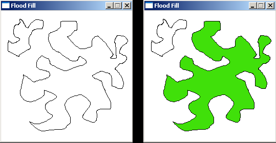
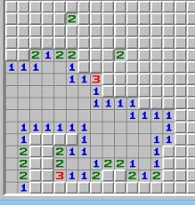
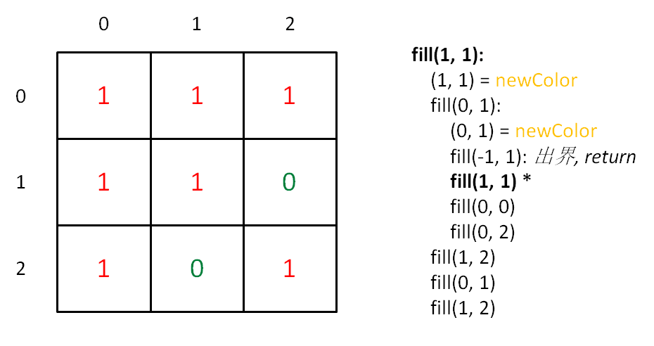
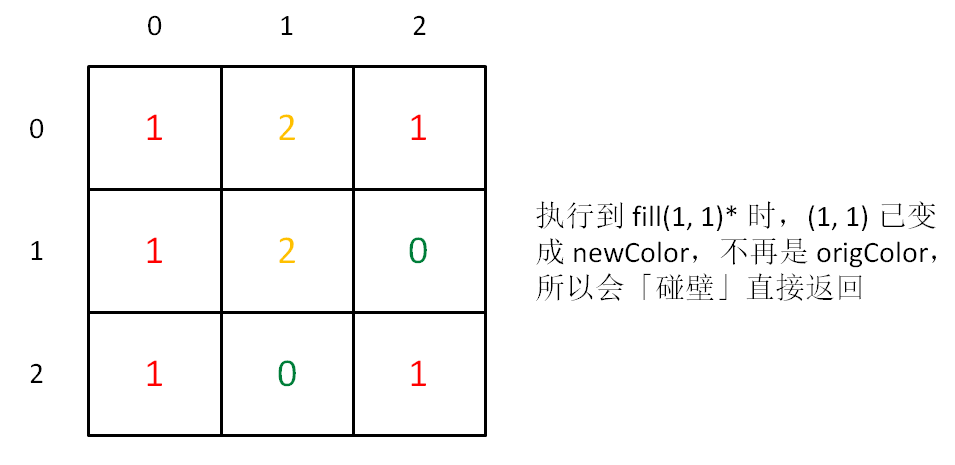
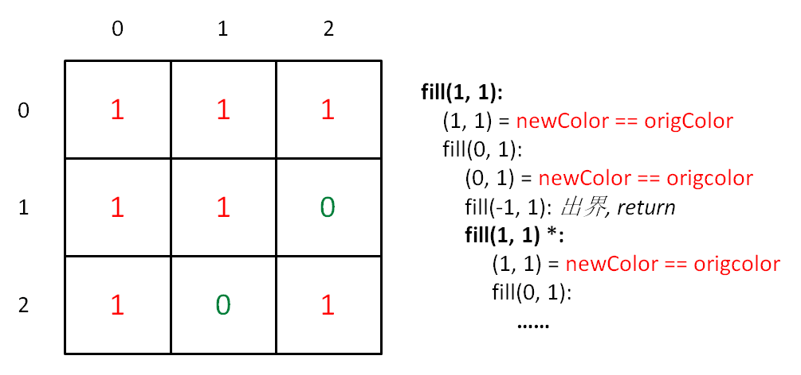
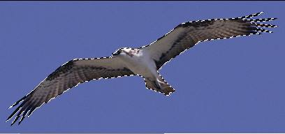
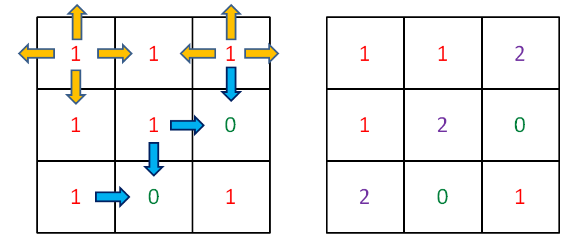
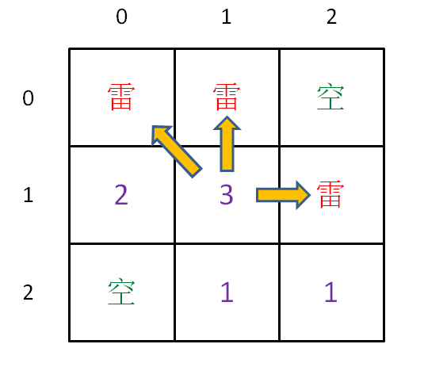

啥是 FloodFill 算法？直接的应用是「颜色填充」，就是 Windows 绘画本中小油漆桶，把圈起来的区域全部染色；



其他地方的应用：扫雷游戏，点一个方格展开一片区域，展开过程就是 FloodFill 算法实现。



抽象问题，提取共同点：

### 一、构建框架

以上都可抽象成二维矩阵（图片就是像素点矩阵），从某个点向四周扩展，直到终止；

矩阵，可以抽象为「图」，即图的遍历；类似一个 N 叉树遍历，代码框架：

```java
void fill(int x, int y) {// (x, y) 为坐标位置
    fill(x - 1, y); // 上
    fill(x + 1, y); // 下
    fill(x, y - 1); // 左
    fill(x, y + 1); // 右
}
```

框架可解决所有二维矩阵的遍历，即深度优先搜索（Depth First Search，简称 DFS），也可叫四叉树遍历；

[733.图像渲染](https://leetcode-cn.com/problems/flood-fill)

```java
int[][] floodFill(int[][] image, int sr, int sc, int newColor) 
    int origColor = image[sr][sc];
    fill(image, sr, sc, origColor, newColor);
    return image;

void fill(int[][] image, int x, int y,int origColor, int newColor) 
    if (!inArea(image, x, y)) return;    // 出界 --- 超出边界索引
    if (image[x][y] != origColor) return;    // 碰壁：遇到其他颜色，超出 origColor 区域
    image[x][y] = newColor;
    fill(image, x, y + 1, origColor, newColor);
    fill(image, x, y - 1, origColor, newColor);
    fill(image, x - 1, y, origColor, newColor);
    fill(image, x + 1, y, origColor, newColor);

boolean inArea(int[][] image, int x, int y) 
    return x >= 0 && x < image.length
        && y >= 0 && y < image[0].length;
```

理解这段代码，要给你鼓掌，因为对「框架思维」的掌控已炉火纯青，此算法已 cover 了 99% 的情况;

仅有一个细节问题: 当 origColor 和 newColor 相同时，陷入无限递归;

### 二、研究细节

为什么会无限递归？很好理解，因为每个坐标都搜索上下左右，那么一个坐标必然会被上下左右的坐标搜索。**被重复搜索时，必须保证递归函数能够能正确地退出，否则就会陷入死循环。**

为什么 newColor 和 origColor 不同时可以正常退出呢？算法流程画个图理解：



可以看到，fill(1, 1) 被重复搜索了，我们用 fill(1, 1)* 表示这次重复搜索。fill(1, 1)* 执行时，(1, 1) 已经被换成了 newColor，所以 fill(1, 1)* 会在这个 if 语句被怼回去，正确退出了。

```java
// 碰壁：遇到其他颜色，超出 origColor 区域
if (image[x][y] != origColor) return;
```


但是，如果 origColor 和 newColor 一样， if 语句就无法让 fill(1, 1)* 正确退出，而是开启了重复递归，形成死循环。



### 三、处理细节

用一个和 image 一样大小的二维 bool 数组记录走过的地方；

```java
 // 出界：超出边界索引
if (!inArea(image, x, y)) return;
// 碰壁：遇到其他颜色，超出 origColor 区域
if (image[x][y] != origColor) return;
// 不走回头路
if (visited[x][y]) return;
visited[x][y] = true;
image[x][y] = newColor;
```

这也是处理「图」的常用手段。但此题不用开数组，最好是用回溯算法；

回溯算法框架：

```java
void fill(int[][] image, int x, int y,
        int origColor, int newColor) {
    // 出界：超出数组边界
    if (!inArea(image, x, y)) return;
    // 碰壁：遇到其他颜色，超出 origColor 区域
    if (image[x][y] != origColor) return;
    // 已探索过的 origColor 区域
    if (image[x][y] == -1) return;
    
    // choose：打标记，以免重复
    image[x][y] = -1;
    fill(image, x, y + 1, origColor, newColor);
    fill(image, x, y - 1, origColor, newColor);
    fill(image, x - 1, y, origColor, newColor);
    fill(image, x + 1, y, origColor, newColor);
    // unchoose：将标记替换为 newColor
    image[x][y] = newColor;
}
```

这种解决方法最常用，相当于用特殊值 -1 代替 visited 数组，不走回头路。为什么是 -1，因为题目中颜色取值在 0 - 65535 ，所以 -1 足够特殊；


### 四、拓展延伸：自动魔棒工具和扫雷

大部分图片编辑软件一定有「自动魔棒工具」这个功能：点击一个地方，帮你自动选中相近颜色的部分。如下图，我想选中老鹰，可以先用自动魔棒选中蓝天背景，然后反向选择，就选中了老鹰。我们来分析一下自动魔棒工具的原理。



算法基于 FloodFill 算法，但有两点不同：首先，背景是蓝色，但不能保证都是相同的蓝色，毕竟是像素点，可能存在肉眼无法分辨的深浅差异，希望能忽略这种细微差异。第二，FloodFill 算法是「区域填充」，这里更像「边界填充」。

第一个问题很好解决：设置阈值 threshold，在阈值范围内波动的颜色都视为 origColor：

```java
if (Math.abs(image[x][y] - origColor) > threshold)
    return;
```

第二个问题：不要把区域内所有 origColor 的都染色，而是只给区域最外圈染色。如何才能仅给外围染色，即如何才能找到最外围坐标，最外围坐标有什么特点？



可以发现，区域边界上的坐标，至少有一个方向不是 origColor，而区域内部的坐标，四面都是 origColor，这就是解决问题的关键。保持框架不变，使用 visited 数组记录已搜索坐标，主要代码如下：

```java
int fill(int[][] image, int x, int y,
    int origColor, int newColor) {
    // 出界：超出数组边界
    if (!inArea(image, x, y)) return 0;
    // 已探索过的 origColor 区域
    if (visited[x][y]) return 1;
    // 碰壁：遇到其他颜色，超出 origColor 区域
    if (image[x][y] != origColor) return 0;

    visited[x][y] = true;
    
    int surround = 
          fill(image, x - 1, y, origColor, newColor)
        + fill(image, x + 1, y, origColor, newColor)
        + fill(image, x, y - 1, origColor, newColor)
        + fill(image, x, y + 1, origColor, newColor);
    
    if (surround < 4)
        image[x][y] = newColor;
    
    return 1;
}
```

这样，区域内部的坐标探索四周后得到的 surround 是 4，而边界的坐标会遇到其他颜色，或超出边界索引，surround 会小于 4。如果你对这句话不理解，我们把逻辑框架抽象出来看：

```java
int fill(int[][] image, int x, int y,
    int origColor, int newColor) {
    // 出界：超出数组边界
    if (!inArea(image, x, y)) return 0;
    // 已探索过的 origColor 区域
    if (visited[x][y]) return 1;
    // 碰壁：遇到其他颜色，超出 origColor 区域
    if (image[x][y] != origColor) return 0;
    // 未探索且属于 origColor 区域
    if (image[x][y] == origColor) {
        // ...
        return 1;
    }
}
```

这 4 个 if 判断涵盖了 (x, y) 的所有可能情况，surround 的值由四个递归函数相加得到，而每个递归函数的返回值就这四种情况的一种。借助这个逻辑框架，你一定能理解上面那句话了。

这样就实现了仅对 origColor 区域边界坐标染色的目的，等同于完成了魔棒工具选定区域边界的功能。

这个算法有两个细节问题，一是必须借助 visited 来记录已探索的坐标，而无法使用回溯算法；二是开头几个 if 顺序不可打乱。读者可以思考一下原因。

同理，思考扫雷游戏，应用 FloodFill 算法展开空白区域的同时，也需要计算并显示边界上雷的个数，如何实现的？其实也是相同的思路，遇到雷就返回 true，这样 surround 变量存储的就是雷的个数。当然，扫雷的 FloodFill 算法不能只检查上下左右，还得加上四个斜向。



[733.图像渲染](https://leetcode-cn.com/problems/flood-fill)

**BFS**
从起始像素向上下左右扩散，只要相邻的点存在并和起始点颜色相同，就染成新的颜色，并继续扩散。

借助队列遍历节点，考察出列的节点，带出满足条件的节点入列。已经染成新色的节点不会入列，避免重复访问节点。

时间复杂度：O(n)。空间复杂度：O(n)

```js
const floodFill = (image, sr, sc, newColor) => {
  const m = image.length;
  const n = image[0].length;
  const oldColor = image[sr][sc];
  if (oldColor == newColor) return image;

  const fill = (i, j) => {
    if (i < 0 || i >= m || j < 0 || j >= n || image[i][j] != oldColor) {
      return;
    }
    image[i][j] = newColor; 
    fill(i - 1, j);
    fill(i + 1, j);
    fill(i, j - 1);
    fill(i, j + 1);
  };

  fill(sr, sc);
  return image;
};
```

**DFS**

```js

let floodFill = function (image, sr, sc, newColor) {
    let origColor = image[sr][sc];
    fill(image, sr, sc, origColor, newColor);
    return image;
}

let fill = function (image, x, y, origColor, newColor) {
    // 出界：超出边界索引
    if (!inArea(image, x, y)) return;

    // 碰壁：遇到其他颜色，超出 origColor 区域
    if (image[x][y] !== origColor) return;

    // 已探索过的 origColor 区域
    if (image[x][y] === -1) return;

    // 打标记 避免重复
    image[x][y] = -1;

    fill(image, x, y + 1, origColor, newColor);
    fill(image, x, y - 1, origColor, newColor);
    fill(image, x - 1, y, origColor, newColor);
    fill(image, x + 1, y, origColor, newColor);

    // un choose：将标记替换为 newColor
    image[x][y] = newColor;
}

let inArea = function (image, x, y) {
    return x >= 0 && x < image.length
        && y >= 0 && y < image[0].length;
}
```

