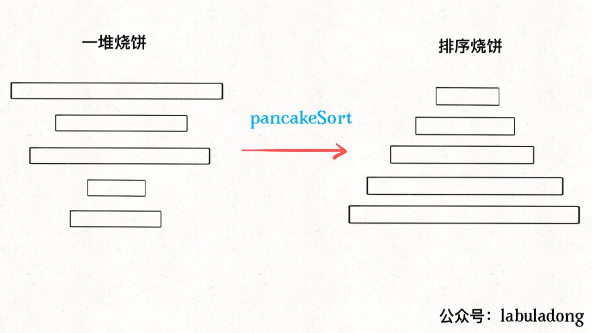
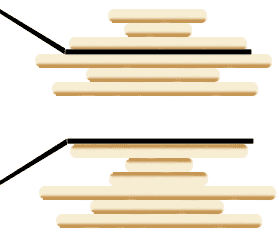
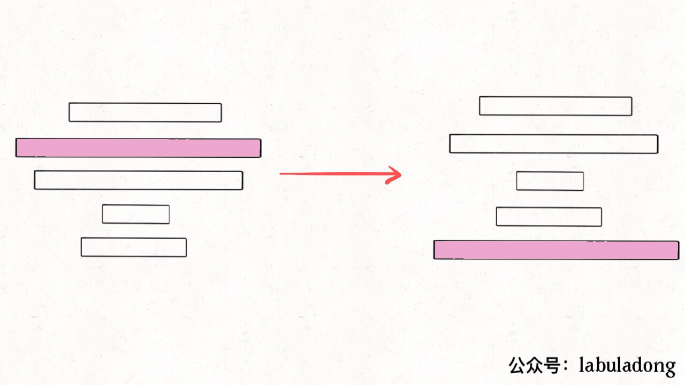
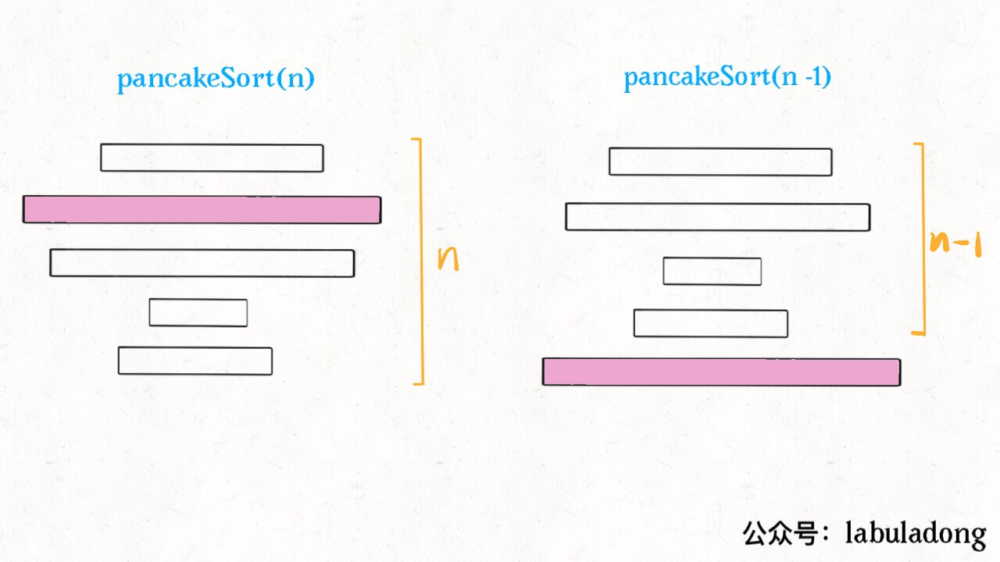

[969.煎饼排序](https://leetcode-cn.com/problems/pancake-sorting)：很有意思的实际问题：假设盘子上有 `n` 块**面积大小不一**的烧饼，如何进行若干次翻转，让烧饼的大小有序？



限制：每次只能将最上面的若干块饼翻转：



问题：**如何得到一个翻转序列，使烧饼有序**？

首先，把问题抽象，用数组来表示烧饼堆；类似递归反转链表，也需要**递归思想**。

### 一、思路分析

```java
// cakes 是烧饼，函数会将前 n 个烧饼排序
void sort(int[] cakes, int n);
```

如果已找到前 `n` 个烧饼中最大的那个，设法将饼子翻转到最底下：



原问题的规模就可以减小，递归调用 `pancakeSort(A, n-1)` ：



总结 ---- 递归：

1、找到 `n` 个饼中最大的那个。

2、把这个最大的饼移到最底下。

3、递归调用 `pancakeSort(A, n - 1)`。

base case：`n == 1` 时，1 个饼不需要排序 ；

问题：**如何将某块烧饼翻到最后呢**？很简单，比如第 3 块饼是最大的，这样操作：

1、将前 3 块饼翻转一下，最大的饼就到最上面。

2、将前 `n` 块饼全部翻转；

题目要求写出具体的反转操作序列，只要在每次翻转烧饼时记录下来。    

### 二、代码实现

注：数组索引从 0 开始，要返回的结果从 1 开始；

```python
        def psort(cakes, n):
            if 1 == n: return # base case
            max_cake_index = cakes[:n].index(n) # 最大饼
            if max_cake_index != n - 1: # 如果最后一个饼就是最大的, 就不需要翻转, 直接递归
                if max_cake_index != 0: # 第一次翻转, 将最大饼翻到最上面
                    cakes[:max_cake_index + 1] = cakes[:max_cake_index + 1][::-1]
                    # 也可: arr[0 : maxIdx + 1] = list(reversed(arr[0 : maxIdx + 1]))
                    res.append(max_cake_index + 1)
                cakes[:n] = cakes[:n][::-1] # 第二次翻转：最大饼翻到最下面
                # 也可：arr[0 : n] = list(reversed(arr[0 : n]))
                res.append(n)
            psort(cakes, n - 1) # 递归
        res = [] # 记录操作序列
        psort(arr, len(arr))
        return res
```

时间复杂度O(n^2)：因为递归调用的次数是 `n`，每次递归都要一次 for 循环；