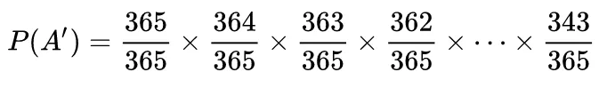
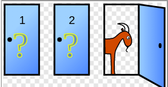
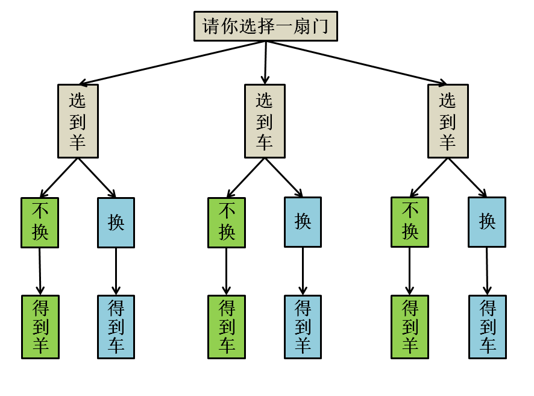

**洗牌算法**讲到验证概率的蒙特卡罗方法，今天聊点轻松的；

计算概率的两个简单原则：

- 一定要有参照系，即「样本空间」：随机事件可能的所有结果。 A 发生的概率 = A 包含的样本点 / 样本空间的总数。

- 条件概率 ---- 概率是连续的整体，不可以把连续的概率分割开；

简单却具有迷惑性的问题：男孩女孩问题、生日悖论、三门问题。

### 一、男孩女孩问题

问：有个家庭有俩娃，已知其中有一个男孩，请问另一个也是男孩的概率是多少？

答：1/2 ，因为要么男，要么女，而且概率相等。但实际上是 1/3；

为什么？因为没有计算样本空间，导致原则一错误。有两个孩子，则样本空间为 4（四种情况：兄弟、兄妹、姐妹、姐弟）。已知有一个男孩，则排除姐妹，样本空间变成 3。只有兄弟符合条件，所以概率为 1/3；

为什么样本空间会算错？因为忽略了条件概率，即混淆了下面两个问题：

- 有一个孩子，这个孩子是男孩的概率是多少？

- 有两个孩子，其中一个是男孩，另一个孩子是男孩的概率是多少？

根据原则二，不能把两个问题混淆。第二个问题用条件概率：已知一个是男孩的条件下，另一个也是男孩的概率。运用条件概率的公式也很好算；

问题最具迷惑性的就是条件概率的忽视：为了不被迷惑，最简单的办法就是穷举所有可能结果；

我见过一个质疑：如果这两个孩子是双胞胎，不存在年龄上的差异怎么办？答：不满足独立性、不要用双胞胎抬杠了。

### 二、生日悖论

问题：一个屋子里需有多少人，才能使存在至少两个人生日是同一天的概率达到 50%？

答： 23 个人。结论看起来不可思议，所以称悖论。直觉上， 50% 的概率得有 183 个人，因为一年有 365 天？

两个思维误区：

**1.「存在」这个词的含义。**

生日悖论计算对象是一个整体，包含了所有人的排列组合，概率之和会大得多。

**2. 误认为概率是线性变化的。**

误区：如果 23 个人出现相同生日的概率达到 50%，意味着 46 个人就能达到 100%？

概率不是简单叠加，而要一个连续的过程，所以结论并没有不合常理。

为什么只要 23 个人？先计算 23 个人生日不重复的概率。只有 1 个人的时候，生日唯一的概率是 `365/365`，2 个人时，生日唯一的概率是 `365/365 × 364/365`，以此类推 23 人的生日都唯一的概率：

大约是 0.493，所以存在相同生日的概率就是 0.507，差不多就是 50% 了。实际上，当人数达到 70 时，概率就上升到了 99.9%，基本可以认为是 100% 了。所以从概率上说，几十人的小团体中存在生日相同的人真没啥稀奇；

### 三、三门问题

这个游戏很经典：三扇门，其中两扇后面是山羊，一扇后面是跑车。参与者随便选一扇，但是主持人会帮参与者：先不急着打开这扇门，而由主持人打开剩下两扇门之一，展示其中的山羊（主持人知道每扇门后面是什么），给参与者一次换门的机会，此时换还是不换？

假设你选择了门 1，然后主持人打开 3 告诉。现在，你是坚持选择 1，还是换2？

答：换门；换门抽到跑车的概率是 2/3，不换是 1/3。又是反直觉，感觉换不换都一样，概率不都是 1/2 吗？

类似男孩女孩问题，穷举所有可能结果：

容易看到：换门中奖率是 2/3，不换是 1/3。

更简单的方法：主持人开门实际上在「浓缩」概率。一开始概率当然是 1/3，剩下两个门的概率当然是 2/3。但主持人排除了一个含有山羊的门，相当于把 2/3 的概率浓缩到了剩下一扇门。
