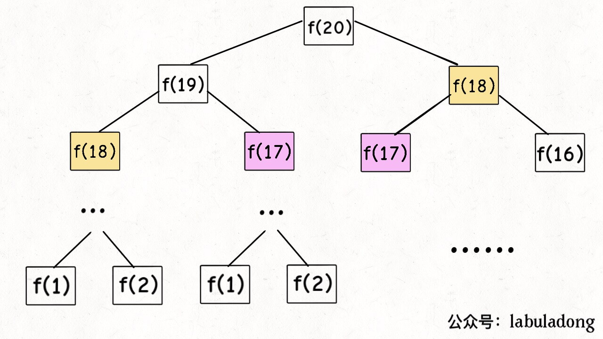
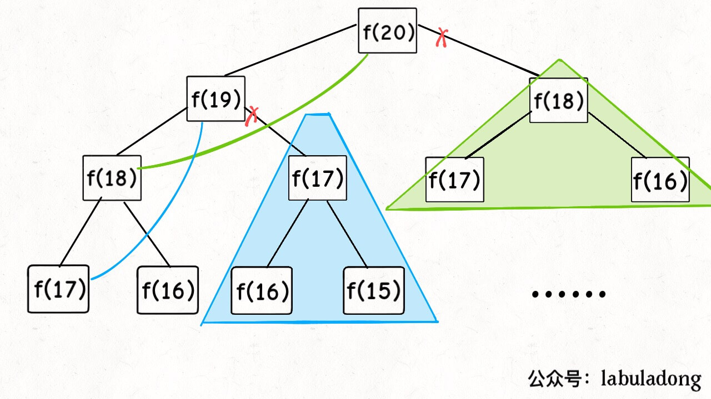
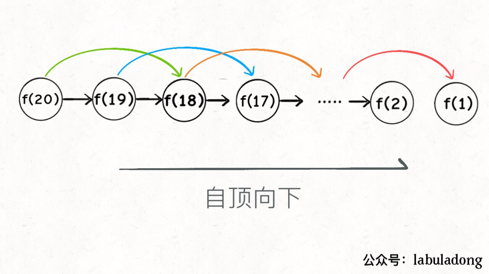
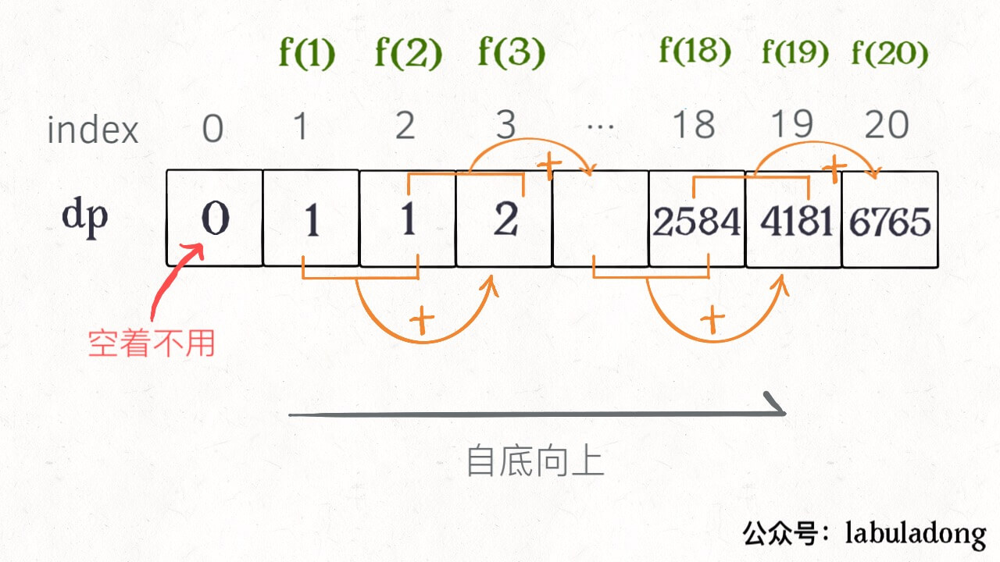
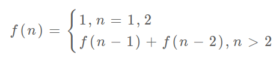
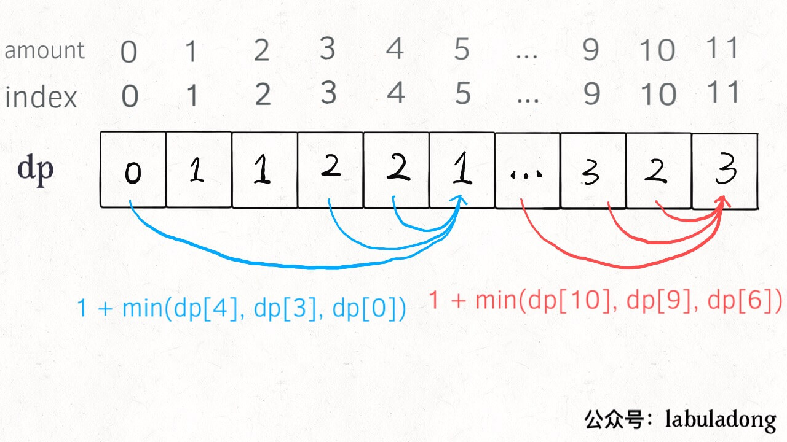

dp过程：**暴力递归 -> 带备忘录的递归 -> 迭代的dp**

思考流程：**找到状态和选择 -> 明确 dp 数组/函数的定义 -> 状态转移方程**；

[509.斐波那契数](https://leetcode-cn.com/problems/fibonacci-number)

[322.零钱兑换](https://leetcode-cn.com/problems/coin-change)

**dp的核心是穷举**：**存在「重叠子问题」**，暴力穷举效率低，用「备忘录」或「DP table」剪枝；

**重叠子问题、最优子结构、状态转移方程**是dp三要素；

**明确 base case -> dp数组的定义：状态、选择 -> 状态转移方程**。

```python
dp[0][0] = base # 初始化：base case
for 状态1 in 状态1的所有取值：# 状态转移
    for 状态2 in 状态2的所有取值：
    	dp[状态1][状态2] = 求最值(选择1，选择2)
```

### 一、斐波那契数列

**简单的例子，把精力集中在算法的思想**。

**1、暴力递归**

```python
int fib(int N)：
    if (N == 1 || N == 2)：return 1 # base case
    return fib(N - 1) + fib(N - 2)
```



递归树：对分析递归算法的复杂度有巨大帮助。

**递归的时间复杂度：子问题个数 * 解决一个子问题的时间；**

**2、带备忘录的递归解法**

子问题先查「备忘录」：数组 or 哈希表（字典）;

```python
memo = {}  # 备忘录
def helper(memo, n):
    if (n == 1 || n == 2) return 1    # base case 
    if n in memo: return memo[n];    # 先查备忘录
    memo[n] = helper(memo, n - 1) + helper(memo, n - 2)
    return memo[n]
return helper(memo, N)   # 带备忘录的递归 
```

递归树：



「备忘录」把冗余的递归树「剪枝」，减少了子问题。



总时间 O(n)：子问题 `f(1)`, `f(2)` ... `f(20)`个数为 O(n)；解决一个子问题的时间 O(1)。

递归是「自顶向下」，dp是「自底向上」。

- 「自顶向下」：递归树从上向下延伸，从原问题向下分解，直到  base case，再逐层返回；

- 「自底向上」：从 base case 开始，直到 `f(20)`；用循环/迭代完成；

**3、dp 数组的迭代法**

把「备忘录」独立成 DP table ，「自底向上」推算

```cpp
    vector<int> dp(N + 1, 0);
    dp[1] = dp[2] = 1;    // base case
    for (int i = 3; i <= N; i++)
        dp[i] = dp[i - 1] + dp[i - 2]
    return dp[N]
```



实际上，带备忘录的递归中：「备忘录」完成后就是 DP table；

「**状态转移方程**」 ---- **问题的数学形式**：



空间优化：根据状态转移方程，**当前状态只和前的两个状态有关， DP table 只存储两个状态**：

```python
    prev = 1, curr = 1; # base case
    for (int i = 3; i <= n; i++)：
        int sum = prev + curr;
        prev = curr;
        curr = sum;
    return curr
```

dp另一个重要特性「最优子结构」没涉及？斐波那契数列严格来说不算dp，因为不求最值；

### 二、凑零钱问题

有 `k` 种硬币面值为 `c1, c2 ... ck`，每种硬币数量无限，**最少**几枚硬币凑出 `amount`：

```java
int coinChange(int[] coins, int amount); // coins 硬币面值，amount 目标金额
```

求 `amount = 11` 最少硬币数，已知amount = 10的解（子问题），只需把子问题的答案加一（再选一枚面值为 1 的硬币）；

**状态转移方程**

1、**确定 base case**：目标金额 `amount` 为 0 时返回 0。

2、**「状态」：原问题和子问题的变量**。只有目标金额 amount 会靠近 base case ；

3、**「选择」：导致「状态」变化的行为**。每选择一枚硬币，就减少了目标金额。所以硬币的面值是「选择」；

```python
def coinChange(coins: List[int], amount: int):
    def dp(n): # 自顶向下递归：函数参数是状态转移的变量, 即「状态」
        if n == 0: return 0 # base case
        if n < 0: return -1
        res = float('INF')# 求最小值，初始化为正无穷
        for coin in coins:
            subproblem = dp(n - coin)
            if subproblem == -1: continue # 子问题无解，跳过
            res = min(res, 1 + subproblem)
        return res if res != float('INF') else -1
    return dp(amount)
```

状态转移方程：


以上是暴力解，递归树：


**2、带备忘录的递归**

```python
def coinChange(coins: List[int], amount: int):
    memo = dict() # 备忘录: 消除重叠子问题
    def dp(n):
        if n < 0: return -1
        if n in memo: return memo[n] # 先查备忘录：剪枝
        if n == 0: return 0 # base case
        res = float('INF')
        for coin in coins:
            subproblem = dp(n - coin)
            if subproblem == -1: continue
            res = min(res, 1 + subproblem) 
        memo[n] = res if res != float('INF') else -1 # 存备忘录
        return memo[n]
    return dp(amount)
```

「备忘录」递归：子问题总数不超过总金额，即 O(n)；子问题时间 O(k)；总时间复杂度 O(kn)；

**3、dp 数组的迭代解法**

`dp` 数组定义：当目标金额为 `i` 时，至少要 `dp[i]` 枚硬币。

```cpp
    vector<int> dp(amount + 1, amount + 1);    // 数组大小 amount + 1，初始值 amount + 1
    dp[0] = 0;    // base case
    for (int i = 0; i < dp.size(); i++) {    // 遍历：状态的所有取值
        for (int coin : coins) {        // 选择
            if (i - coin < 0) continue;    // 子问题无解
            dp[i] = min(dp[i], 1 + dp[i - coin]);
    return (dp[amount] == amount + 1) ? -1 : dp[amount];
```



### 三、总结

**计算机解决问题没有任何奇技淫巧，唯一的解决办法就是穷举**。先“穷举”，再聪明地穷举 ---- **状态转移方程**；