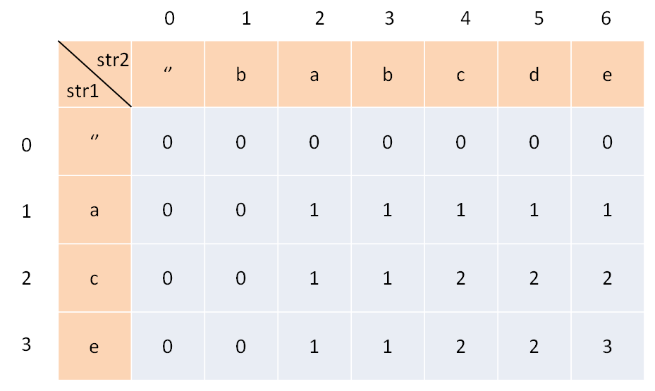
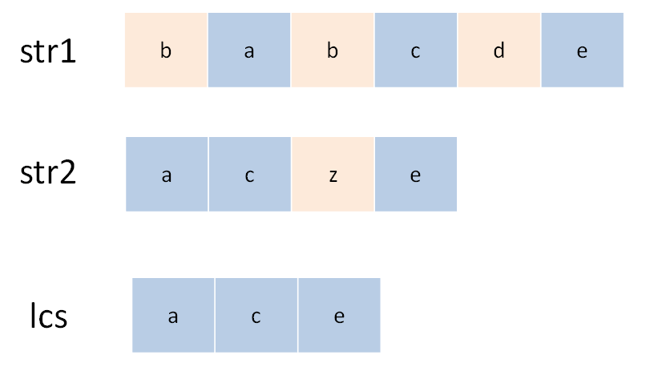
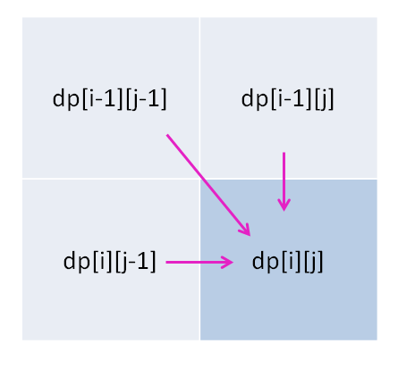

[1143.最长公共子序列](https://leetcode-cn.com/problems/longest-common-subsequence)

最长公共子序列（Longest Common Subsequence，LCS）：典型的二维dp，类似**编辑距离**。

### 一、dp  =  穷举 + 剪枝

**第一步：构造`dp`  table**



`dp[i][j]` ：**对于 `s1[1..i]` 和 `s2[1..j]`**， LCS 长度是 `dp[i][j]`。

`d[2][4] `：对于 `"ac"` 和 `"babc"`， LCS 长度是 2。求解`dp[3][6]`。

**第二步：base case**

base case：索引 0 的行、列表示空串，`dp[0][..]` 和 `dp[..][0]` 初始化为 0 ；

**第三步：状态转移方程**

字符串问题的套路：**状态转移**就是**做选择**，对于 `s1` 和 `s2` 中的字符，只有两种选择 ---- 在 `lcs` 中，不在 `lcs`中；



「在」和「不在」就是选择，如果某个字符在 `lcs` 中，则肯定同时存在 `s1` 和 `s2` 中：

**指针 `i` 和 `j` 从后往前遍历** `s1` 和 `s2`: 如果 `s1[i]==s2[j]`，该字符**在 `lcs` 中**；否则两个字符**至少有一个不在 `lcs` 中**，需丢弃一个：

```python
def longestCommonSubsequence(str1, str2) -> int: # 递归
    def dp(i, j):
        if i == -1 or j == -1: return 0 # 空串的 base case （dp table的第0行/列）
        if str1[i] == str2[j]: return dp(i - 1, j - 1) + 1 # 找到1个 lcs 中的元素，前移i、j一位
        else: return max(dp(i-1, j), dp(i, j-1)) # 谁能让 lcs 最长，就听谁的
    return dp(len(str1)-1, len(str2)-1) # i 和 j 初始化为最后一个索引
```

这是暴力解；用备忘录、 DP table 优化：

```python
def longestCommonSubsequence(str1, str2) -> int:
    m, n = len(str1), len(str2)
    dp = [[0] * (n + 1) for _ in range(m + 1)]# DP table 和 base case
    for i in range(1, m + 1):
        for j in range(1, n + 1):
            if str1[i - 1] == str2[j - 1]: dp[i][j] = 1 + dp[i-1][j-1]	# 找到1个 lcs 中的字符
            else: dp[i][j] = max(dp[i-1][j], dp[i][j-1])
    return dp[-1][-1]
```

### 二、疑难解答

 `s1[i]` 和 `s2[j]` 不相等时，会不会两个字符都不在lcs中？

```python
else:
    dp[i][j] = max(dp[i-1][j], 
                   dp[i][j-1],
                   dp[i-1][j-1])
```

其实多此一举，因为 `dp[i-1][j-1]` 永远是三者中最小的，max 不可能取到它。

### 三、总结

对于两个字符串的dp问题，一般都是定义 DP table，写出状态转移方程，`dp[i][j]` 的状态推导：



思考每个状态有哪些「选择」，用正确的逻辑做出选择。
