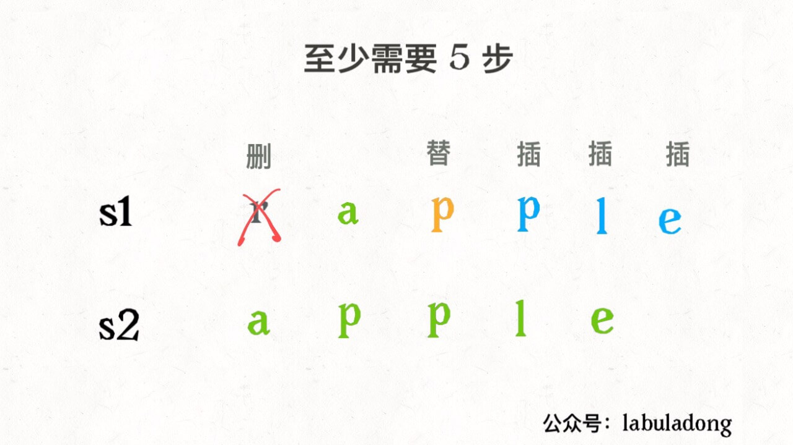
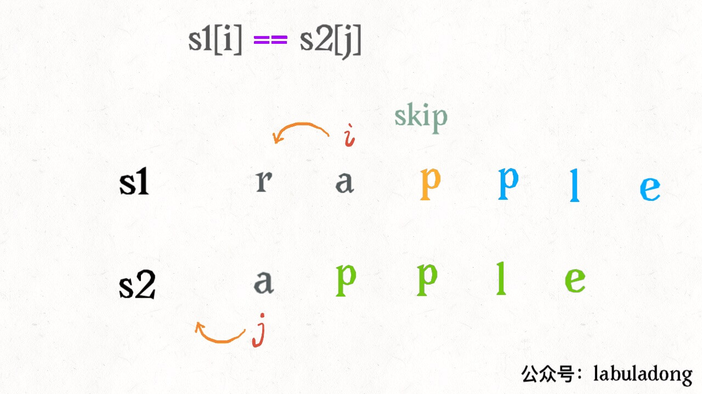
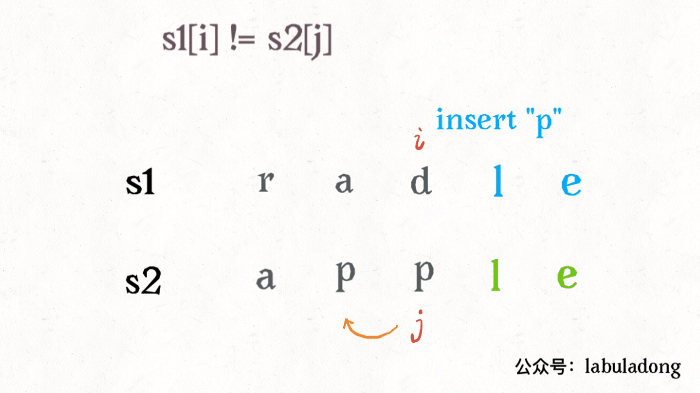
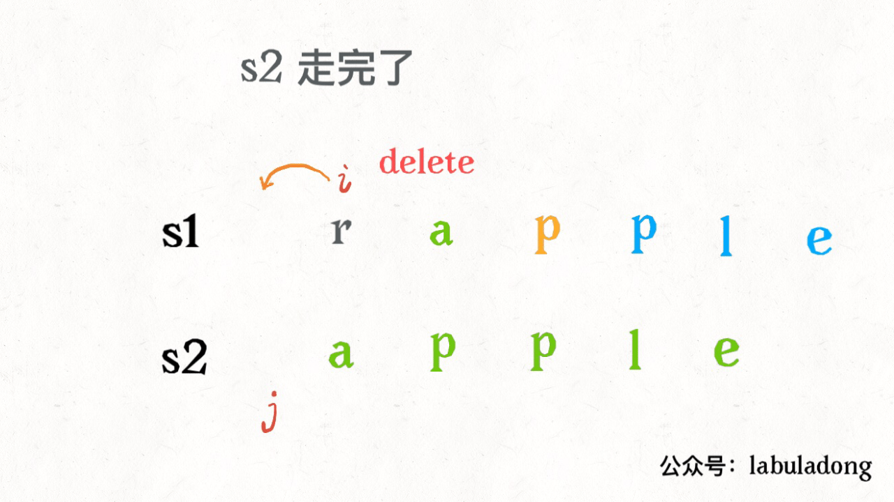
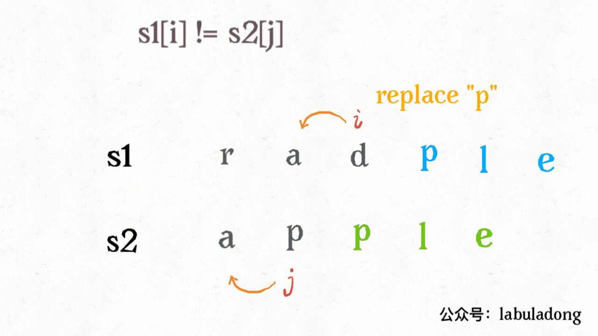
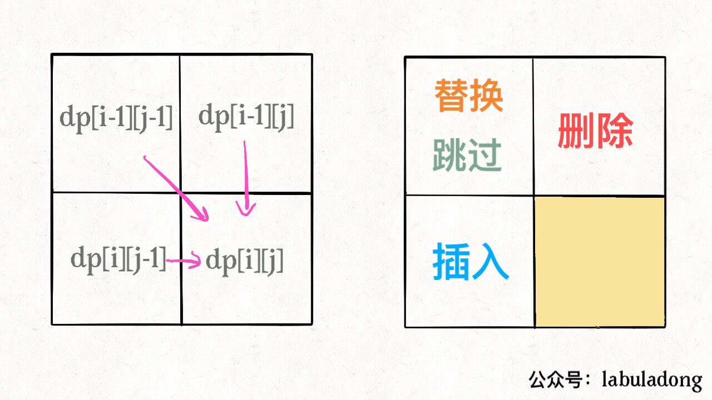
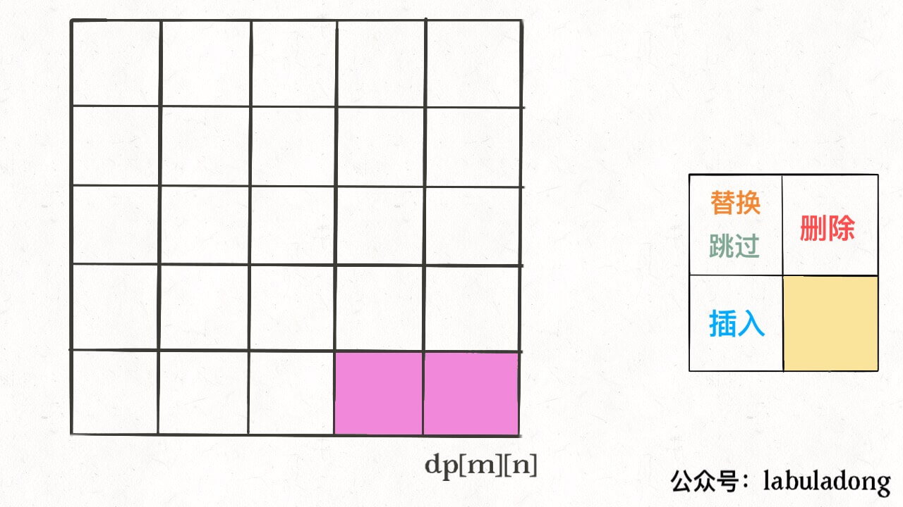
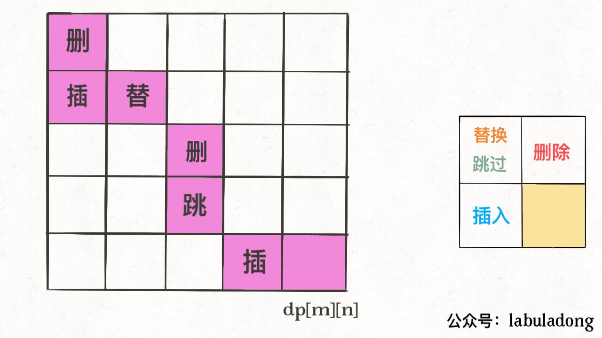

[72.编辑距离](https://leetcode-cn.com/problems/edit-distance)

解法简单漂亮，也是少有的实用算法：如DNA 序列可类比字符串，编辑距离衡量两个 DNA 序列的相似度；

### 一、思路

「最长公共子序列」：**两字符串的dp问题，用双指针 `i,j` 分别指向最后，然后往前缩小问题规模**。

设两个字符串分别为 "rad" 和 "apple"，为了把 `s1` 变成 `s2`，算法会这样进行：



发现：操作不只有三个，第四个操作是什么都不做（skip）---- 两个字符相同，直接前移 `i,j` ；



 **base case**： `j` 走完 `s2` 时或 `i` 走完 `s1` ，另一个没走完，就用插入操作把剩余字符全部插入：

### 二、代码

每对 `s1[i]` 和 `s2[j]`，有四种操作：

```python
if s1[i] == s2[j]:
    啥也不做（skip）
    i, j 同时向前移动
else:
    三选一：
        插入（insert）
        删除（delete）
        替换（replace）
```

「三选一」怎么选择？很简单，全试一遍，选择最优结果：

```python
def minDistance(s1, s2) -> int: # 递归解法
    def dp(i, j):
        if i == -1: return j + 1        # base case：i走完s1或j走完s2，直接返回另一个字符串剩下的长度；
        if j == -1: return i + 1
        if s1[i] == s2[j]: return dp(i - 1, j - 1)  # 啥都不做
        else:
            return min(
                dp(i, j - 1) + 1,    # 插入
                dp(i - 1, j) + 1,    # 删除
                dp(i - 1, j - 1) + 1 # 替换
            )
    return dp(len(s1) - 1, len(s2) - 1)    # i，j 初始化指向最后一个索引
```

解释一下递归：

```python
def dp(i, j) -> int # 返回 s1[0..i] 和 s2[0..j] 的最小编辑距离
```

**记住这个定义**，看代码：

```python
if s1[i] == s2[j]: return dp(i - 1, j - 1)  # 啥都不做
# 解释：s1[0..i] 和 s2[0..j] 的最小编辑距离 == s1[0..i-1] 和 s2[0..j-1] 的最小编辑距离
```

如果 `s1[i]！=s2[j]`，对三个操作递归：

```python
dp(i, j - 1) + 1,    # 插入：在 s1[i] 插入和 s2[j] 一样的字符 ---- 前移 j; 操作数加一
```



```python
dp(i - 1, j) + 1,    # 删除：把 s[i] 字符删掉 ---- 前移 i; 操作数加一
```



```python
dp(i - 1, j - 1) + 1 # 替换：把 s1[i] 替换成 s2[j] ---- 同时前移 i，j; 操作数加一
```



这是暴力解，存在**重叠子问题**；

### 三、动态规划优化

优化方法：备忘录、 DP table。

```python
        memo = {}
        def dp(i,j):
            if (i,j) in memo: return memo[(i,j)] # 查备忘录
            if i == -1: return j+1 # base case
            if j == -1: return i+1 # base case
            if word1[i] == word2[j]:
                memo[(i,j)] = dp(i-1,j-1) # 存备忘录
                return memo[(i,j)]
            else:
                memo[(i,j)] = min(dp(i,j-1)+1,
                dp(i-1,j)+1,
                dp(i-1,j-1)+1)
                return memo[(i,j)]
        return dp(len(word1)-1, len(word2)-1)
```

**DP table**：二维数组


`dp[..][0]` 和 `dp[0][..]` 是 **base case**：递归的 base case 是 `i,j` 等于 -1，而数组索引至少是 0，所以 dp 数组会偏移一位；套用递归思路，**唯一不同：DP table 是自底向上，递归是自顶向下**：

```python
        m, n= len(word1), len(word2)
        dp = [[0] * (n+1) for _ in range(m+1)]
        for i in range(m+1): # base case 
            dp[i][0] = i
        for j in range(n+1):
            dp[0][j] = j
        for i in range(1,m+1): # 自底向上求解
            for j in range(1,n+1):
                if word1[i-1] == word2[j-1]:
                    dp[i][j] = dp[i-1][j-1]
                else:
                    dp[i][j] = min(dp[i - 1][j] + 1,
                    dp[i][j - 1] + 1,
                    dp[i-1][j-1] + 1)
        return dp[m][n]
```

### 三、扩展

一般处理两个字符串的dp问题，都是本文的思路：



细节优化：既然每个 `dp[i][j]` 只和附近的三个状态有关，空间复杂度可压缩成 `O(min(M, N))` （M，N 是两个字符串的长度）。不难，但是可解释性大大降低；

**这里只求最小编辑距离，具体的操作是什么**？代码稍加修改，给 dp 数组增加额外的信息：

```java
Node[][] dp; // int[][] dp;

class Node：
    int val;
    int choice; // 0：skip；1：插入；2：删除；3：替换；
```

 `val` ：最小编辑距离，`choice` ：最后一个操作，比如插入操作，左移一格（j - 1）：



重复此过程，一步步到 `dp[0][0]`，按路径上的操作进行编辑:



附录：状态压缩技巧：用额外的变量 pre 保存 (i-1,j-1) 的值。**状态转移公式**从二维：

```
dp[i][j] = min(dp[i-1][j] , dp[i-1][j-1] , dp[i][j-1]) + 1
```

转为一维：

```
dp[i] = min(dp[i-1], pre, dp[i]) + 1
```

