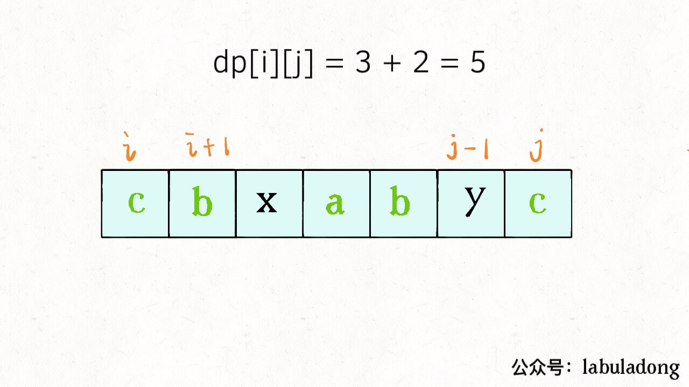
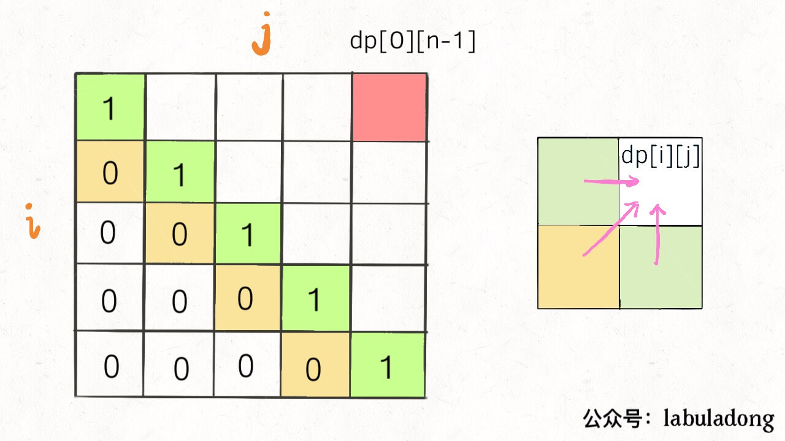

[516.最长回文子序列](https://leetcode-cn.com/problems/longest-palindromic-subsequence)

子序列问题相对子串、子数组更难，因为序列可以不连续；dp解法的时间一般都是 O(n^2)；

只有两种思路模板（dp 数组的定义思路）：

**第一种思路模板：一维 dp 数组**：

```java
for (int i = 1; i < len(arr); i++)：
    for (int j = 0; j < i; j++)：
        dp[i] = 最值(dp[i], dp[j]...)
```

例如「最长递增子序列」中， `dp[i]`定义为子数组 `array[0..i]`的 LIS 长度；符合数学归纳法，找状态转移的关系；

**第二种思路模板：二维 dp 数组**：

```java
n = len(arr)
for (int i = 0; i < n; i++):
    for (int j = 0; j < n; j++):
        if (arr[i] == arr[j]) 
            dp[i][j] = dp[i][j] + ...
        else
            dp[i][j] = 最值(...)
```

这种思路运用广泛：涉及两个字符串/数组的子序列，如「最长公共子序列」；dp 数组的定义分两种：「一个字符串」和「两个字符串」

- 两个字符串/数组：如最长公共子序列，dp 数组定义：**在子数组 `arr1[0..i]` 和子数组 `arr2[0..j]` 中，子序列（最长公共子序列）长度为 `dp[i][j]`**。

- 一个字符串/数组：比如本文的最长回文子序列，dp 数组定义：**在子数组 `array[i..j]` 中，子序列（最长回文子序列）的长度为 `dp[i][j]`**。

### 二、最长回文子序列

求最长回文子序列的长度， dp 数组：**在子串 `s[i..j]` 中，最长回文子序列的长度为 `dp[i][j]`**。记住这个定义；

为何这样定义二维 dp 数组？前文多次提到，**找状态转移需要数学归纳法，从已知推未知**，容易发现状态转移关系。

具体地，已知子问题 `dp[i+1][j-1]` （`s[i+1...j-1]` 中最长回文子序列的长度），求 `dp[i][j]` （`s[i..j]` 中最长回文子序列的长度）


取决于 `s[i]` 和 `s[j]` 的字符：**如果相等**



**如果不相等**，则不可能同时**出现在 `s[i..j]` 的最长回文子序列中，**分别加入 `s[i+1..j-1]` 中，看哪个产生的回文子序列更长：


```java
if (s[i] == s[j])
    dp[i][j] = dp[i + 1][j - 1] + 2;     // 它俩一定在最长回文子序列中
else
    dp[i][j] = max(dp[i + 1][j], dp[i][j - 1]); // s[i+1..j] 和 s[i..j-1] 谁的回文子序列更长？
```

至此，状态转移方程就出来了，根据 dp 数组的定义，要求的是 `dp[0][n - 1]`，即整个 `s` 的最长回文子序列的长度。

### 三、代码实现

- base case：只有一个字符， `dp[i][j] = 1 (i == j)`。

因为 `i` 肯定 <= `j`，对于 `i > j` 的位置，不存在子序列，初始化为 0;

- 状态转移方程，求 `dp[i][j]` 需要 `dp[i+1][j-1]`，`dp[i+1][j]`，`dp[i][j-1]` 这三个位置；



**每次计算 `dp[i][j]`，只能斜着遍历或反着遍历**：


反着遍历（后图），代码：

```python
        n = len(s)
        dp = [[0] * n for _ in range(n)]
        for i in range(n):
            dp[i][i] = 1 # base case 
        for i in range(n - 2, -1, -1): # 反向遍历(后一种遍历方式)
            for j in range(i + 1, n):
                if s[i] == s[j]:
                    dp[i][j] = dp[i + 1][j - 1] + 2
                else:
                    dp[i][j] = max(dp[i + 1][j], dp[i][j - 1])
        return dp[0][n - 1] #  整个 s 的最长回文子串长度
```

