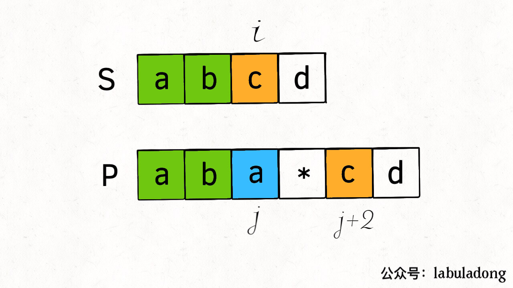
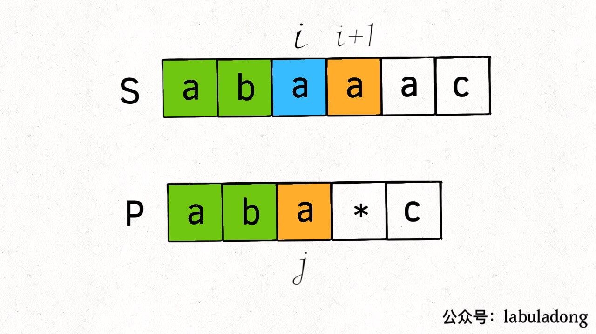
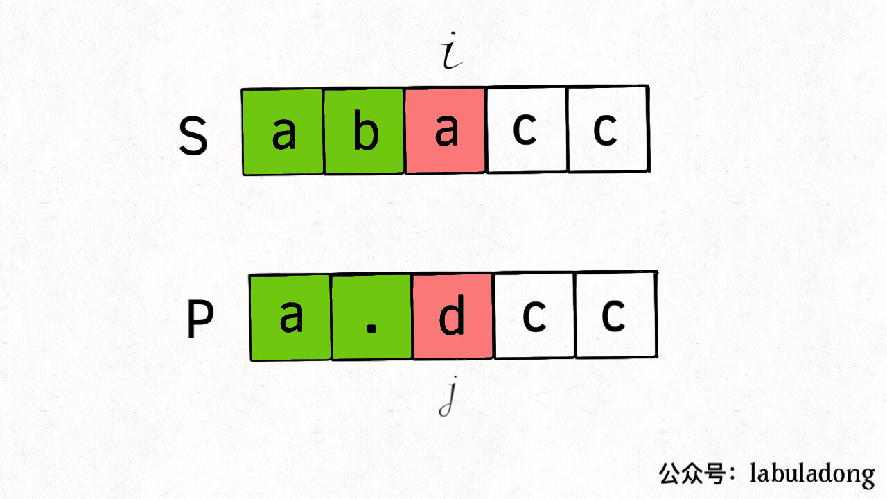

[10.正则表达式匹配](https://leetcode-cn.com/problems/regular-expression-matching/)

正则表达式是非常有用的工具，本文看一看底层原理，包括「.」通配符和「*」通配符；

- 点号「.」匹配任意一个字符，星号「*」让前一字符重复任意次（ 0或多次）；

- 模式串 `".a*b"` 可匹配 `"zaaab"`，也可匹配 `"cb"`；
- 模式串 `"a..b"` 可匹配 `"amnb"`；
- 模式串 `".*"` 可匹配任何文本；

题目：输入两个字符串 `s` 和 `p`，`s` 代表文本，`p` 代表模式串，判断模式串 `p` 是否可以匹配文本 `s`。假设模式串只包含小写字母和上述两种通配符且合法（不会出现 `*a` 或者 `b**` 这种不合法的模式串）；

- 点号通配符：很好实现，`s` 的任何字符，只要遇到 `.` 通配符就无脑匹配
-  `*` 通配符：前面的字符可重复一次，可重复多次，也可一次不出现；很简单，对于所有可能出现的情况，全部穷举一遍，只要有一种情况可以匹配，就认为 `p` 可以匹配 `s`。两个字符串的穷举，条件反射地想到dp技巧；

### 一、思路

`s` 和 `p` 匹配的过程：两个指针 `i, j` 分别在 `s` 和 `p` 上移动，如果两个指针都能移动到字符串的末尾，则匹配成功；

**不考虑 `*` 通配符：只需看两个字符是否匹配**：

```cpp
    int i = 0, j = 0;
    while (i < s.size() && j < p.size()) {
        if (s[i] == p[j] || p[j] == '.') {
            i++; j++; // 匹配，继续匹配 s[i+1..] 和 p[j+1..]
        } else {
            return false; // 不匹配
    return i == j;
```

**当 `p[j + 1]` 为 `*` 通配符，分情况讨论**：

1、如果 `s[i] == p[j]`，有两种情况：

- `p[j]` 可能会匹配多个字符：如 `s = "aaa", p = "a*"`，则 `p[0]` 的 `*` 匹配 3 个字符 `"a"`；

- `p[j]` 也可匹配 0 个字符：如 `s = "aa", p = "a*aa"`，则 `p[0]` 的 `*` 只能匹配 0 次；

2、如果 `s[i] != p[j]`，只有一种情况：

`p[j]` 只能匹配 0 次：如 `s = "aa", p = "b*aa"`，此时 `p[0]` 只能匹配 0 次；

```cpp
if (s[i] == p[j] || p[j] == '.') {
......
} else {    // . 不匹配
    if (j < p.size() - 1 && p[j + 1] == '*') {
        // 有 * 通配符，只能匹配 0 次
    } else {
        return false; // 无 * 通配符
```

整体的思路已清晰，问题：遇到 `*` 通配符时，应该匹配 0 次还是多次？多次是几次？

这就是**做「选择」，把所有可能的选择穷举一遍**。dp 的核心就是「状态」和「选择」，**「状态」是 `i` 和 `j` 指针位置，「选择」是 `p[j]` 选择匹配几个字符**。

### 二、dp解法

根据「状态」，定义 `dp` 函数：

```cpp
bool dp(string s, int i, string p, int j)
```

**若 `dp(s, i, p, j) = true`，则 `s[i..]` 可匹配 `p[j..]`；若 `dp(s, i, p, j) = false`，则 `s[i..]` 无法匹配 `p[j..]`**。

根据定义，要求解的是 `i = 0, j = 0` 时 `dp` 的结果：

```cpp
bool isMatch(string s, string p) {
    return dp(s, 0, p, 0);    // 指针 i，j 从索引 0 开始移动
```

 `dp` 函数的主要逻辑：

```cpp
bool dp(string s, int i, string p, int j)：
    if (s[i] == p[j] || p[j] == '.') { // 匹配
        if (j < p.size() - 1 && p[j + 1] == '*') { // 通配符匹配 0 次或多次（下面解释1）
            return dp(s, i, p, j + 2) || dp(s, i + 1, p, j);
        } else { // 常规匹配 1 次
            return dp(s, i + 1, p, j + 1);
        }
    } else { // 不匹配
        if (j < p.size() - 1 && p[j + 1] == '*') { // 通配符匹配 0 次
            return dp(s, i, p, j + 2);
        } else { // 无法继续匹配（解释2）
            return false;
```

解释1 ---- 通配符匹配 0 或多次：

- 匹配0次：将 `j` 加 2，`i` 不变；直接跳过 `p[j]` 和之后的通配符：



- 匹配多次：将 `i` 加 1，`j` 不变； `p[j]` 匹配了 `s[i]`，但 `p[j]` 还可以继续匹配；



解释2 ---- 没有 `*` 通配符：无法匹配，匹配失败



 `dp` 函数的 base case：

- `j == p.size()` ：模式串 `p` 匹配完，看文本串 `s` 匹配到哪里：

```cpp
if (j == p.size())：
    return i == s.size()
```

- `i == s.size()` ：文本串 `s` 已经全部匹配，只要简单地检查一下 `p` 是否也匹配完：

```cpp
if (i == s.size())：
    // 这样行吗？
    return j == p.size();
```

**不正确：只要 `p[j..]` 能匹配空串，就可以算完成匹配**。如 `s = "a", p = "ab*c*"`，当 `i` 走到 `s` 末尾，`j` 并没有走到 `p` 的末尾；

```cpp
int m = s.size(), n = p.size();
if (i == s.size()) {
    if ((n - j) % 2 == 1)： // 如果能匹配空串：字符和 * 成对出现
        return false;
    for (; j + 1 < p.size(); j += 2) { // 检查是否为 x*y*z* 形式
        if (p[j + 1] != '*')：
            return false;
    return true;
```

完整代码：

```cpp
bool dp(string s, int i, string p, int j) { // p[j..] 是否匹配 s[i..]
    int m = s.size(), n = p.size();
    if (j == n)：// base case
        return i == m;
    if (i == m)：
        if ((n - j) % 2 == 1)：
            return false;
        for (; j + 1 < n; j += 2)：
            if (p[j + 1] != '*')：
                return false;
        return true;

    string key = to_string(i) + "," + to_string(j) // 记录状态 (i, j)，消除重叠子问题
    if (memo.count(key)) return memo[key];
    
    bool res = false;
    if (s[i] == p[j] || p[j] == '.')：
        if (j < n - 1 && p[j + 1] == '*')：
            res = dp(s, i, p, j + 2) || dp(s, i + 1, p, j);
        } else {
            res = dp(s, i + 1, p, j + 1);
    } else {
        if (j < n - 1 && p[j + 1] == '*')：
            res = dp(s, i, p, j + 2);
        } else：
            res = false;
    memo[key] = res; // 存备忘录
    return res;
```

哈希表 `memo` ：消除重叠子问题 ---- 算法的递归框架：

```cpp
bool dp(string& s, int i, string& p, int j)：
    dp(s, i, p, j + 2);
    dp(s, i + 1, p, j);
    dp(s, i + 1, p, j + 1);
```

从 `dp(s, i, p, j)` 得到 `dp(s, i+2, p, j+2)`：至少有两条路径，说明 `(i+2, j+2)` 状态存在重复，存在重叠子问题。

- dp时间复杂度为「状态的总数」*「每次递归花费的时间」：本题状态总数是 `i` 和 `j` 的组合，即 `M * N`（`M` 为 `s` 的长度，`N` 为 `p` 的长度）；递归函数 `dp` 中没有循环（base case 不考虑，因为触发次数有限），所以一次递归的时间为常数。总时间`O(MN)`。

- 空间复杂度：备忘录 `memo` 的大小，即 `O(MN)`；