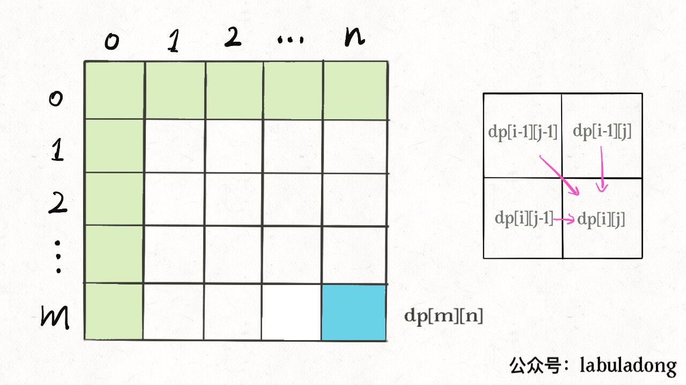

两个问题：

1、什么叫「最优子结构」，和dp的关系；

2、为什么遍历 `dp` 数组的方式五花八门：正着遍历，倒着遍历，斜着遍历；

### 一、最优子结构

「最优子结构」是问题的一种性质，不是dp专属。很多问题都有最优子结构，但不具有重叠子问题；

例：学校有 10 个班，已计算出每个班的最高成绩。要求全校最高的成绩？只要在这 10 个最高成绩中取最大的。

- **符合最优子结构**：从子问题的最优结果推出最优解。算**每个班**的最优成绩是子问题；

- 显然没有重叠子问题，求最值肯定用不出dp；

例：学校有 10 个班，已知每个班的最大分差（最高分 - 最低分），计算全校学生中的最大分数差？不能通过已知的最大分差推出；

- **不符合最优子结构**：没法通过局部最优值推出全局最优值；想满足最优子结构，子问题必须互相独立。全校的最大分差可能出现在两个班之间，显然**子问题不独立**，所以不符合最优子结构;

这种情况怎么办？**改造问题**。最大分数差的暴力代码：

```java
int result = 0;
for (Student a : school) {
    for (Student b : school) {
        if (a is b) continue;
        result = max(result, |a.score - b.score|);
return result;
```

改造问题：问题等价转化；最大分数差，等价于最高分和最低分的差，即求最高和最低分数，具有最优子结构；

再举个例子，二叉树的最大值（简单起见，假设节点中的值都是非负数）：

```java
int maxVal(TreeNode root)：
    if (root == null)：return -1;
    int left = maxVal(root.left);
    int right = maxVal(root.right);
    return max(root.val, left, right);
```

**符合最优子结构**：以 `root` 为根的最大值，通过子树（子问题）的最大值推导；

当然这也不是dp，最优子结构并不是dp独有的性质，求最值问题都有此性质；**反过来，最优子结构作为dp的必要条件，一定是求最值**，碰到最值题，思路往dp想，这就是套路；

- dp是从最简单的 base case 往后推导：想象成链式反应，以小博大。但只有符合最优子结构的问题，才有链式反应；

- 找最优子结构，其实是证明状态转移方程的正确性；写出暴力解，看有没有重叠子问题，有则优化；

### 二、dp 数组的遍历方向

二维 `dp` ，正向遍历：

```java
int[][] dp = new int[m][n];
for (int i = 0; i < m; i++)
    for (int j = 0; j < n; j++)
        // 计算 dp[i][j]
```

反向遍历：

```java
for (int i = m - 1; i >= 0; i--)
    for (int j = n - 1; j >= 0; j--)
        // 计算 dp[i][j]
```

斜向遍历：

```java
for (int l = 2; l <= n; l++) {
    for (int i = 0; i <= n - l; i++) {
        int j = l + i - 1;
        // 计算 dp[i][j]
```

有时候正向、反向都可以得正确答案，比如「团灭股票问题」；

原因有两点：

**1、遍历过程中：状态必须是已计算出的**。

**2、遍历终点：必须是存储结果的位置**。

- 编辑距离：通过对 `dp` 数组的定义，确定 base case 是 `dp[..][0]` 和 `dp[0][..]`，最终答案是 `dp[m][n]`；而且状态转移方程 `dp[i][j]` 是从 `dp[i-1][j]`, `dp[i][j-1]`, `dp[i-1][j-1]` 转移而来：



参考两条原则，遍历 `dp` 数组肯定是正向：

```java
for (int i = 1; i < m; i++)
    for (int j = 1; j < n; j++)
        // 计算 dp[i][j]：通过 dp[i-1][j], dp[i][j - 1], dp[i-1][j-1]
```

每一步迭代的左、上、左上的位置都是计算过的，最终答案 `dp[m][n]`；

- 回文子序列：通过对 `dp` 数组的定义， base case 处在中间的对角线，`dp[i][j]` 从 `dp[i+1][j]`, `dp[i][j-1]`, `dp[i+1][j-1]` 转移而来，最终答案是 `dp[0][n-1]`：


根据两个原则，有两种遍历方式：


从左至右斜着遍历、从下向上从左到右遍历，保证每次 `dp[i][j]` 的左边、下边、左下边已经计算完毕；
