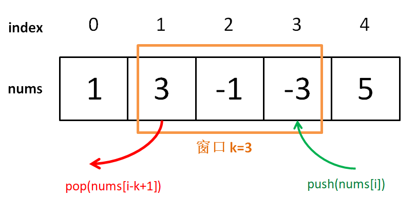

[239.滑动窗口最大值](https://leetcode-cn.com/problems/sliding-window-maximum)

前文讲了「单调栈」monotonic stack，解决了「Next Greater Number」；

类似的「单调队列」：解决滑动窗口问题；

### 一、解题框架

题很简单，难点在于 O(1) 时间求每个「窗口」最大值，使整个算法在线性时间O(n)。

之前类似的**场景：一堆数字已知最值，添加一个数，比较一次可得最值；**但如果减少一个数，就要遍历所有数重新找最值。

回到这道题：每个窗口前进时，添加一个数同时减少一个数，想 O(1) 时间得出新的最值，需要「单调队列」来辅助。

```java
class Queue: // 普通的队列
    void push(int n);
    void pop(); // 删除队头元素
```

「单调队列」也差不多：

```java
class MonotonicQueue:
    void push(int n);
    int max(); // 当前队列中的最大值;
    void pop(int n); // 队头元素如果是 n，删除;
```

暂且认为时间复杂度都是 O(1)；先写「滑动窗口」解题框架：

```cpp
    MonotonicQueue window;
    vector<int> res;
    for (int i = 0; i < nums.size(); i++) {
        if (i < k - 1) { //先填满窗口的前 k - 1 
            window.push(nums[i]);
        } else { // 窗口开始滑动
            window.push(nums[i]);
            res.push_back(window.max());
            window.pop(nums[i - k + 1]); // nums[i - k + 1] 是窗口最后的元素
    return res;
```



思路很简单；下面开始重头戏，实现单调队列。

### 二、实现单调队列

```java
class deque: // 双端队列
    void push_front(int n); // 在队头插入元素 n
    void push_back(int n); // 在队尾插入元素 n
    void pop_front();
    void pop_back();
    int front(); // 返回队头元素
    int back(); // 返回队尾元素
```

复杂度都是 O(1); 用链表作为底层结构很容易实现。

「单调队列」的核心思路和「单调栈」类似。push 方法依然在队尾添加元素，但要删掉比 cur 小的元素：

```cpp
    void push(int n)：
        while (!data.empty() && data.back() < n) 
            data.pop_back();
        data.push_back(n);
```

可以**想象：加入的数字代表人的体重，把前面体重不足的都压扁了，直到遇到更大的量级**；


最终单调队列是**递减**的顺序；

```cpp
int max() ：
    return data.front();
```

pop() 在队头删除元素 n：

```cpp
void pop(int n)：
    if (!data.empty() && data.front() == n) // 元素 n 可能不在窗口中，此时不用删除：
        data.pop_front();
```

为何判断 `data.front() == n`？因为想删除的队头元素 n 可能已被「压扁」，此时不用删除：

至此，单调队列设计完毕：

**三、复杂度分析**

nums 中每个元素最多 push_back 和 pop_back 一次，整体的复杂度 O(N)；空间复杂度就是窗口的大小 O(k)；

**四、总结**

「单调队列」和「优先级队列」差别很大：单调队列在添加元素的时候需删除元素来保持单调性，相当于抽出单调递增的部分；


```python
from collections import deque
class MonotonicQueue(object):
    def __init__(self):
        self.data = deque() # 双端队列
    def push(self, n):
        while self.data and self.data[-1] < n:
            self.data.pop()
        self.data.append(n)
    def max(self): # 单调队列中的最大值
        return self.data[0]
    def pop(self, n):
        if self.data and self.data[0] == n:
            self.data.popleft()
class Solution:
    def maxSlidingWindow(self, nums: List[int], k: int) -> List[int]:
        window = MonotonicQueue() # 单调队列实现的滑动窗口
        res = []
        for i in range(0, len(nums)):
            if i < k-1: # 先填满窗口前k-1
                window.push(nums[i])
            else: # 窗口开始滑动
                window.push(nums[i])
                res.append(window.max())
                window.pop(nums[i-k+1])
        return res
```
