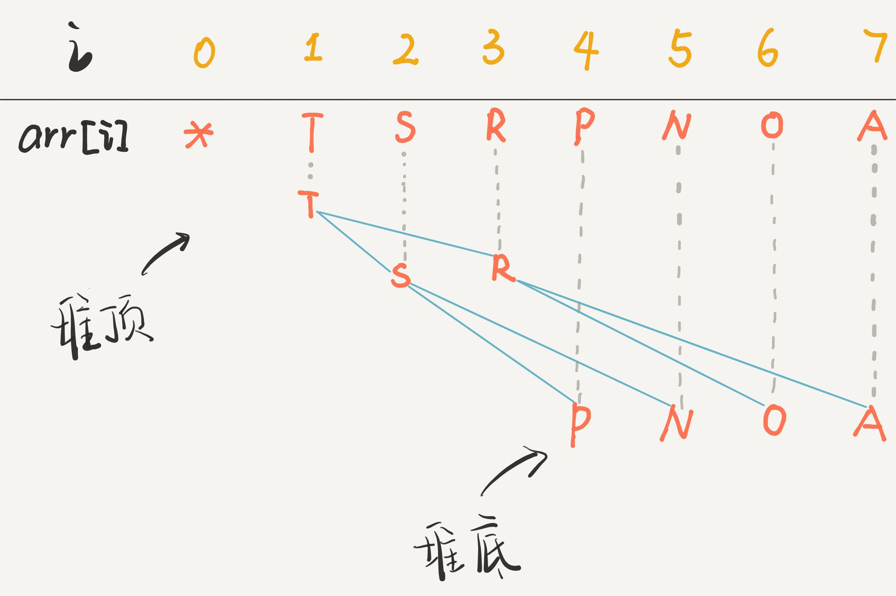

二叉堆（Binary Heap），比 BST 简单：

- 主要操作: 只有`sink`（下沉）和 `swim`（上浮），维护二叉堆的性质。
- 主要应用:「堆排序」，数据结构「优先级队列」（Priority Queue）

### 一、二叉堆

特殊的二叉树（完全二叉树），用数组存储，索引作为指针(注: **索引 0 空着不用; arr[1]为树根**)

```java
def parent(int root)： // 父节点的索引
    return root / 2;
def left(int root)： // 左孩子的索引
    return root * 2;
def right(int root): // 右孩子的索引
    return root * 2 + 1;
```



### 二、优先级队列（以最大堆为例）

主要 API： `insert` 和 `delMax` （最小堆用 `delMin`）；

```java
public class MaxPQ<Key extends Comparable<Key>>： //Java 泛型: Key 是任意可比的数据类型
    private Key[] pq; // 数组: 存储元素
    private int N = 0; // 元素个数

    public MaxPQ(int cap)
        pq = (Key[]) new Comparable[cap + 1]; // 索引 0 不用，多分配1位

    public Key max()： //返回最大元素
        return pq[1];

    public void insert(Key e) {...}
    public Key delMax() {...}
    private void swim(int k) {...} //上浮
    private void sink(int k) {...} // 下沉
```

### 三、 swim 和 sink

```java
private void swim(int k)： // 上浮：直到堆顶
    while (k > 1 && less(parent(k), k))： // 如果第 k 个元素比上层大
        exch(parent(k), k);
        k = parent(k);
```

```java
private void sink(int k) ：// 下沉
    while (left(k) <= N)： 
        int older = left(k); // 较大节点：暂定左儿子
        if (right(k) <= N && less(older, right(k)))：older = right(k);  // 右儿子
        if (less(older, k)) break;   // 符合最大堆：不必下沉
        exch(k, older);  // 不符合最大堆：下沉
        k = older;
```

至此，二叉堆的主要操作讲完；


### 四、 insert和delMax 

**`insert` 把元素插到堆底，再上浮到正确位置。**


```java
public void insert(Key e)
    N++;
    pq[N] = e;     // 元素加到最后
    swim(N);     // 上浮到正确位置
```

**`delMax` 先把堆顶元素 A 和堆底元素 B 对调，再删除 A，让 B 下沉到正确位置。**

```java
public Key delMax()：
    Key max = pq[1];     // 堆顶是最大元素
    exch(1, N);  // 最大元素换到最后，并删除
    pq[N] = null;
    N--;
    sink(1);    // pq[1] 下沉到正确位置
    return max;
```

至此，优先级队列实现，插入和删除元素为 `O(logK)`，`K` 为当前二叉堆（优先级队列）元素总数。

时间主要花在 `sink` 或者 `swim` 上：时间为树（堆）的高度 log K。