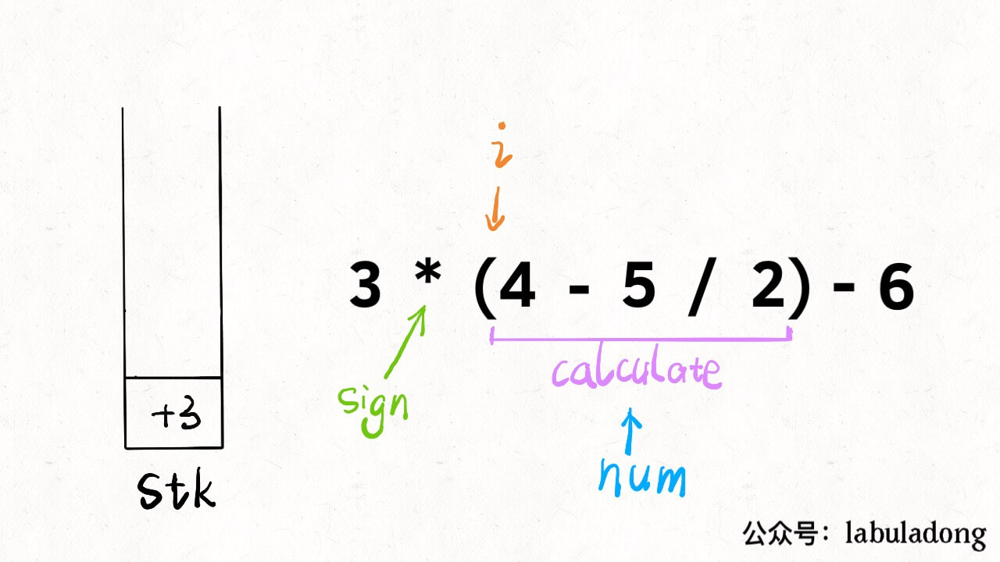

[224.基本计算器](https://leetcode-cn.com/problems/basic-calculator)

[227.基本计算器II](https://leetcode-cn.com/problems/basic-calculator-ii)

要实现的计算器功能：

1、输入字符串: 包含`+ - * /`、数字、括号、空格，返回运算结果

2、运算法则：括号的优先级最高，先乘除后加减

3、除号是整数除法，无论正负都向 0 取整（5/2=2，-5/2=-2）

**层层拆解问题，化整为零，逐个击破**，这种思维方式能解决各种复杂问题。

### 一、字符串转整数

```cpp
string s = "458";
int n = 0;
for (int i = 0; i < s.size(); i++)：
    char c = s[i];
    n = 10 * n + (c - '0');
```

很简单，老套路了。但有坑：**`(c - '0')`的这个括号不能省略，否则可能造成整型溢出**。

### 二、处理加减法

进一步，**如果算式只包含加减法，且不存在空格**？以`1-12+3`为例，很简单的思路：第一个数默认符号`+`，变成`+1-12+3`；把运算符和数字组合成对：`+1`，`-12`，`+3`，入栈；出栈求和；

```cpp
        int sign = 1, res = 0; // sign 代表正负
        int length = s.length();
        for (int i = 0; i < length; i++)：
            char ch = s.charAt(i);
            if (Character.isDigit(ch))：
                int cur = ch - '0';
                while (i + 1 < length && Character.isDigit(s.charAt(i + 1)))
                    cur = cur * 10 + s.charAt(++i) - '0';
                res = res + sign * cur; // 求和：获取res
            else if (ch == '+')
                sign = 1;
            else if (ch == '-')
                sign = -1;
```

另外，当`i`走到算式的尽头（`i == s.size() - 1`），也将前面的数字入栈；

至此，仅处理紧凑加减法字符串的算法就完成了，后续的内容就基于框架修改。

### 三、处理乘除法

字符串`2-3*4+5`举例，核心思路依然是把字符串分解成**符号和数字的组合**：分解为`+2`，`-3`，`*4`，`+5`：

```cpp
            else if ch == '*': // 取前一个数字做运算
                pre = st.pop();
                st.push(pre * num);
            else if ch == '/':
                pre = st.pop();
                st.push(pre / num);
```

**乘除优先于加减：乘除先和栈顶的数结合，而加减只能入栈**。

```cpp
if ((!isdigit(c) && c != ' ') || i == s.size() - 1): //空格: 不是运算符，应该忽略
    ...
```

### 四、处理括号

为了规避编程语言的繁琐细节，把解法翻译成 Python ：

```python
def calculate(s: str) -> int:
    def helper(s: List) -> int:
        stack = []
        sign = '+'
        num = 0
        while len(s) > 0:
            c = s.pop(0)
            if c.isdigit(): num = 10 * num + int(c)
            if (not c.isdigit() and c != ' ') or len(s) == 0:
                if sign == '+':
                    stack.append(num)
                elif sign == '-':
                    stack.append(-num)
                elif sign == '*':
                    stack[-1] = stack[-1] * num
                elif sign == '/':
                    stack[-1] = int(stack[-1] / float(num)) # 除法：向 0 取整
                num = 0
                sign = c
        return sum(stack)
    return helper(list(s))    # 字符串转list，方便操作
```

为什么处理括号没有看起来那么难，**因为括号有递归性质**。拿字符串`3*(4-5/2)-6`举例：

calculate(`3*(4-5/2)-6`)
= 3 * calculate(`4-5/2`) - 6
= 3 * 2 - 6
= 0

无论嵌套多少层括号，通过 calculate 函数递归调用，可将算式化简成一个数。即：括号的算式直接视为一个数；

```python
def calculate(s: str) -> int:
    def helper(s: List) -> int: # 超时。。。
        stack = []
        sign = '+'
        num = 0
        while len(s) > 0:
            c = s.pop(0)
            if c.isdigit():
                num = 10 * num + int(c)
            if c == '(': # 左括号：开始递归计算 num
                num = helper(s)
            if (not c.isdigit() and c != ' ') or len(s) == 0:
                if sign == '+': ...
                elif sign == '-': ... 
                elif sign == '*': ...
                elif sign == '/': ...
                num = 0
                sign = c
            if c == ')': break # 右括号：返回递归结果
        return sum(stack)
    return helper(list(s))
```

```python
        st = []
        sign = 1
        res, i = 0, 0 
        while i < len(s): # 迭代
            ch = s[i]
            if ch.isdigit():
                cur = int(ch)
                while i + 1 < len(s) and s[i + 1].isdigit():
                    cur = cur * 10 + int(s[i + 1])
                    i += 1
                res += sign * cur
            elif ch == '+': sign = 1
            elif ch == '-': sign = -1
            elif ch == '(':
                st.append(res)
                res = 0
                st.append(sign)
                sign = 1
            elif ch == ')': res = st.pop(-1) * res + st.pop(-1)
            i += 1
        return res
```




两三行代码就处理了括号，这就是递归。

### 五、总结

本文表达的是处理复杂问题的思路：1、字符串转数字；2、只包含加减法的算式；3、包含加减乘除四则运算的算式；4、处理空格字符；5、包含括号的算式。**对于比较困难的问题，解法并不是一蹴而就的，而是步步推进**；
