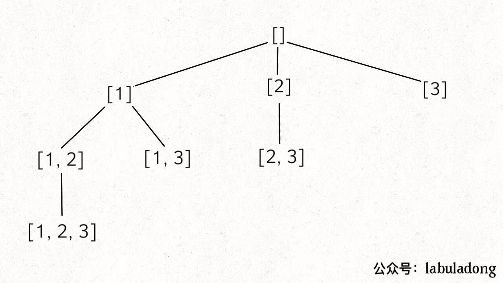
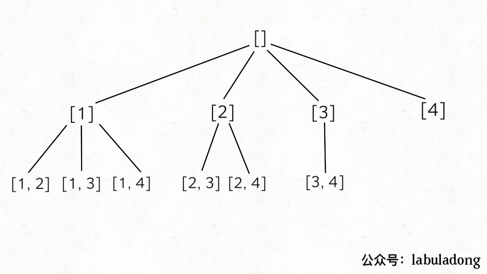
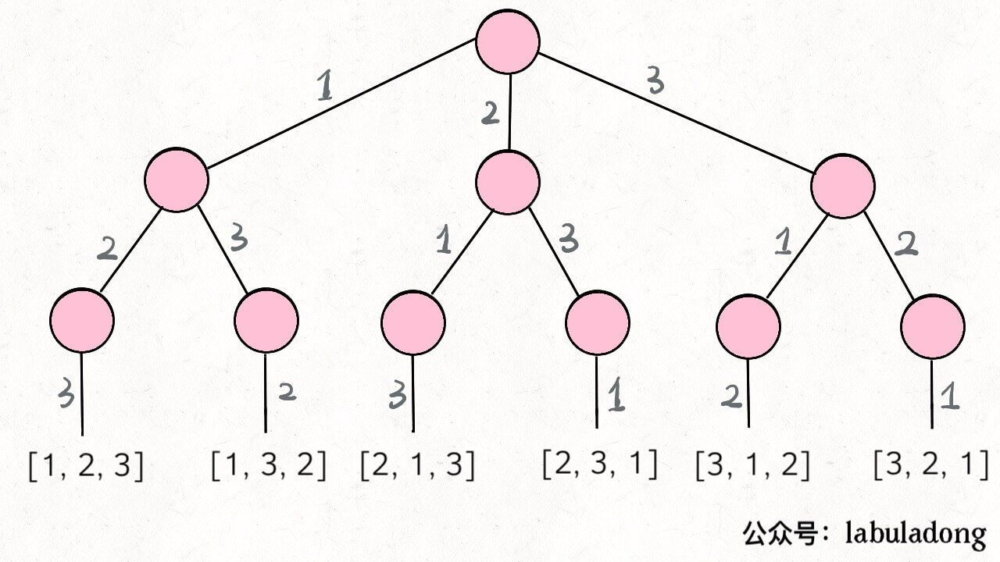

回溯算法（backtrack）：团灭**子集、排列、组合**问题

[78.子集](https://leetcode-cn.com/problems/subsets)：也可用数学归纳法；

[46.全排列](https://leetcode-cn.com/problems/permutations)

[77.组合](https://leetcode-cn.com/problems/combinations)

### 一、子集

输入：**不包含重复数字**的数组，输出所有子集；输入 `nums = [1,2,3]`，输出：[ [],[1],[2],[3],[1,3],[2,3],[1,2],[1,2,3] ]

**回溯**模板：

```python
result = []
def backtrack(路径, 选择列表):
    if 满足结束条件:
        result.add(路径)
        return
    for 选择 in 选择列表:
        做选择
        backtrack(路径, 选择列表)
        撤销选择
```

解法：

```python
        res, path = [], []
        def dfs(start, path):
            if len(path) <= len(nums):
                res.append(copy.copy(path))
            for i in range(start, len(nums)):
                path = path + [nums[i]] # 做选择
                dfs(i+1, path) 
                path.pop() # 撤销选择
        dfs(0, path)
        return res
```

先序遍历，res 是树上的所有节点：




### 二、组合

输入 `n, k`，输出 `[1..n]` 中 k 个数字的组合；如输入 `n = 4, k = 2`，输出（不含重复）：[ [1,2], [1,3], [1,4], [2,3], [2,4], [3,4] ]；

**回溯：`k` 限制了树高，`n` 限制了树宽**：



```python
        res, path = [], []
        def dfs(start, path):
            if len(path) == k:
                res.append(path)
                return
            for i in range(start, n+1):
                dfs(i+1, path + [i]) # path + [i]: 做选择 + 撤销选择
        dfs(1, path)
        return res
```

和上一题的区别：更新 `res` 是树到达底端时；

### 三、排列

输入**不包含重复数字**的数组 `nums`，输出全部排列。

回溯树：



```python
        def backtrack(nums, track, res):
            if len(track) == len(nums):
                res.append(copy.copy(track))
                return
            for i in range(len(nums)):
                if visited[i] == 1: continue
                visited[i] = 1 # 选择
                backtrack(nums, track + [nums[i]], res) # track + [nums[i]]：选择 + 撤销选择
                visited[i] = 0 # 撤销选择
        res, path = [], []
        visited = [0] * len(nums)
        backtrack(nums, path, res) # 回溯
        return res
```

**总结**：记住这几种树，足以秒杀所有回溯算法，区别无非是**用 `start` 或 `visited` 剪枝**；