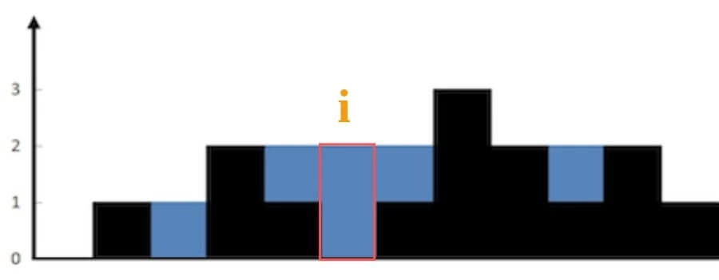

[42.接雨水](https://leetcode-cn.com/problems/trapping-rain-water)

由浅入深：暴力解法 -> 备忘录解法 -> 双指针解法

### 一、思路

不要想整体，而去想局部；dp字符串问题，不要处理整个字符串，思考如何处理每一个字符。

具体来说，仅仅对于位置 `i`，能装多少水？



能装 2 格水，位置 `i` 的水柱高度和其左右两边 `l_max` 和 `r_max`有关；**位置 i 最大水柱高度 `min(l_max, r_max)`。**

```python
water[i] = min(
               max(height[0..i]), # 左边最高的柱子
               max(height[i..end]) # 右边最高的柱子
            ) - height[i]
```


暴力法：

```cpp
    int n = height.size();
    int res = 0;
    for (int i = 1; i < n - 1; i++) {
        int l_max = 0, r_max = 0;
        for (int j = i; j < n; j++)
            r_max = max(r_max, height[j]); // 右边最高的柱子
        for (int j = i; j >= 0; j--) 
            l_max = max(l_max, height[j]); // 左边最高的柱子
        res += min(l_max, r_max) - height[i];
    return res;
```

时间 O(N^2)，空间 O(1)；

### 二、备忘录优化

暴力解法在每个位置 `i` 都要计算 `r_max` 和 `l_max` ；备忘录把结果都提前存下来；

**数组 `r_max` 和 `l_max` 当备忘录，`l_max[i]` 是`i` 左边最高，`r_max[i]` 是 `i` 右边最高**。

```cpp
    if (height.empty()) return 0;
    int n = height.size();
    int res = 0;
    vector<int> l_max(n), r_max(n);    // 备忘录
    l_max[0] = height[0];    // base case
    r_max[n - 1] = height[n - 1];
    for (int i = 1; i < n; i++)    // 从左向右计算 l_max
        l_max[i] = max(height[i], l_max[i - 1]);
    for (int i = n - 2; i >= 0; i--)     // 从右向左计算 r_max
        r_max[i] = max(height[i], r_max[i + 1]);
    for (int i = 1; i < n - 1; i++) 
        res += min(l_max[i], r_max[i]) - height[i];
    return res;
```

避免了重复计算，时间 O(N)，已是最优；但空间复杂度O(N)。

### 三、双指针解法

思路相同，但实现手法巧妙，不用备忘录提前计算了，而是用双指针**边走边算**；

```cpp
    if (height.empty()) return 0;
    int n = height.size();
    int left = 0, right = n - 1;
    int res = 0;
    
    int l_max = height[0];
    int r_max = height[n - 1];
    while (left <= right) {
        l_max = max(l_max, height[left]);
        r_max = max(r_max, height[right]);
        // res += min(l_max, r_max) - height[i]
        if (l_max < r_max) {
            res += l_max - height[left];
            left++; 
        } else {
            res += r_max - height[right];
            right--;
    return res;
```

双指针：`l_max` 和 `r_max` 是 `height[0..left]` 和 `height[right..end]` 的最高柱子高度


 `l_max` 是 `left` 指针左边的最高柱子，但 `r_max` 并不一定是 `left` 指针右边最高的柱子，这真的可以得到正确答案吗？其实我们只在乎 `min(l_max, r_max)`。**已知 `l_max < r_max` ，至于这个 `r_max` 是不是右边最大的，不重要。 `height[i]` 能装的水只和较低的 `l_max` 之差有关**：

