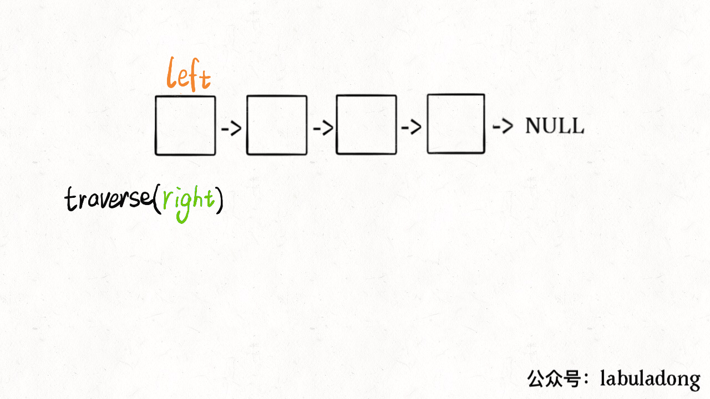

[234.回文链表](https://leetcode-cn.com/problems/palindrome-linked-list)

数组：用「双指针技巧」，从两端向中间逼近：

```cpp
    int left = 0, right = s.length - 1;
    while (left < right) {
        if (s[left] != s[right])
            return false;
        left++; right--;
    return true;
```

### 一、回文单链表

无法倒着遍历，无法用双指针;

法1: 原始链表反转存入一条新的链表

其实: **借助二叉树后序遍历的思路，无需显式反转原始链表也可倒序遍历链表**：

```python
def traverse(root):
    # 前序遍历代码
    traverse(root.left)
    # 中序遍历代码
    traverse(root.right)
    # 后序遍历代码
```

链表兼具递归结构，树结构是链表的衍生。**链表也有前序遍历和后序遍历**：

```python
def traverse(head):
    # 前序遍历代码
    traverse(head.next)
    # 后序遍历代码
```

这个框架有什么意义？如果想**正序打印链表，在前序遍历位置写代码；**如果想倒序遍历链表......

```python
def traverse(head):
    if (head == null) return
    traverse(head.next)
    print(head.val) # 后序遍历代码
```

双指针实现：

```python
        left = head
        def traverse(right): # 递归
            if not right: return True
            res = traverse(right.next)
            nonlocal left
            res = res and (right.val == left.val) # 后序遍历位置
            left = left.next
            return res
        return traverse(head)
```

```python
        left, right = head, head
        st = [] # 栈：模拟递归过程
        while right:
            st.append(right.val)
            right = right.next
        res = True
        while st and left:
            res = res and (st.pop(-1) == left.val)
            left = left.next
        return res
```

逻辑: **用 right 把链表节点放入递归栈，再取出（元素已逆序）和 left 比较**



时间和空间复杂度都是 O(N)。能不能不用额外的空间？

### 二、优化空间复杂度

```python
        slow,fast = head,head # 用快慢指针找中点; 逆序后半部分; check ;
        while fast:
            slow = slow.next
            fast = fast.next.next if fast.next else None
        prev = None
        while slow: # 逆序后半部分
            tmp = slow.next
            slow.next = prev
            prev = slow
            slow = tmp
        while head and prev: # prev逆序后的头结点（原始链表的tail）
            if head.val != prev.val:
                return False
            head = head.next
            prev = prev.next
        return True
```

算法总体的时间复杂度 O(N)，空间复杂度 O(1)；

有读者会问：这种解法虽然高效，但破坏了输入链表的原始结构，能不能避免？解决：先找`p, q`两个指针位置：


在函数 return 之前加一段代码恢复原链表：

```java
p.next = reverse(q);
```
