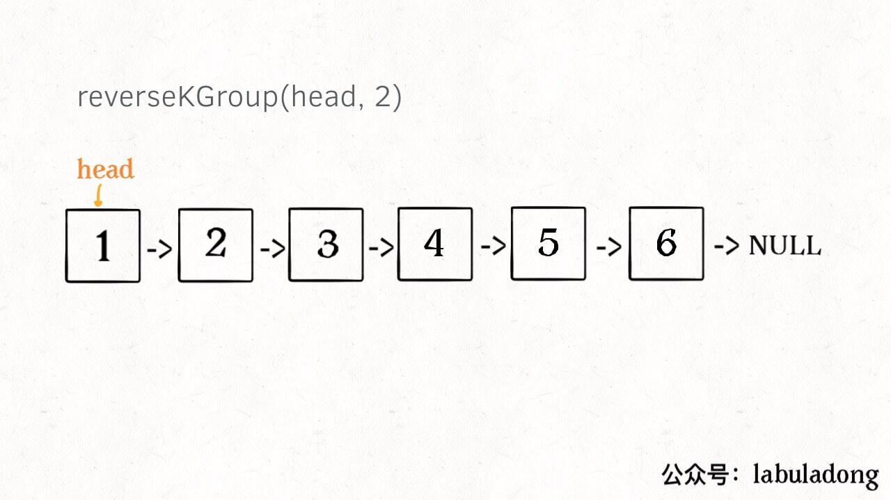
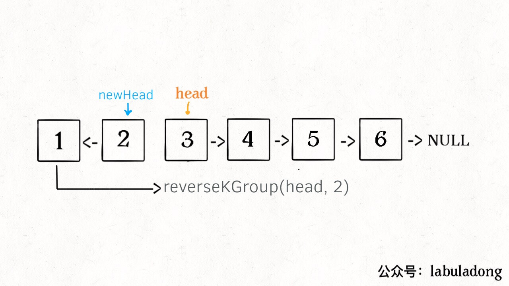
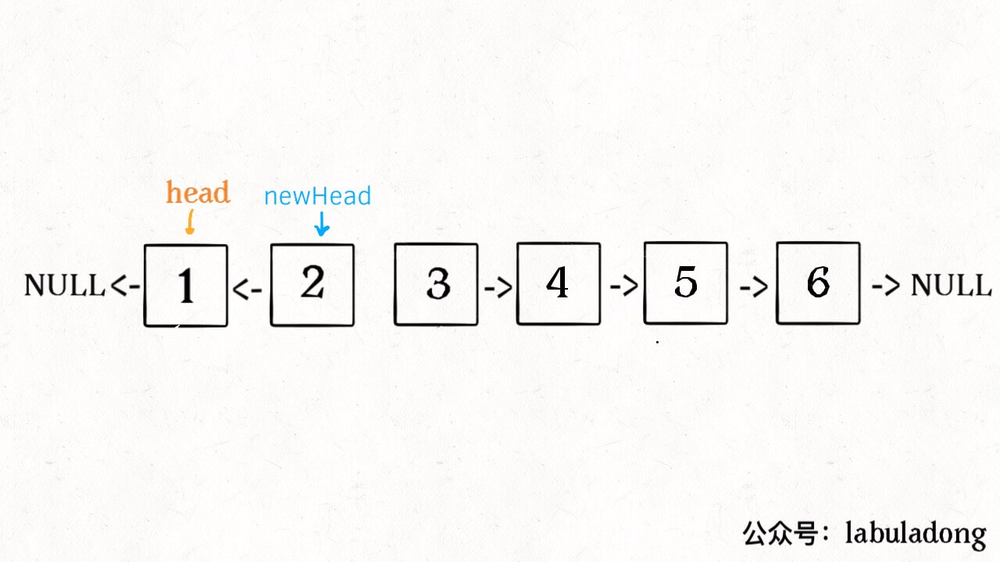
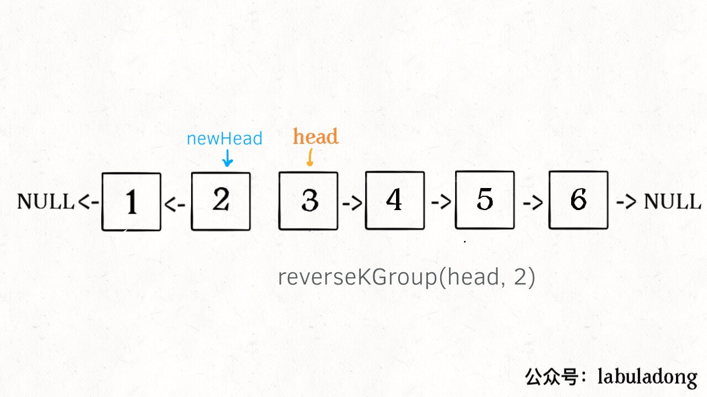
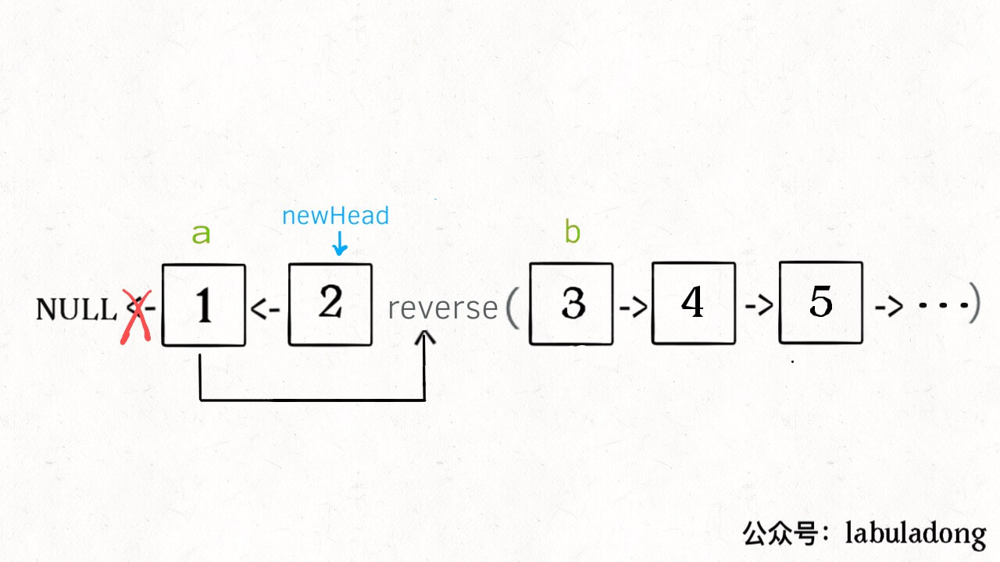
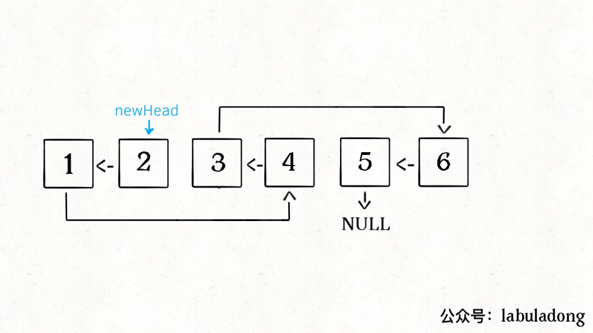

[25.K个一组翻转链表](https://leetcode-cn.com/problems/reverse-nodes-in-k-group)

如何迭代地反转链表？拆解问题。

### 一、分析问题

链表：兼具递归和迭代性质；对链表调用 `reverseKGroup(head, 2)`，以 2 个节点为一组反转链表：



后面也是链表，而且是规模小的**子问题**。和原问题结构相同，直接递归调用 `reverseKGroup(cur, 2)`；



算法流程：

**1、先反转以 `head` 开头的 `k` 个元素**。



**2、将第 `k + 1` 个元素作为 `head` 递归调用 `reverseKGroup` 函数**。



**3、连接上述两个结果**。

**base case**：最后的元素不足 `k` 个，保持不变；

### 二、实现

首先实现`reverse` 函数：反转一个区间的元素。

```python
def reverse(a, b): # 反转链表区间 [a, b) ; 注意: 左闭右开
    pre, cur, nxt = None, a, a
    while cur != b: # while 终止条件
        nxt = cur.next
        cur.next = pre
        pre = cur
        cur = nxt
    return pre # 新的head（原链表的tail）
```

编写 `reverseKGroup` 函数：

```python
def reverseKGroup(head, k):
    if head == None: return None
    a, b = head, head # 区间 [a, b) : 包含 k 个待反转元素
    for i in range(k): 
        if b == None: return head # base case: 不足 k 个
        b = b.next
    newHead = reverse(a, b) # 反转 k 个元素
    a.next = reverseKGroup(b, k) # 连接:递归反转后的链表
    return newHead
```

解释后几句代码：



整个函数递归完成之后的结果：

