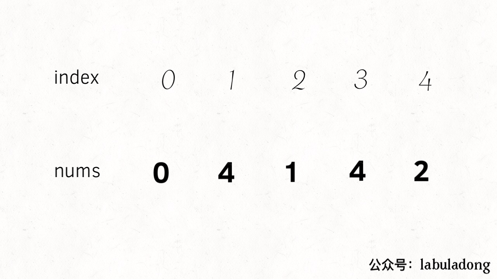
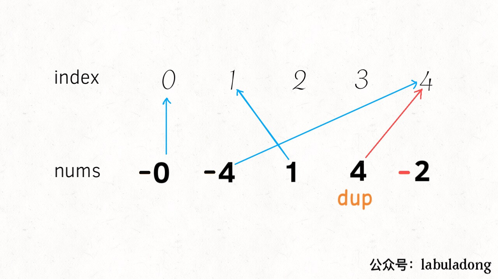
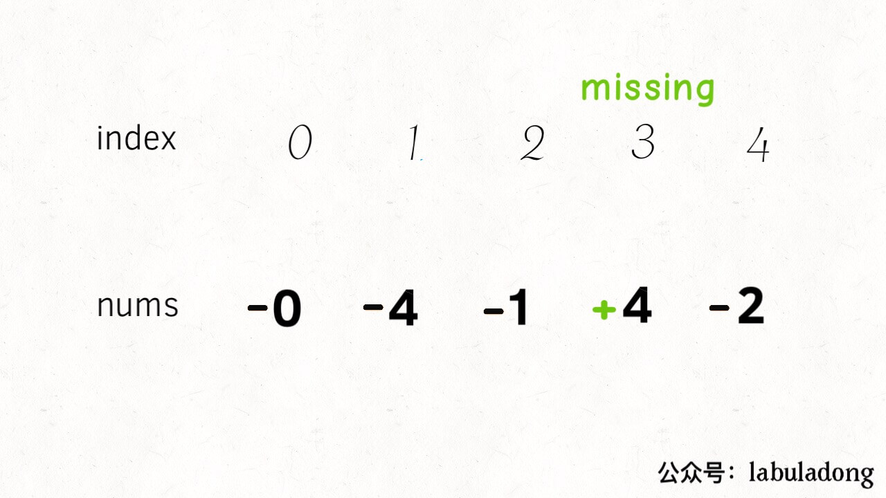

[645.错误的集合](https://leetcode-cn.com/problems/set-mismatch)

长度为 `N` 的数组 `nums`，其中一个元素有重复，导致另一个元素缺失。请找到 `nums` 中的重复元素和缺失元素的值。

输入：`nums = [1,2,2,4]`，返回 `[2,3]`。

- 常规解法：哈希表， O(N) 空间复杂度。

- O(N) 的时间复杂度遍历数组无法避免，想办法降低空间复杂度：

### 思路

问题的特点：每个元素和数组索引有对应关系。

改造下问题，**将 `nums` 中的元素变为 `[0..N-1]`，每个元素就和一个数组索引完全对应了**。

找到重复元素的索引，缺失元素对应的索引：如何不使用额外空间？这就是问题的精妙之处；

**将每个索引对应的元素变成负数**：





缺失元素 `3`，索引 `3` 对应的元素是正数：



代码：

```cpp
    int n = nums.size();
    int dup = -1;
    for (int i = 0; i < n; i++) {
        int index = abs(nums[i]) - 1;  // 元素是从 1 开始的
        if (nums[index] < 0)
            dup = abs(nums[i]);
        else
            nums[index] *= -1;

    int missing = -1;
    for (int i = 0; i < n; i++)
        if (nums[i] > 0)
            missing = i + 1; // 将索引转换成元素
    
    return {dup, missing};
```

其实，元素从 1 开始是用的，也必须从非零数开始。如果元素从 0 开始，0 的相反数还是自己，数字 0重复或缺失就无法判断；

### 总结

数组问题，**关键：元素和索引成对出现，常用方法：排序、异或、映射**。

映射：就是刚才的思路，将每个索引和元素映射起来，用正负号记录元素是否被映射。

排序：对于这个问题，如果元素都被从小到大排序，观察索引对应的元素是否相符；

异或运算：因为异或性质 `a ^ a = 0, a ^ 0 = a`，如果将索引和元素同时异或，即可消除成对的索引和元素，留下重复或缺失元素；

