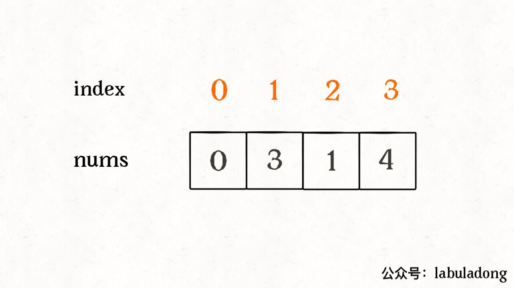
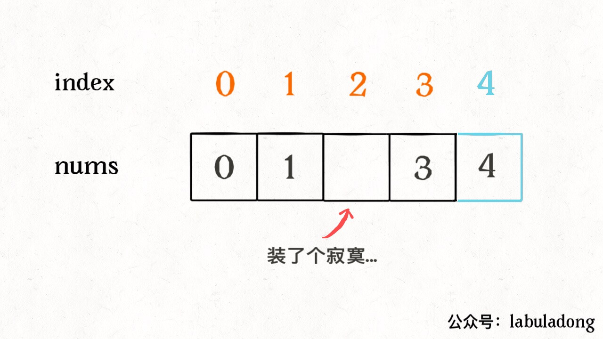
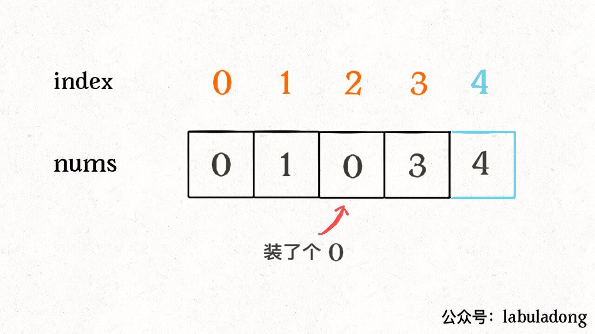

[448.找到所有数组中消失的数字](https://leetcode-cn.com/problems/find-all-numbers-disappeared-in-an-array)

一道巧妙的题目：长度为 n 的数组，要装 n + 1 个元素 `[0,n]`，肯定有一个元素装不下，请找出缺失的元素；

容易想到：把数组排序，再遍历；时间复杂度是 O(NlogN)

或者：用 HashSet 把数字都存下来，再遍历 `[0,n]` 之间的数字，去 HashSet 中查；时间复杂度是 O(N)；

**方法3：位运算**。

异或运算（`^`）的性质：

- 一个数和本身异或= 0，一个数和 0 异或=本身。

- 异或运算满足交换律和结合律：2 ^ 3 ^ 2 = 3 ^ (2 ^ 2) = 3 ^ 0 = 3

巧妙算出缺失元素，如 `nums = [0,3,1,4]`：




便于理解，先把索引补一位，让每个元素和索引对应：




除了缺失元素之外，所有的索引和元素都对应了；**把所有元素和索引做异或运算，成对的数字消为 0，只有缺失元素会剩下**：

```java
    int n = nums.length;
    int res = 0;
    res ^= n;    // 先和新补的索引异或
    for (int i = 0; i < n; i++)    // 和其他元素、索引异或
        res ^= i ^ nums[i];
    return res;
```



异或运算满足交换律和结合律，所以总是能把成对的数字消去，留下缺失元素（索引）；时间 O(N)，空间 O(1)，已最优；

还有个特别简单的解法：**等差数列求和公式**。

理解：现有等差数列 0, 1, 2,..., n，少了某个数，不就是 `sum(0,1,..n) - sum(nums)` ？

```java
    int n = nums.length;
    int expect = (0 + n) * (n + 1) / 2;    //求和公式：(首项 + 末项) * n / 2
    int sum = 0;
    for (int x : nums) 
        sum += x;
    return expect - sum;
```

这种是最简单的；

但：用求和公式计算 `expect` 时，考虑过**整型溢出**吗？为了避免溢出，可以一边求和一边减。类似位运算的思路，假设 `nums = [0,3,1,4]`，先补一位索引让元素跟索引配对，让每个索引减去其对应的元素，再把相减的结果加起来，得到缺失的元素：

```java
    int n = nums.length;
    int res = 0;
    res += n - 0;    // 新补的索引
    for (int i = 0; i < n; i++)     // 剩下索引和元素作差，求和
        res += i - nums[i];
    return res;
```

由于加减法满足交换律和结合律，所以总能把成对的数字消去，留下缺失元素；


[剑指 Offer 53 - II. 0～n-1中缺失的数字](https://leetcode-cn.com/problems/que-shi-de-shu-zi-lcof/)

[448.找到所有数组中消失的数字](https://leetcode-cn.com/problems/find-all-numbers-disappeared-in-an-array)

```python
def missingNumber(self, nums: List[int]) -> int:    #思路1，位运算
    res = len(nums)
    for i,num in enumerate(nums):
        res ^= i^num
        return res
```

```python
def missingNumber(self, nums: List[int]) -> int:    #思路2，求和
    n = len(nums)
    return n*(n+1)//2-sum(nums)
```

```python
def missingNumber(self, nums: List[int]) -> int:    #思路3，防止整形溢出的优化
    res = len(nums)
    for i,num in enumerate(nums):
        res+=i-num
        return res
```

python3中不存在整数溢出的问题（只要内存放得下），思路3优化提升并不大；

