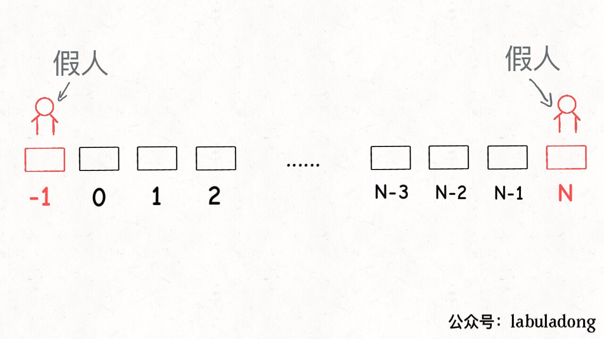
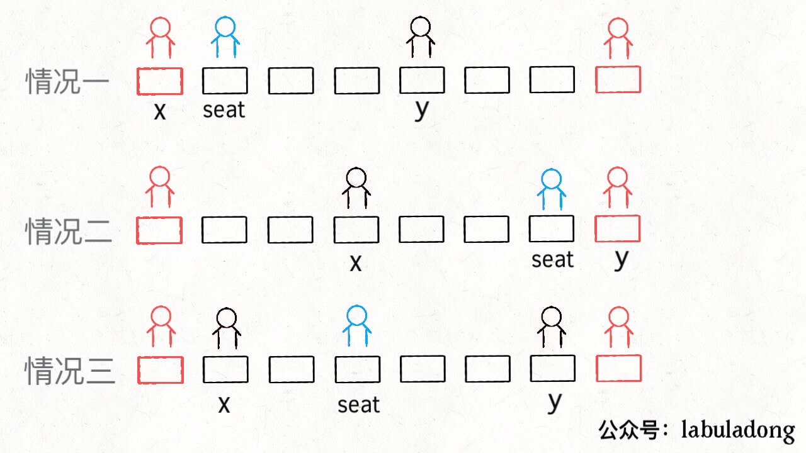
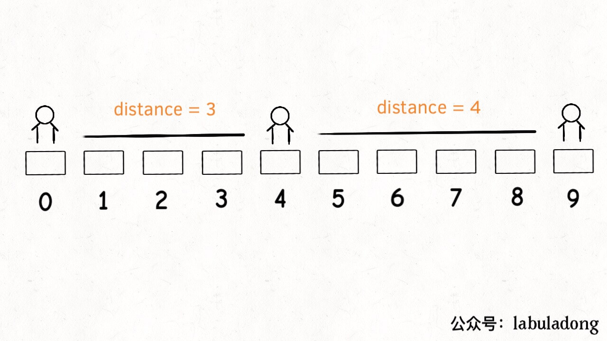
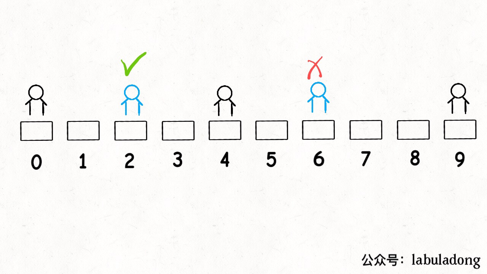
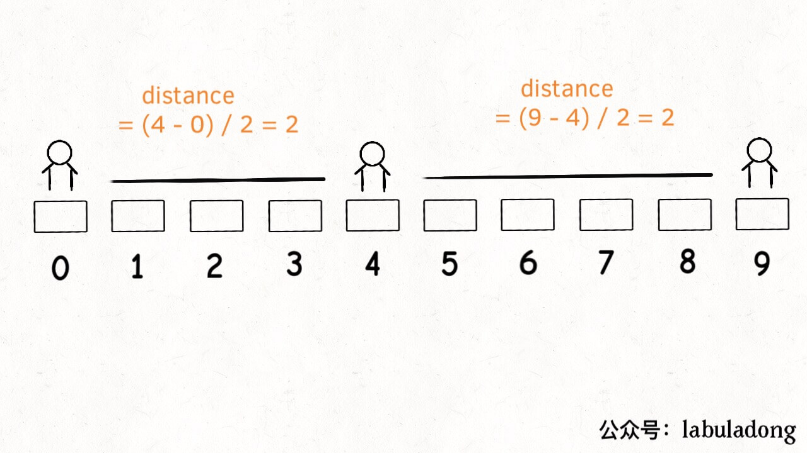

[855.考场就座](https://leetcode-cn.com/problems/exam-room)

有趣且有技巧性：对数据结构的理解和代码水平！

题目：考场`N` 个座位，索引 `[0..N-1]`，考生陆续进入考场，并可离开考场。安排考生座位：每当一个学生进入，需要最大化他和最近其他人的距离；如果有多个座位符合，则安排到距离索引最近的座位。

```java
class ExamRoom：
    public ExamRoom(int N);    // 构造函数：座位总数 N
    public int seat();    // 返回：分配的考生座位
    public void leave(int p);    // p 位置的考生离开了
```

比如有 5 个座位 `[0..4]`：

考生0进入，调用 `seat()`，坐在任何位置都行，安排索引最小的位置 0；

学生1进入，再调用 `seat()`，要距离最远的位置 4；

学生2进入，要和别人距离最远，安排中间座位 2；

最后的学生，可选座位 1 或 3，取较小的索引 1；

规律：**将相邻的考生看做线段的端点，安排新生就是找最长的线段，让该考生在中间把线段「二分」，中点就是分配的座位；`leave(p)` 就是去除端点 `p`，合并相邻的线段**。

### 一、思路分析

把学生抽象成线段，用二元组表示；**在动态过程中取最值：需要有序数据结构，常用二叉堆和平衡二叉搜索树**；

- **二叉堆/优先级队列**：取最值 O(logN)，但只能删除最大值；
- **平衡二叉树**：可取最值，也可修改、删除，时间都是 O(logN)；

综上，二叉堆不满足 `leave` 操作，用**平衡二叉树**（ **Java 的 `TreeSet`，底层由红黑树**维护有序性）；

### 二、简化问题

如果有多个可选座位，要选择索引最小？先简化问题，暂不考虑这个要求；

问题还用到一个技巧 ---- 用一个「虚拟线段」启动算法；类比：链表问题的「虚拟头结点」；

```java
private Map<Integer, int[]> startMap; // 端点 p —> 以 p 为左端点的线段
private Map<Integer, int[]> endMap; // 端点 p -> 以 p 为右端点的线段
private TreeSet<int[]> pq; // 根据线段长度升序存储
private int N;

public ExamRoom(int N) {
    this.N = N;
    startMap = new HashMap<>();
    endMap = new HashMap<>();
    pq = new TreeSet<>((a, b) -> {
        int distA = distance(a); // 线段的长度
        int distB = distance(b);
        return distA - distB; // 长的排后面
    addInterval(new int[] {-1, N}); // 在有序集合中放虚拟线段

private void removeInterval(int[] intv) { // 去除一个线段
    pq.remove(intv);
    startMap.remove(intv[0]);
    endMap.remove(intv[1]);

private void addInterval(int[] intv) { // 增加一个线段
    pq.add(intv);
    startMap.put(intv[0], intv);
    endMap.put(intv[1], intv);

private int distance(int[] intv) { // 计算一个线段的长度
    return intv[1] - intv[0] - 1;
```

「虚拟线段」: 将所有座位表示为一个线段：



 API : `seat` 和 `leave` ：

```java
public int seat() {
    int[] longest = pq.last(); // 从有序集合拿出最长的线段
    int x = longest[0];
    int y = longest[1];
    int seat;
    if (x == -1) { // 情况一
        seat = 0;
    } else if (y == N) { // 情况二
        seat = N - 1;
    } else { // 情况三
        seat = (y - x) / 2 + x;
    int[] left = new int[] {x, seat}; // 线段分成两段
    int[] right = new int[] {seat, y};
    removeInterval(longest);
    addInterval(left);
    addInterval(right);
    return seat;

public void leave(int p) {
    int[] right = startMap.get(p); // 找出 p 左右的线段
    int[] left = endMap.get(p);
    int[] merged = new int[] {left[0], right[1]}; // 合并两个线段
    removeInterval(left);
    removeInterval(right);
    addInterval(merged);
```



代码虽多，但思路简单：

- `seat`：找最长的线段，从中间`seat`分隔成两段；
- `leave(p)`：找 `p` 的左右线段，合并成一个线段 ；

### 三、进阶问题

但是，题目要求多个选择时选择索引最小的座位，下面情况会出错：



有序集合里有线段 `[0,4]` 和 `[4,9]`，最长线段 `longest` 是后者，分割 `[4,9]`返回座位 6。但正确答案是座位 2： 2 和 6 都满足最大化相邻考生距离；



**解决方式：修改有序数据结构的排序方式**。即：修改 `TreeMap` 的比较函数逻辑：

```java
pq = new TreeSet<>((a, b) -> {
    int distA = distance(a);
    int distB = distance(b);
    if (distA == distB)     // 长度相同时：比较索引
        return b[0] - a[0];
    return distA - distB;
```

除此之外，还要改 `distance` 函数，**不能简单地计算线段端点间的长度，而是计算线段中点和端点之间的长度**。

```java
private int distance(int[] intv) {
    int x = intv[0];
    int y = intv[1];
    if (x == -1) return y;
    if (y == N) return N - 1 - x;
    return (y - x) / 2; // 中点和端点之间的长度
```



这样，`[0,4]` 和 `[4,9]` 的 `distance` 值就相等了。

### 四、总结

核心问题：有序数据结构的理解和使用；处理动态问题一般都用到序数据结构（平衡二叉搜索树、二叉堆），但前者支持的操作多。

既然平衡二叉搜索树好用，还用二叉堆干嘛？因为二叉堆底层就是数组，实现简单，你实现个红黑树试试？操作复杂，而且消耗空间多一些。
