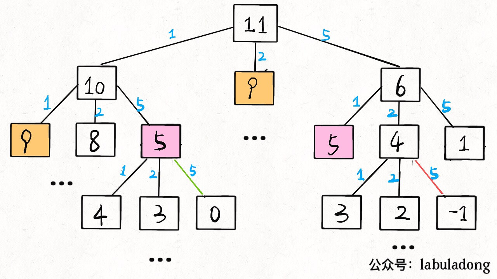

对数据结构和算法建立一个框架性的认识。

### 一、数据结构

**数据结构本质上只有两种：数组（顺序存储）、链表（链式存储）**。

数组和链表是「结构基础」，其他属于「上层建筑」。

「队列」、「栈」既可用链表也可用数组实现；

「图」的两种表示：邻接表是链表，邻接矩阵是二维数组；

「散列表」用散列函数把键映射到数组。对于散列冲突用拉链法；线性探查法用数组；

「树」，用数组实现是「堆」，「堆」是完全二叉树；用链表实现很常见，不一定是完全二叉树。

**优缺点**：

**数组**连续存储，可通过索引快速查找；如果要扩容，需重新分配空间，时间复杂度 O(N)；插入和删除的时间复杂度 O(N)。

**链表**指针指向下一个元素的地址，不存在数组的扩容问题；删除或插入时间复杂度 O(1)；不能随机访问；


### 二、数据结构的基本操作

任何数据结构的基本操作无非遍历 + 访问，再具体一点就是：增删改查。

各种数据结构的遍历 + 访问无非两种形式：线性的和非线性的。

线性时 for/while 迭代，非线性是递归。

数组遍历框架，迭代：

```java
    for (int i = 0; i < arr.length; i++) {
        // 迭代访问 arr[i]
    }
```

链表遍历框架，迭代和递归：

```java
void traverse(ListNode head) {
    for (ListNode p = head; p != null; p = p.next) {
        // 迭代访问
    }
}

void traverse(ListNode head) {
    // 递归访问 head.val
    traverse(head.next)
}
```

二叉树遍历框架，典型的非线性递归遍历结构：

```java
/* 基本的二叉树节点 */
class TreeNode {
    int val;
    TreeNode left, right;
}

void traverse(TreeNode root) {
    traverse(root.left)
    traverse(root.right)
}
```

扩展为 N 叉树遍历：

```java
/* N 叉树节点 */
class TreeNode {
    int val;
    TreeNode[] children;
}

void traverse(TreeNode root) {
    for (TreeNode child : root.children)
        traverse(child);
}
```

N 叉树又可扩展为图的遍历。图可以有环？这个容易，用布尔数组 visited 做标记就行；

### 三、刷题指南

首先明确，**数据结构是工具，算法是有合适的工具解决特定问题**。

**先刷二叉树，先刷二叉树，先刷二叉树**！**因为二叉树最容易培养框架思维，且大部分算法技巧本质上都是树的遍历**。

```java
    // 前序遍历
    // 中序遍历
    // 后序遍历
```

LeetCode 124 题，难度 Hard，求二叉树最大路径和，主要代码：

```cpp
int ans = INT_MIN;
int oneSideMax(TreeNode* root) {
    if (root == nullptr) return 0;
    int left = max(0, oneSideMax(root->left));
    int right = max(0, oneSideMax(root->right));
    ans = max(ans, left + right + root->val);
    return max(left, right) + root->val;
}
```

你看，这就是个后序遍历嘛。

LeetCode 105 题，难度 Medium，根据前序遍历和中序遍历的结果还原一棵二叉树，很经典的问题：

```java
TreeNode buildTree(int[] preorder, int preStart, int preEnd, 
    int[] inorder, int inStart, int inEnd, Map<Integer, Integer> inMap) {

    if(preStart > preEnd || inStart > inEnd) return null;

    TreeNode root = new TreeNode(preorder[preStart]);
    int inRoot = inMap.get(root.val);
    int numsLeft = inRoot - inStart;

    root.left = buildTree(preorder, preStart + 1, preStart + numsLeft, 
                          inorder, inStart, inRoot - 1, inMap);
    root.right = buildTree(preorder, preStart + numsLeft + 1, preEnd, 
                          inorder, inRoot + 1, inEnd, inMap);
    return root;
}
```

函数的参数很多，只是为了控制数组索引而已，本质上就是前序遍历。

LeetCode 99 题，难度 Hard，恢复一棵 BST，主要代码如下：

```cpp
void traverse(TreeNode* node) {
    if (!node) return;
    traverse(node->left);
    if (node->val < prev->val) {
        s = (s == NULL) ? prev : s;
        t = node;
    }
    prev = node;
    traverse(node->right);
}
```

就是个中序遍历。

Hard 难度的题目不过如此，而且有规律可循，只要把框架写出来，然后往相应的位置加东西就行，就是思路。

对于一个理解二叉树的人来说，刷一道二叉树的题目花不了多长时间。那么如果你对刷题无从下手或者有畏惧心理，不妨从二叉树下手，前 10 道也许有点难受；结合框架再做 20 道，也许你就有点自己的理解了；刷完整个专题，再去做什么回溯动规分治专题，**你就会发现只要涉及递归的问题，都是树的问题**。

再举例：[动态规划详解](https://labuladong.gitee.io/algo/)说过凑零钱问题，暴力解法就是遍历一棵 N 叉树：



```python
def coinChange(coins: List[int], amount: int):

    def dp(n):
        if n == 0: return 0
        if n < 0: return -1

        res = float('INF')
        for coin in coins:
            subproblem = dp(n - coin)
            # 子问题无解，跳过
            if subproblem == -1: continue
            res = min(res, 1 + subproblem)
        return res if res != float('INF') else -1
    
    return dp(amount)
```

这么多代码看不懂咋办？直接提取出框架，就能看出核心思路了：

```python
# 不过是一个 N 叉树的遍历问题而已
def dp(n):
    for coin in coins:
        dp(n - coin)
```

很多动态规划问题就是遍历一棵树；再看回溯算法，[回溯算法详解](https://labuladong.gitee.io/algo/)直接说了，回溯算法就是 N 叉树的前后序遍历问题，没有例外。

比如 N 皇后问题吧，主要代码如下：

```java
void backtrack(int[] nums, LinkedList<Integer> track) {
    if (track.size() == nums.length) {
        res.add(new LinkedList(track));
        return;
    }
    
    for (int i = 0; i < nums.length; i++) {
        if (track.contains(nums[i]))
            continue;
        track.add(nums[i]);
        // 进入下一层决策树
        backtrack(nums, track);
        track.removeLast();
    }

/* 提取出 N 叉树遍历框架 */
void backtrack(int[] nums, LinkedList<Integer> track) {
    for (int i = 0; i < nums.length; i++) {
        backtrack(nums, track);
}
```

N 叉树的遍历框架，找出来了;

**综上，先刷树，从框架上看问题，不要纠结于细节**。

思维很重要，[动态规划详解](https://labuladong.gitee.io/algo/)总结的找状态转移方程，按照流程写出解法。

**这就是框架的力量，能够保证你在快睡着的时候，依然能写出正确的程序；就算你啥都不会，都能比别人高一个级别。**

