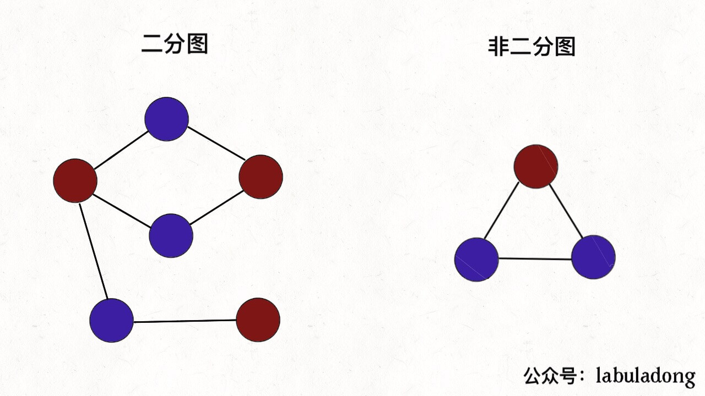
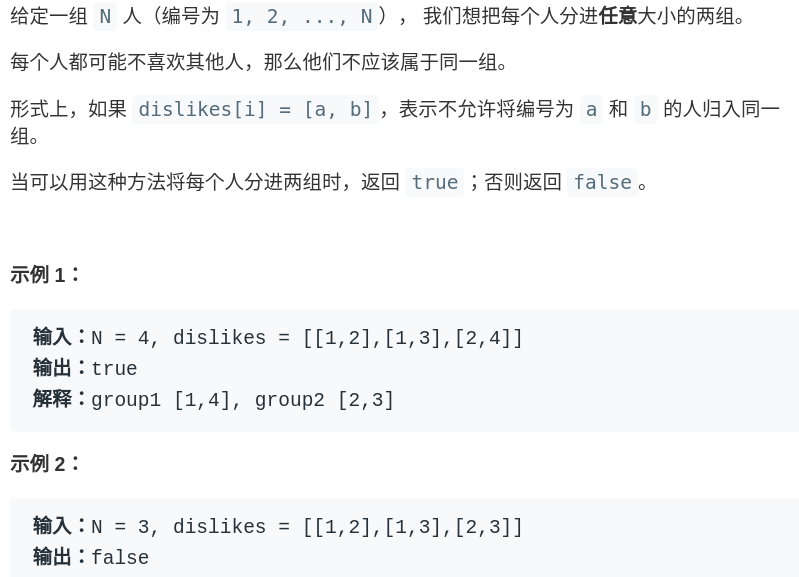
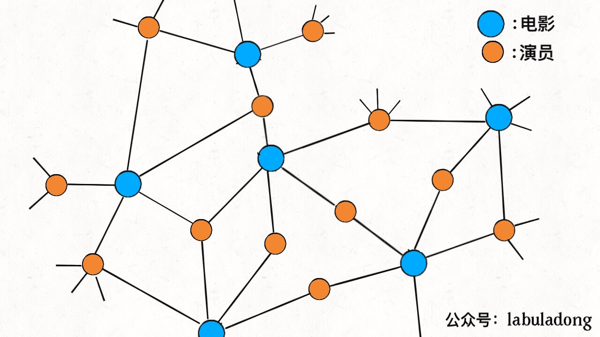
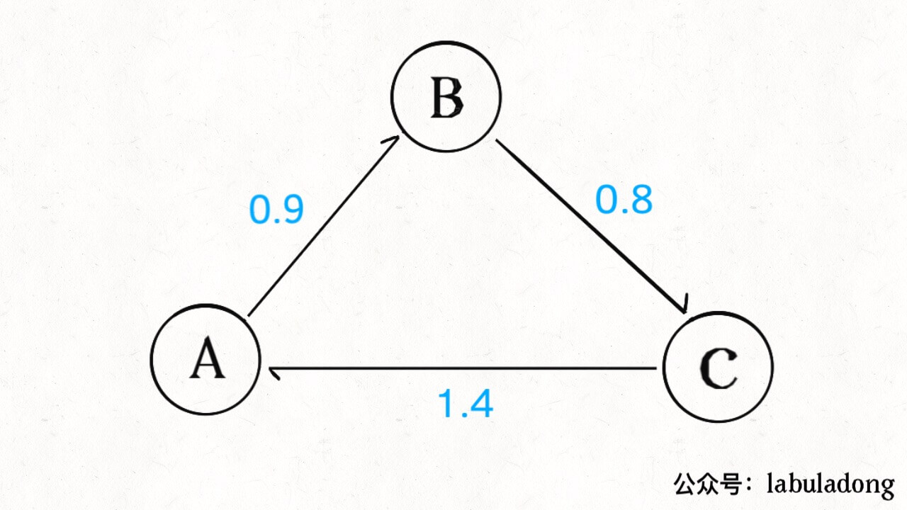

**本书适合初学者**。算法是一种思维模式，《算法4》看起来挺厚，但前几十页是 Java ；每章习题不少页；每章数学证明都可忽略。剩下的知识含金量很高，动手实践一遍，就可以达到不错的水平了。

这本书讲解详细，有大量配图，把算法和生活中的使用场景联系起来：

### 一、二分图的应用

第一个例子是**二分图**：能用两种颜色为所有顶点着色，使任何一条边的两个顶点颜色不同。

如何判定是不是二分图**。如 LeetCode 题：

你想想，如果我们把每个人视为一个顶点，边代表讨厌；相互讨厌的两个人之间连接一条边，就可以形成一幅图。那么根据刚才二分图的定义，如果这幅图是一幅二分图，就说明这些人可以被分为两组，否则的话就不行。

这是判定二分图算法的一个应用，**其实二分图在数据结构方面也有一些不错的特性**。

比如说我们需要一种数据结构来储存电影和演员之间的关系：某一部电影肯定是由多位演员出演的，且某一位演员可能会出演多部电影。你使用什么数据结构来存储这种关系呢？

既然是存储映射关系，最简单的不就是使用哈希表嘛，我们可以使用一个 `HashMap<String, List<String>>` 来存储电影到演员列表的映射，如果给一部电影的名字，就能快速得到出演该电影的演员。

但是如果给出一个演员的名字，我们想快速得到该演员演出的所有电影，怎么办呢？这就需要「反向索引」，对之前的哈希表进行一些操作，新建另一个哈希表，把演员作为键，把电影列表作为值。

对于上面这个例子，可以使用二分图来取代哈希表。电影和演员是具有二分图性质的：如果把电影和演员视为图中的顶点，出演关系作为边，那么与电影顶点相连的一定是演员，与演员相邻的一定是电影，不存在演员和演员相连，电影和电影相连的情况。

回顾二分图的定义，如果对演员和电影顶点着色，肯定就是一幅二分图：

如果这幅图构建完成，就不需要反向索引，对于演员顶点，其直接连接的顶点就是他出演的电影，对于电影顶点，其直接连接的顶点就是出演演员。

当然，对于这个问题，书中还提到了一些其他有趣的玩法，比如说社交网络中「间隔度数」的计算（六度空间理论应该听说过）等等，其实就是一个 BFS 广度优先搜索寻找最短路径的问题，具体代码实现这里就不展开了。

### 二、套汇的算法

如果我们说货币 A 到货币 B 的汇率是 10，意思就是 1 单位的货币 A 可以换 10 单位货币 B。如果我们把每种货币视为一幅图的顶点，货币之间的汇率视为加权有向边，那么整个汇率市场就是一幅「完全加权有向图」。

一旦把现实生活中的情景抽象成图，就有可能运用算法解决一些问题。比如说图中可能存在下面的情况：

图中的加权有向边代表汇率，我们可以发现如果把 100 单位的货币 A 换成 B，再换成 C，最后换回 A，就可以得到 100×0.9×0.8×1.4 = 100.8 单位的 A！如果交易的金额大一些的话，赚的钱是很可观的，这种空手套白狼的操作就是套汇。

现实中交易会有种种限制，而且市场瞬息万变，但是套汇的利润还是很高的，关键就在于如何**快速**找到这种套汇机会呢？

借助图的抽象，我们发现套汇机会其实就是一个环，且这个环上的权重之积大于 1，只要在顺着这个环交易一圈就能空手套白狼。

图论中有一个经典算法叫做 **Bellman-Ford 算法，可以用于寻找负权重环**。对于我们说的套汇问题，可以先把所有边的权重 w 替换成 -ln(w)，这样「寻找权重乘积大于 1 的环」就转化成了「寻找权重和小于 0 的环」，就可以使用 Bellman-Ford 算法在 O(EV) 的时间内寻找负权重环，也就是寻找套汇机会。

《算法4》就介绍到这里，关于上面两个例子的具体内容，可以自己去看书，**公众号后台回复关键词「算法4」就有 PDF**。

### 三、最后说几句

这也是我从来不推荐《算法导论》这本书的原因。如果有人给你推荐这本书，只可能有两个原因，要么他是真大佬，要么他在装大佬。《算法导论》中充斥大量数学证明，而且很多数据结构是很少用到的，顶多当个字典用。你说你学了那些有啥用呢，饶过自己呗。
