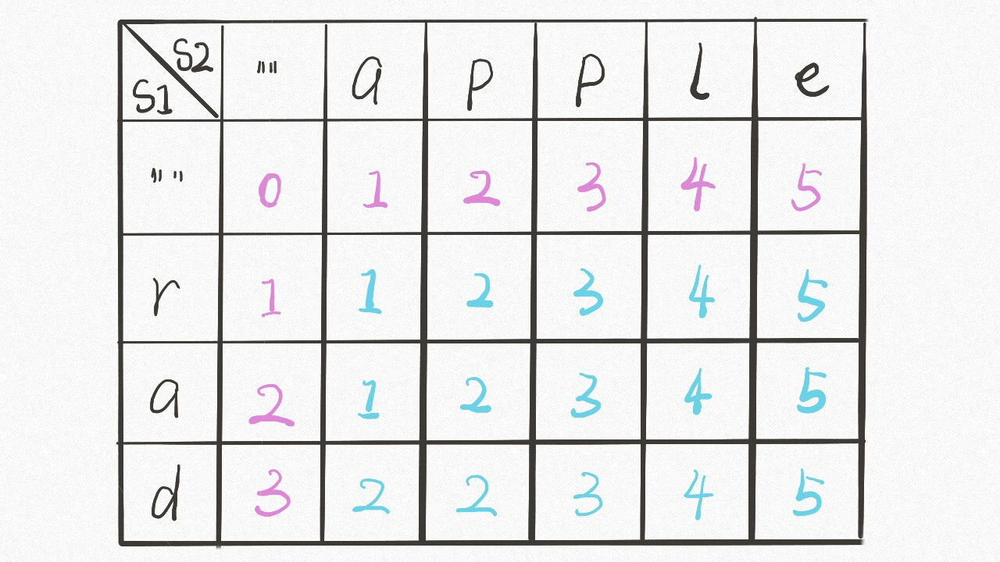

## 最长递增子序列（LIS）

[300.最长递增子序列（LIS）](https://leetcode-cn.com/problems/longest-increasing-subsequence)

```python
        dp = [1] * len(nums) # base case: 长度为1的子数组
        for i in range(len(nums)):
            for j in range(0,i):
                if nums[i] > nums[j]: # 状态转移 ---- 数学归纳法：假设 dp[0...i-1] 已知，求解 `dp[i]`
                    dp[i] = max(dp[i], dp[j] + 1)
        res = 0
        for i in range(len(dp)):
            res = max(res,dp[i])
        return res
```

[62. 不同路径](https://leetcode.cn/problems/unique-paths/)

```python
        dp = [[0] * n for _ in range(m)]
        for i in range(m): dp[i][0] = 1 # 初始化为1
        for j in range(n): dp[0][j] = 1 # 初始化为1
        for i in range(1, m):
            for j in range(1, n):
                dp[i][j] = dp[i-1][j] + dp[i][j-1] # 状态转移方程: 因为只能往下或者往右;
        return dp[-1][-1]
```

[72.编辑距离](https://leetcode-cn.com/problems/edit-distance)：




[1143.最长公共子序列](https://leetcode-cn.com/problems/longest-common-subsequence)：


[152. 乘积最大子数组](https://leetcode.cn/problems/maximum-product-subarray/)

```python
        maxRes, minRes = 1, 1        # 两负数乘积可得大正数，需同时计算“最小解”
        res = -10
        for i in range(len(nums)):
            if nums[i] < 0: 
                maxRes, minRes = minRes, maxRes # 负数: imax与imin交换, 再计算
            maxRes = max(maxRes * nums[i], nums[i])
            minRes = min(minRes * nums[i], nums[i])
            res = max(maxRes, res)
        return res
```

[53. 最大子数组和](https://leetcode.cn/problems/maximum-subarray/)

```python
	    curSum, maxSum = nums[0], nums[0]
        for n in nums[1:]:
            curSum = curSum + n if curSum > 0 else n
            maxSum = max(curSum, maxSum)
        return maxSum
```

[128. 最长连续序列](https://leetcode.cn/problems/longest-consecutive-sequence/)