### GBDT（梯度提升决策树）：

- Boosting 策略；**决策树**为基学习器；

### Boosting Tree（提升树 ）：

- **决策树**为基学习器；
- 获取新树：不断拟合残差；
- 分类用分类树；回归用回归树；
- **加法模型**（ T 为决策树）：

<a href="http://www.codecogs.com/eqnedit.php?latex=f_M(x)=\sum_{m=1}^MT(x;\Theta_m)">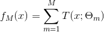</a>

- 初始化：提升树 `f_0(x)=0`，则第 m 步的模型为

- 通过最小化损失函数求解下一个决策树的参数

<a href="http://www.codecogs.com/eqnedit.php?latex=\hat{\Theta}_m=\arg\underset{\Theta_m}{\min}\sum_{i=1}^NL(y_i,{\color{Red}&space;f_{m-1}(x_i)&plus;T(x_i;\Theta_m)})">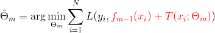</a>

- 二分类问题：提升树只需将**AdaBoost** 的基学习器限制为二叉分类树；

### 算法（提升树、Boosting Tree）：

回归：新树是通过不断拟合**残差**（residual）得到的；

- 输入：训练集 `T={(x1,y1),..,(xN,yN)}, xi ∈ R^n, yi ∈ R`
- 输出：回归提升树 `f_M(x)`

1. 初始化 `f_0(x)=0`  
1. 对 `m=1,2,..,M`

  计算**残差**

<a href="http://www.codecogs.com/eqnedit.php?latex={\color{Red}&space;r_{m,i}}=y_i-f_{m-1}(x_i),\quad&space;i=1,2,..,N">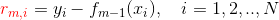</a>

  拟合残差：学习下一个回归树的参数

<a href="http://www.codecogs.com/eqnedit.php?latex=\hat{\Theta}_m=\arg\underset{\Theta_m}{\min}\sum_{i=1}^N&space;L({\color{Red}&space;r_{m,i}},{\color{Blue}&space;T(x_i;\Theta_m)})">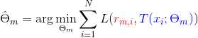</a>

  更新 `f_m(x)`

<a href="http://www.codecogs.com/eqnedit.php?latex=f_m(x)=f_{m-1}(x)&plus;T(x;\Theta_m)">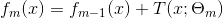</a>

  得到回归提升树

## 梯度提升(GB)算法

- 梯度提升是梯度下降的近似，用损失函数的**负梯度作为残差的近似值**，来拟合下一个决策树；
- 当损失函数为平方损失或指数损失时，每一步的优化很直观；但对于一般的损失函数不容易——梯度提升正是针对这一问题提出；

## GBDT 算法描述

- 输入：训练集 `T={(x1,y1),..,(xN,yN)}, xi ∈ R^n, yi ∈ R`；损失函数 `L(y,f(x))`；
- 输出：回归树 `f_M(x)`

1. 初始化回归树

<a href="http://www.codecogs.com/eqnedit.php?latex=f_0(x)={\color{Red}&space;\arg\underset{c}{\min}}\sum_{i=1}^NL(y_i,c)">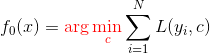</a>

1. 对 `m=1,2,..,M`

   对 `i=1,2,..,N`，计算残差/负梯度

   
<a href="http://www.codecogs.com/eqnedit.php?latex=r_{m,i}=-\frac{\partial&space;L(y_i,{\color{Red}&space;f_{m-1}(x_i)}))}{\partial&space;{\color{Red}&space;f_{m-1}(x_i)}}">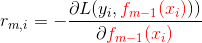</a>

   对 `r_mi` 拟合一个回归树，得到第 `m` 棵树的叶节点区域

   
<a href="http://www.codecogs.com/eqnedit.php?latex=R_{m,j},\quad&space;j=1,2,..,J">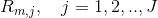</a>

   对 `j=1,2,..,J`，计算

   
<a href="http://www.codecogs.com/eqnedit.php?latex=c_{m,j}={\color{Red}&space;\arg\underset{c}{\min}}\sum_{x_i\in&space;R_{m,j}}L(y_i,{\color{Blue}&space;f_{m-1}(x_i)&plus;c})">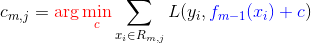</a>

   更新回归树

   
<a href="http://www.codecogs.com/eqnedit.php?latex=f_m(x)=f_{m-1}&plus;\sum_{j=1}^J&space;c_{m,j}{\color{Blue}&space;I(x\in&space;R_{m,j})}">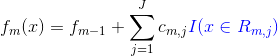</a>

   得到回归树

   
<a href="http://www.codecogs.com/eqnedit.php?latex=f_M(x)=\sum_{i=1}^M\sum_{j=1}^Jc_{m,j}{\color{Blue}&space;I(x\in&space;R_{m,j})}">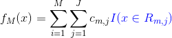</a>

- 说明：
  - 初始化，估计使损失函数最小的常数值，得到一棵只有一个根节点的树
  - 计算损失函数的负梯度，将其作为残差的估计
    - 对平方损失而言，负梯度就是残差；对于一般的损失函数，是残差的近似
  - 估计回归树的节点区域，以拟合残差的近似值
  - 用线性搜索估计叶节点区域的值，使损失函数最小化

## XGBoost 算法

> [一步一步理解GB、GBDT、xgboost](https://www.cnblogs.com/wxquare/p/5541414.html) - wxquare - 博客园 

- XGBoost 是改进的**梯度提升(GB)**算法；
  
- XGBoost 与 GB 的区别：[Introduction to Boosted Trees](http://xgboost.readthedocs.io/en/latest/model.html) — xgboost 0.72 documentation 
  
- 首先，定义一棵树 `f(x)` 为

  
<a href="http://www.codecogs.com/eqnedit.php?latex=f_t(x)&space;=&space;w_{q(x)},&space;w&space;\in&space;R^T,\quad&space;q:R^d\rightarrow&space;\{1,2,\cdots,T\}&space;.">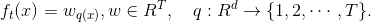</a>

  > Here `w` is the vector of scores on leaves, `q` is a function assigning each data point to the corresponding leaf, and `T` is the number of leaves.

- 对损失函数加入**正则项**，包括 L2 权重衰减和对叶子数的限制

<a href="http://www.codecogs.com/eqnedit.php?latex=\begin{aligned}&space;&L(\theta)&space;=&space;\sum_{i=1}^n&space;l(y_i,&space;\hat{y}_i^{(t)})&space;&plus;&space;\sum_{i=1}^t\Omega(f_i)&space;\\&space;\text{where}\quad&space;&\Omega(f)&space;=&space;\gamma&space;T&space;&plus;&space;\frac{1}{2}\lambda&space;\sum_{j=1}^T&space;w_j^2&space;\end{aligned}">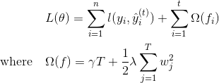</a>

- 使用**牛顿法**代替**梯度下降法**寻找最优解

  前者使用一阶+二阶导数作为残差，后者只使用了一阶导数

- 传统 CART树寻找最优切分点的标准是**最小化均方差**；

  XGBoost 通过最大化**得分公式**来寻找最优切分点：

  
<a href="http://www.codecogs.com/eqnedit.php?latex=Gain&space;=&space;\frac{1}{2}&space;\left[\frac{G_L^2}{H_L&plus;\lambda}&plus;\frac{G_R^2}{H_R&plus;\lambda}-\frac{(G_L&plus;G_R)^2}{H_L&plus;H_R&plus;\lambda}\right]&space;-&space;\gamma">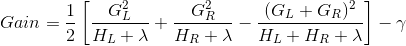</a>

  > This formula can be decomposed as 1). the score on the new left leaf 2). the score on the new right leaf 3). The score on the original leaf 4). regularization on the additional leaf.

  这也起到了“**剪枝**”作用——如果分数小于`γ`，则不会增加分支；

### XGBoost 的一些内部优化

- 在寻找最佳分割点时，传统的方法会枚举每个特征的所有可能切分点。XGBoost 实现了一种近似的算法，大致的思想是根据百分位法列举几个可能成为分割点的候选者，然后从候选者中根据上面求分割点的公式计算找出最佳的分割点。
- XGBoost 考虑了训练数据为稀疏值的情况，可以为缺失值或者指定的值指定分支的默认方向，这能大大提升算法的效率，paper 提到能提高 50 倍。
- **特征列**排序后以块的形式存储在内存中，在迭代中可以重复使用；虽然 Boosting 算法迭代必须串行，但是在处理每个特征列时可以做到并行。
- 按照**特征列**方式存储能优化寻找最佳的分割点，但是当**以行计算梯度数据**时会导致内存的不连续访问，严重时会导致 **cache miss**，降低算法效率。Paper 中提到，可先将数据收集到线程内部的 buffer，然后再计算，提高算法的效率。
- XGBoost 还考虑了数据量比较大的情况，当内存不够时怎么有效的使用磁盘，主要是结合多线程、数据压缩、分片的方法，尽可能的提高算法的效率。

# 随机森林

TODO