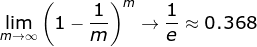

- [集成学习](#集成学习基本问题)
  - [集成学习为什么有效？](#集成学习为什么有效)
  - [集成学习的基本策略](#集成学习的基本策略)：[Boosting](#boosting-方法)、[Bagging（Booststrap AGGregatING）](#bagging-方法booststrap-aggregating)、[Stacking](#stacking-方法)
  - [为什么使用决策树作为基学习器？](#为什么使用决策树作为基学习器)
  - [Boosting/Bagging 与 偏差/方差 的关系](#boostingbagging-与-偏差方差-的关系)

### 集成学习为什么有效？

- 集成学习：将多个学习器组合成一个性能更好的学习器

- 为什么有效：不同模型在**测试集**误差不同；如果误差相互独立，集成模型将比成员表现更好；

### 策略

#### Boosting 
- **串行**：新的学习器需根据上一个学习器生成； ---> 基学习器之间存在依赖关系;
- **思路**：
  - 初始化训练集（样本权重相等）；训练基学习器；
  - 根据上一个基学习器**调整样本权重**，提高分类错误的样本权重（降低分类正确的样本权重）；
  - 迭代：训练下一个基学习器；
  - 加法模型：测试时，对各基学习器**加权**获得集成模型；
- **特点**：
  - 每次学习都用**全部训练样本**；
- **代表算法**：[AdaBoost 算法](#adaboost-算法)、[GBDT 算法](#gbdt-算法)

#### Bagging （Booststrap AGGregatING，自助采样法）

- **并行**：基学习器可同时生成；不存在依赖关系。
- **思路**：
  
  - 用**自助采样法（Booststrap）**对训练集随机采样，重复T次;
  - 基于每个采样训练集学习一个基学习器：得到 `T` 个基学习器；
  - 预测 ---- **投票表决**：
    > **自助采样法（Booststrap）**：对 m 个样本的训练集，有放回的采样 m 次 ---> 样本始终没被采样的概率为 `0.368`，即每次采样只含全部样本的 `63%` ；
    
    

  
- **特点**：
  - 每个基学习器只用部分样本；
  
  - **基学习器**：选用偏好**不稳定**的学习器（对**样本分布**敏感）；
  
    

#### Stacking 

- **串行策略**：初级学习器的输出作为次级学习器的输入（存在依赖关系）；
- **思路**：
  - 先从初始训练集训练 `T` 个**不同的初级学习器**;
  - 利用每个初级学习器的**输出**构建一个**次级数据集**；
  - 根据新的数据集训练**次级学习器**；
> 西瓜书将 Stacking 作为一种**结合策略**（而不是集成策略），如**加权平均**和**投票**都属于结合策略；

- 降低过拟合风险 ---- **交叉验证**：
  
  

### 为什么用决策树作为基学习器？
- 原因：决策树的表达能力和泛化能力，可剪枝（快速调整）；
- 决策树可方便地将**样本的权重**整合到训练过程中；（适合 Boosting 策略）
- 决策树是**不稳定**的学习器（数据样本的扰动会对决策树的结果产生较大的影响）；（适合 Bagging 策略）
### 为什么用不稳定的学习器？

- 不稳定的学习器受**样本分布**影响大（方差大），引入了**随机性**；有助于集成学习（特别是 **Bagging** 策略）提升模型的泛化能力；
- 为了引入随机性，有时会随机选择一个**属性子集**中的最优分裂属性，而不是全局最优（**随机森林**）

#### 还有哪些模型适合作为基学习器？
- **神经网络**
  - 属于**不稳定**的学习器；
  - 可改变模型的表达能力和泛化能力，**引入随机性**：调整神经元数量、网络层数，初始权重：

#### Bagging 能用线性分类器？ Boosting 呢？
- Bagging 中**不推荐**
  - 线性分类器都属于稳定的学习器（方差小） ---- 对数据扰动不敏感；
  - 甚至可能因为 Bagging 的采样，导致训练难以收敛，增大集成分类器的**偏差**
- Boosting 可以使用
  - Boosting 用降低**偏差**的方式来提升模型性能，而线性分类器本身方差小；
  - XGBoost 中就支持以线性分类器作为基学习器。

### Boosting/Bagging 与 偏差/方差 的关系
简单来说，**Boosting** 降低了**偏差**；**Bagging** 降低了**方差**；

- **Boosting** ：
  
  - 不断减小模型的**训练误差**（拟合残差/加大错类的权重），加强模型的学习能力，减小偏差；
  - 但 Boosting 不会降低方差，因为**基学习器是强相关的，缺少独立性;**
- **Bagging** ：
  
  - 对 `n` 个**独立的模型**预测值取平均，方差降为 `1/n`；
  - 假设所有基分类器出错的概率是独立的，**超过半数**基分类器出错的概率会随着基分类器的数量增加而下降。
- 关系图：
  
  

