- [信息论](#信息论)
- [逻辑斯蒂回归](#逻辑斯蒂回归)
- [支持向量机](#支持向量机)

符号说明：遵从《统计学习方法》的符号表示。

- 默认`w`为行向量，`x`为列向量，以避免用转置符号求wx；

    输入实例`x`：

    
<a href="http://www.codecogs.com/eqnedit.php?latex=x=(x^{(1)},x^{(2)},\cdots,x^{(n)})^T">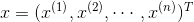</a>

    训练集：

    
<a href="http://www.codecogs.com/eqnedit.php?latex=T=\left&space;\{&space;(x_1,y_1),(x_2,y_2),\cdots,(x_N,y_N)&space;\right&space;\}">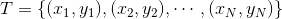</a>

    > 小`n`：特征向量维数；大`N`：训练集样本数

- **公式说明**：所有公式都可点击跳转至编辑页面；

# 信息论
> 一件不太可能发生的事发生，要比一件非常可能的事发生，提供更多的信息；
- 小概率事件信息量大；大概率事件信息量少；（极端情况）必然事件信息量为0。
- **独立事件**：投掷硬币；**两次正面朝上的信息量 = 投掷一次硬币正面朝上的信息量 × 2**；

<h3>信息熵 与 自信息</h3>

- **自信息**（self-information）：量化上述信息量；事件`x`的自信息：

    
<a href="http://www.codecogs.com/eqnedit.php?latex=I(x)=-\log&space;P(x)">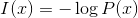</a>

    > 以自然对数 e 为底数时，单位为奈特（nats）；以 2 为底数时，单位为比特（bit）/香农（shannons）

- **信息熵**（Information-entropy）：量化整个概率分布的**不确定性**总量（自信息的数学期望）：

    
<a href="http://www.codecogs.com/eqnedit.php?latex=H(\mathrm{X})=\mathbb{E}_{\mathrm{X}&space;\sim&space;P}[I(x)]=-\sum_{x&space;\in&space;\mathrm{X}}P(x)\log&space;P(x)">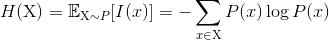</a>

    > 约定 `0log0 = 0`

<h3>交叉熵 与 相对熵/KL散度</h3>

**P 对 Q** 的 **KL 散度**（Kullback-Leibler divergence）：

<a href="http://www.codecogs.com/eqnedit.php?latex=D_P(Q)=\mathbb{E}_{\mathrm{X}\sim&space;P}\left&space;[&space;\log&space;\frac{P(x)}{Q(x)}&space;\right&space;]=\sum_{x&space;\in&space;\mathrm{X}}P(x)\left&space;[&space;\log&space;P(x)-\log&space;Q(x)&space;\right&space;]">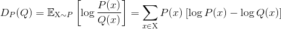</a>

- 在信息论中的物理意义：用分布Q来编码分布P的样本，平均所需的**额外的Bit数**

  

  

**性质**：

- 不对称；

- KL 散度为 0 当且仅当P 和 Q 是相同的分布；

- **非负** ---- 用[Jensen不等式](https://blog.csdn.net/qq_40406773/article/details/80630280)证明 ---- 随机变量X， ϕ 是凸函数，则 

  凸函数：
  
  证明：
  
  
  
  
  直观解释：当编码对应的分布与样本对应的分布为同一分布时，为**最优编码状态**，此时编码所需的比特数是最少的，其余方式H'(x)恒大于H(x)，所以P与Q之间的KL散度不小于0；

**交叉熵**（cross-entropy）：

<a href="http://www.codecogs.com/eqnedit.php?latex=H_P(Q)=-\mathbb{E}_{\mathrm{X}\sim&space;P}\log&space;Q(x)=-\sum_{x&space;\in&space;\mathrm{X}}P(x)\log&space;Q(x)">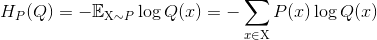</a>

- 本质：衡量两个编码方式之间的差值
- LR模型：如果用MSE，则损失函数非凸；如果用**CE，损失函数是凸函数**；
- **CE是二项分布的极大似然**；MSE是高斯分布的最大似然；

**交叉熵 与 KL 散度**

- 第1行：信息量/平均编码长度 H(p)；第2行：**交叉熵 CE**（KL散度的一项）；第3行：KL散度（前两者之差）

- 最大似然估计中，最小化 KL 散度 == 最小化分布之间的交叉熵。

> 《深度学习》 ch5.5 - 最大似然估计

# 逻辑斯蒂回归

- **二项**LR，**条件概率分布**：

[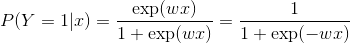](http://www.codecogs.com/eqnedit.php?latex=P(Y=1|x)=\frac{\exp(wx)}{1&plus;\exp(wx)}=\frac{1}{1&plus;\exp(-wx)})

[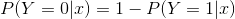](http://www.codecogs.com/eqnedit.php?latex=P(Y=0|x)=1-P(Y=1|x))
  > 省略了偏置 `b`；也可看做：扩充到了权重w中；

**其中** ：[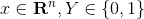](http://www.codecogs.com/eqnedit.php?latex=x\in&space;\mathbf{R}^n,Y\in&space;\left&space;\{&space;0,1&space;\right&space;\})

- 用 `σ`与跟神经网络统一：

  [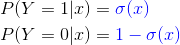](http://www.codecogs.com/eqnedit.php?latex=\begin{aligned}&space;&P(Y=1|x)={\color{Blue}&space;\sigma(x)}\\&space;&P(Y=0|x)={\color{Blue}&space;1-\sigma(x)}&space;\end{aligned})

## 推导
> [逻辑回归推导](https://www.cnblogs.com/daguankele/p/6549891.html) - 罐装可乐 - 博客园 
1. **逻辑回归**定义：

    [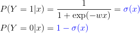](http://www.codecogs.com/eqnedit.php?latex=\begin{aligned}&space;&P(Y=1|x)={\color{Blue}&space;\sigma(x)}\\&space;&P(Y=0|x)={\color{Blue}&space;1-\sigma(x)}&space;\end{aligned})
2. **负对数**，作为损失函数：

    [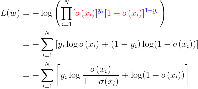](http://www.codecogs.com/eqnedit.php?latex=\begin{aligned}&space;L(w)&=-\log\left&space;(&space;\prod_{i=1}^N&space;[{\color{Red}&space;\sigma(x_i)}]^{{\color{Blue}&space;y_i}}&space;[{\color{Red}&space;1-&space;\sigma(x_i)}]^{{\color{Blue}&space;1-y_i}}&space;\right&space;)

    代入 `σ(x)` ：

    [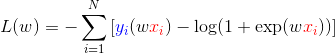](http://www.codecogs.com/eqnedit.php?latex=\begin{aligned}&space;L(w)&=-\sum_{i=1}^N&space;\left&space;[&space;{\color{Blue}&space;y_i}(w{\color{Red}&space;x_i})-\log(1&plus;\exp(w{\color{Red}&space;x_i}))
3. 梯度：最终**和(预测值和真实值的)残差成正比** ---- Sigmoid函数的优点！！！
   
    [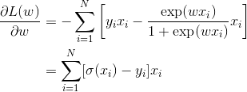](http://www.codecogs.com/eqnedit.php?latex=\begin{aligned}&space;\frac{\partial&space;L(w)}{\partial&space;w}&=-\sum_{i=1}^N&space;\left&space;[&space;y_ix_i-\frac{\exp(wx_i)}{1&plus;\exp(wx_i)}x_i&space;\right&space;]\\&space;&=\sum_{i=1}^N&space;[\sigma&space;(x_i)-y_i]x_i&space;\end{aligned})
4. 使用**梯度下降法**求解参数
   
    > 深度学习/[梯度下降法](../深度学习/README.md#梯度下降法)

## 多分类逻辑斯蒂回归模型
- 设 `Y ∈ {1,2,..K}`，则多项式逻辑斯蒂回归模型为：

    [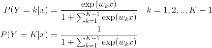](http://www.codecogs.com/eqnedit.php?latex=\begin{aligned}&space;P(Y=k|x)&=\frac{\exp(w_kx)}{1&plus;\sum_{k=1}^{K-1}&space;\exp(w_kx)}&space;\quad&space;k=1,2,..,K-1&space;\\&space;P(Y=K|x)&=\frac{1}{1&plus;\sum_{k=1}^{K-1}\exp(w_kx)}&space;\end{aligned})
- 类似 `Softmax`

# 支持向量机（SVM）

## 简述
- 支持向量机（Support Vector Machines）是二分类模型。定义在特征空间上的**间隔最大**的线性分类器；间隔最大使它有别于感知机；
- 支持向量机还包括**核技巧**，使其成为非线性分类器。
- **SVM 的学习策略 ---- 间隔最大化**，等价于正则化的**损失函数**最小化。

### 什么是支持向量
- 支持向量：训练集中与分离超平面距离最近的样本点（向量）；

  > [SVM中支持向量的通俗解释](https://blog.csdn.net/AerisIceBear/article/details/79588583) - CSDN博客 

### 支持向量机的分类
- 线性可分SVM：训练数据**线性可分**时，通过**硬间隔最大化**学习，又称**硬间隔支持向量机**。
- 线性SVM：训练数据**接近线性可分**时，通过**软间隔最大化**学习，又称**软间隔支持向量机**。
- 非线性SVM：训练数据**线性不可分**时，用**核技巧**及软间隔最大化学习。

### 核函数与核技巧
- **核函数**：将输入向量映射到新的特征空间；使线性不可分的样本可在核空间可分；

### 最大间隔超平面的原理
- 对Loss进行约束——对比 L2 正则化，则是对权重进行约束

  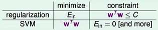
  
- 相当于**限制了模型复杂度**——防止过拟合，增强泛化能力

**符号定义**：
---
- 训练集 `T`

  ,(x_2,y_2),\cdots,(x_N,y_N)&space;\right&space;\})

- **分离超平面** `(w,b)`

  [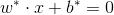](http://www.codecogs.com/eqnedit.php?latex=w^*\cdot&space;x&plus;b^*=0)

  如果使用映射函数，则分离超平面为：

  [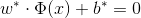](http://www.codecogs.com/eqnedit.php?latex=w^*\cdot&space;\Phi&space;(x)&plus;b^*=0)
  
  > 映射函数 `Φ(x)` ：从输入空间变换到特征空间，特征空间通常更高维；方便起见，假设 `Φ(x)` 是恒等变换；
  
- 分类决策函数 `f(x)`

  [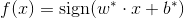](http://www.codecogs.com/eqnedit.php?latex=f(x)=\mathrm{sign}(w^*\cdot&space;x&plus;b^*))

**SVM 标准问题的推导**(2)
---

> 《统计学习方法》 & [支持向量机SVM推导及求解过程](https://blog.csdn.net/american199062/article/details/51322852#commentBox)

1. **从“函数间隔”到“几何间隔”**

    给定训练集`T`和超平面`(w,b)`，定义**函数间隔`γ^`**：

    [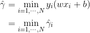](http://www.codecogs.com/eqnedit.php?latex=\begin{aligned}&space;\hat{\gamma}&=\underset{i=1,\cdots,N}{\min}\,y_i(wx_i&plus;b)&space;\\&space;&=\underset{i=1,\cdots,N}{\min}\,\hat{\gamma}_i\end{aligned})

    对 `w` 规范化，函数间隔成为**几何间隔`γ`**

    [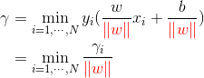](http://www.codecogs.com/eqnedit.php?latex=\begin{aligned}&space;\gamma&=\underset{i=1,\cdots,N}{\min}\,y_i(\frac{w}{{\color{Red}&space;\left&space;\|&space;w&space;\right&space;\|}}x_i&plus;\frac{b}{{\color{Red}&space;\left&space;\|&space;w&space;\right&space;\|}})\\&space;&=\underset{i=1,\cdots,N}{\min}\,\frac{\gamma_i}{{\color{Red}&space;\left&space;\|&space;w&space;\right&space;\|}}&space;\end{aligned})

1. **最大化几何间隔**

    &space;\geq&space;\gamma,\quad&space;i=1,2,\cdots,N&space;\end{aligned})

    由函数间隔与几何间隔的关系，等价于

    [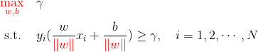](http://www.codecogs.com/eqnedit.php?latex=\begin{aligned}&space;&\underset{w,b}{\max}&space;\quad{\color{Red}&space;\frac{\hat{\gamma}}{\left&space;|&space;w&space;\right&space;|}}&space;\&space;&&space;\mathrm{s.t.}\quad,&space;y_i(wx_i&plus;b)&space;\geq&space;{\color{Red}&space;\hat{\gamma}},\quad&space;i=1,2,\cdots,N&space;\end{aligned})
    
    函数间隔`γ^`的取值不会影响最终的超平面`(w,b)`：取`γ^=1`；又最大化 `1/||w||` 等价于最小化`1/2*||w||^2`，于是有

    [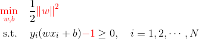](http://www.codecogs.com/eqnedit.php?latex=\begin{aligned}&space;&{\color{Red}&space;\underset{w,b}{\max}&space;}&space;\quad\frac{\hat{\gamma}}{{\color{Red}&space;\left&space;\|&space;w&space;\right&space;\|}}&space;\\&space;&\&space;\mathrm{s.t.}\quad\,&space;y_i(wx_i&plus;b)&space;\geq&space;\hat{\gamma}_i,\quad&space;i=1,2,\cdots,N&space;\end{aligned})
    > 为什么令`γ^=1`？——比例改变`(ω,b)`，超平面不会改变，但函数间隔`γ^`会成比例改变，因此可以通过等比例改变`(ω,b)`使函数间隔`γ^=1`
    
- 该约束最优化问题即为**线性支持向量机**的标准问题——是**凸二次优化**问题；

  理论上，线性 SVM 的问题已经解决了；但在高等数学中，**带约束的最优化问题**还可以用另一种方法求解——**拉格朗日乘子法**。优点（1）更容易求解，（2）自然引入**核函数**，进而推广为非线性。

**SVM 对偶算法的推导**(5)
---
1. 构建**拉格朗日函数**

    [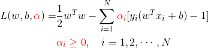](http://www.codecogs.com/eqnedit.php?latex=\begin{aligned}&space;L(w,b,{\color{Red}&space;\alpha})=&\frac{1}{2}w^Tw-\sum_{i=1}^N{\color{Red}&space;\alpha_i}[y_i(w^Tx_i&plus;b)-1]\\&space;&{\color{Red}&space;\alpha_i&space;\geq&space;0},\quad&space;i=1,2,\cdots,N&space;\end{aligned})
    
1. 标准问题是求极小极大问题：

    [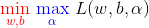](http://www.codecogs.com/eqnedit.php?latex=\begin{aligned}&space;{\color{Red}&space;\underset{w,b}{\min}}\&space;{\color{Blue}&space;\underset{\alpha}{\max}}\&space;L(w,b,\alpha)&space;\end{aligned})

    其对偶问题为：

    [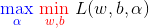](http://www.codecogs.com/eqnedit.php?latex=\begin{aligned}&space;{\color{Blue}&space;\underset{\alpha}{\max}}\&space;{\color{Red}&space;\underset{w,b}{\min}}\&space;L(w,b,\alpha)&space;\end{aligned})
    
1. 求 `L` 对 `(w,b)` 的极小

    [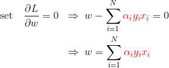](http://www.codecogs.com/eqnedit.php?latex=\begin{aligned}&space;\mathrm{set}\quad&space;\frac{\partial&space;L}{\partial&space;w}=0&space;\;\;&\Rightarrow\;&space;w-\sum_{i=1}^N&space;{\color{Red}&space;\alpha_i&space;y_i&space;x_i}=0\\&space;&\Rightarrow\;&space;w=\sum_{i=1}^N&space;{\color{Red}&space;\alpha_i&space;y_i&space;x_i}&space;\end{aligned})

    [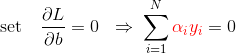](http://www.codecogs.com/eqnedit.php?latex=\begin{aligned}&space;\mathrm{set}\quad&space;\frac{\partial&space;L}{\partial&space;b}=0&space;\;\;&\Rightarrow\;&space;\sum_{i=1}^N&space;{\color{Red}&space;\alpha_i&space;y_i}=0&space;\end{aligned})

    结果代入`L`，有：

    [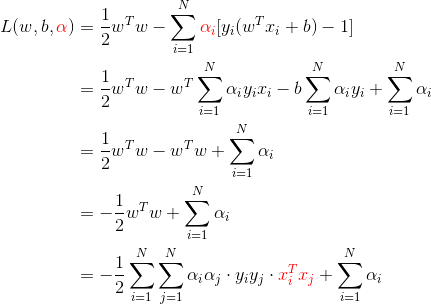](http://www.codecogs.com/eqnedit.php?latex=\begin{aligned}&space;L(w,b,{\color{Red}&space;\alpha})&space;&=\frac{1}{2}w^Tw-\sum_{i=1}^N{\color{Red}&space;\alpha_i}[y_i(w^Tx_i&plus;b)-1]\\&space;&=\frac{1}{2}w^Tw-w^T\sum_{i=1}^N&space;\alpha_iy_ix_i-b\sum_{i=1}^N&space;\alpha_iy_i&plus;\sum_{i=1}^N&space;\alpha_i\\&space;&=\frac{1}{2}w^Tw-w^Tw&plus;\sum_{i=1}^N&space;\alpha_i\\&space;&=-\frac{1}{2}w^Tw&plus;\sum_{i=1}^N&space;\alpha_i\\&space;&=-\frac{1}{2}\sum_{i=1}^N\sum_{j=1}^N&space;\alpha_i\alpha_j\cdot&space;y_iy_j\cdot&space;{\color{Red}&space;x_i^Tx_j}&plus;\sum_{i=1}^N&space;\alpha_i&space;\end{aligned})

    即

    [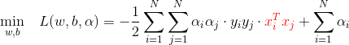](http://www.codecogs.com/eqnedit.php?latex=\begin{aligned}&space;L(w,b,{\color{Red}&space;\alpha})&space;&=\frac{1}{2}w^Tw-\sum_{i=1}^N{\color{Red}&space;\alpha_i}[y_i(w^Tx_i&plus;b)-1]\\&space;&=\frac{1}{2}w^Tw-w^T\sum_{i=1}^N&space;\alpha_iy_ix_i-b\sum_{i=1}^N&space;\alpha_iy_i&plus;\sum_{i=1}^N&space;\alpha_i\\&space;&=\frac{1}{2}w^Tw-w^Tw&plus;\sum_{i=1}^N&space;\alpha_i\\&space;&=-\frac{1}{2}w^Tw&plus;\sum_{i=1}^N&space;\alpha_i\\&space;&=-\frac{1}{2}\sum_{i=1}^N\sum_{j=1}^N&space;\alpha_i\alpha_j\cdot&space;y_iy_j\cdot&space;{\color{Red}&space;x_i^Tx_j}&plus;\sum_{i=1}^N&space;\alpha_i&space;\end{aligned})
    
1. 求 `L` 对 `α` 的极大，即

    [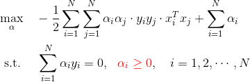](http://www.codecogs.com/eqnedit.php?latex=\begin{aligned}&space;&\underset{\alpha}{\max}&space;\quad&space;-\frac{1}{2}\sum_{i=1}^N\sum_{j=1}^N&space;\alpha_i\alpha_j\cdot&space;y_iy_j\cdot&space;x_i^Tx_j&plus;\sum_{i=1}^N&space;\alpha_i\\&space;&\&space;\mathrm{s.t.}\quad\;&space;\sum_{i=1}^N&space;\alpha_i&space;y_i=0,\&space;\&space;{\color{Red}&space;\alpha_i&space;\geq&space;0},\quad&space;i=1,2,\cdots,N&space;\end{aligned})

    该问题的对偶问题为：

    [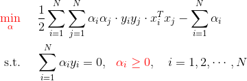](http://www.codecogs.com/eqnedit.php?latex=\begin{aligned}&space;&{\color{Red}&space;\underset{\alpha}{\min}&space;}&space;\quad\&space;\frac{1}{2}\sum_{i=1}^N\sum_{j=1}^N&space;\alpha_i\alpha_j\cdot&space;y_iy_j\cdot&space;x_i^Tx_j-\sum_{i=1}^N&space;\alpha_i\\&space;&\&space;\mathrm{s.t.}\quad\;&space;\sum_{i=1}^N&space;\alpha_i&space;y_i=0,\&space;\&space;{\color{Red}&space;\alpha_i&space;\geq&space;0},\quad&space;i=1,2,\cdots,N&space;\end{aligned})

    于是，标准问题最后等价于求解该**对偶问题**

    > 继续求解该优化问题，有 [SMO 方法](https://blog.csdn.net/ajianyingxiaoqinghan/article/details/73087304#t11)；因为《统计学习方法》也只讨论到这里，故推导也止于此

1. 设 `α` 的解为 `α*`，则存在下标`j`使`α_j > 0`，可得标准问题的解为：

    [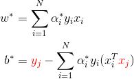](http://www.codecogs.com/eqnedit.php?latex=\begin{aligned}&space;w^*&=\sum_{i=1}^N&space;\alpha_i^*y_ix_i\\&space;b^*&={\color{Red}&space;y_j}-\sum_{i=1}^N&space;\alpha_i^*y_i(x_i^T{\color{Red}&space;x_j})&space;\end{aligned})
    
    可得分离超平面及分类决策函数为：

    

    =\mathrm{sign}(w^*\cdot&space;x&plus;b^*))
