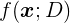
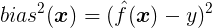
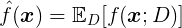
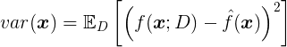
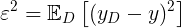
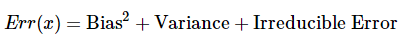
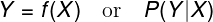
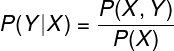
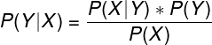

- [偏差与方差](#偏差与方差)
- [生成模型与判别模型](#生成模型与判别模型)
- [先验概率与后验概率](#先验概率与后验概率)

## 偏差与方差

> 《机器学习》 2.5 偏差与方差 - 周志华
**偏差**：模型**预测值**与**真实值**之差的期望；衡量了模型的**拟合能力**；

### 计算公式

- 模型

  

- **偏差**（Bias）

  > **偏差**：预测值与真实结果的偏离程度，即：算法的拟合能力；

- **方差**（Variance）：

  - 1. **期望**（平均值）

  

  - 2. **方差**（Variance）

  

  > **方差**：模型的稳定性 ---- 数据扰动所造成的影响；

- **噪声**：对于任务 T，学习算法 A 能达到的期望泛化误差的下界，刻画了学习问题本身的难度；

- “**偏差-方差分解**”表明：模型的泛化能力由**算法复杂度、数据的充分性、任务本身的难度**共同决定。

**方差**：模型预测的**期望值**与**预测值**之差的平方和；衡量了模型的**稳定性**；

- 监督学习中，模型的**泛化误差** = 偏差 + 方差 + 噪声（如下方图1）
  

**偏差和方差的原因：**

- **偏差**：模型复杂度不够；对学习算法做了**错误的假设**；
  - **欠拟合（偏差大）**：真实模型是二次函数，而假设模型为一次函数；
  - 体现在**训练误差**上；
- **方差**：**模型复杂度过高(拟合能力强，偏差小)**；
  - **过拟合(方差大**；**测试/泛化误差大**)：真实模型是二次函数，而假设模型是高次函数；用**正则化方法**避免；

### 偏差与方差的权衡（模型复杂度的权衡）
- 给定学习任务 T，
  - **拟合能力不够**（数据的扰动不会使模型显著变化）：**偏差**主导模型的泛化误差；
  - 随着模型**拟合能力增强**（能够学习数据发生的扰动）：**方差**逐渐主导模型的泛化误差；
  - 当模型**拟合能力过强**（数据的轻微扰动都会导致模型的显著变化）：发生**过拟合**；

- **模型容量**（模型复杂度）、**欠拟合**、**过拟合**：

  - 当模型容量增大（x 轴）， 偏差减小，而方差增大

**Reference**
- [Understanding the Bias-Variance Tradeoff](http://scott.fortmann-roe.com/docs/BiasVariance.html)

- [机器学习中的Bias(偏差)，Error(误差)，和Variance(方差)有什么区别和联系？](https://www.zhihu.com/question/27068705) - 知乎 

  

## 生成模型与判别模型
- 监督学习模型：**决策函数**或**条件概率分布**（后验概率）：

  

  - **决策函数**：输入 X ，返输出Y；分类任务：与**阈值**比较，判定 X 所属类别；
  - **条件概率分布**：输入 X ，输出**X 属于每个类别的概率**；将概率最大类的作为 X 所属类别；
- 监督学习：**生成模型**与**判别模型**
  - **判别模型**：直接学习决策函数或条件概率分布；直观理解：模型是不同类别的最优分隔面；
  - **生成模型**：学习联合概率分布`P(X,Y)`，根据条件概率公式计算 `P(Y|X)`
    
    

**区别与联系**

- 存在“**隐变量**”时，只能用**生成模型**：存在隐变量 z 时，**生成模型**学习的是隐变量 z 与样本特征的联合概率分布 P(x, z) ;

  > 隐变量：找不到引起某一现象的原因时，就把无法确定的因素叫“隐变量”

- **生成模型**需要的样本量大（在统计学上有意义的数量）；**判别模型**学习决策边界所需的样本较少；

- 特征处理：**判别模型**可对样本特征抽象，如**特征降维，特征交叉**（显式构造新特征）；

- 由生成模型可得判别模型，但由判别模型得不到生成模型。

**优缺点**

- **判别模型**
  - 优点
    - 直接面对预测，准确率更高
    - 直接学习 `P(Y|X)` 或 `f(X)`，可对数据进行各种程度的抽象，定义特征并使用特征，简化学习过程
  - 缺点
    - 不能反映训练数据本身的特性
- **生成模型**
  - 优点
    - 可还原出联合概率分布 `P(X,Y)`
    - 收敛速度更快
  - 缺点
    - 学习和计算过程比较复杂

**常见模型**

- 判别模型
  - K 近邻、感知机（神经网络）、决策树、逻辑斯蒂回归、**最大熵模型**、SVM、提升方法、**条件随机场**
- 生成模型
  - 朴素贝叶斯、隐马尔可夫模型、混合高斯模型、贝叶斯网络、马尔可夫随机场

**Reference**
- [机器学习---生成模型与判别模型](https://blog.csdn.net/u012101561/article/details/52814571) - CSDN博客 

**贝叶斯公式**

  

- **条件概率**（**似然**函数）：`P(X|Y)`

- **先验概率**： `P(X)`；可基于历史数据的统计，也可根据人的主观观点；

- **后验概率**：`P(Y|X)`；**反向条件概率**；在事件X发生后，对事件Y的概率重新评估;

> [先验概率，后验概率，似然概率，条件概率，贝叶斯，最大似然](https://blog.csdn.net/suranxu007/article/details/50326873) - CSDN博客 
