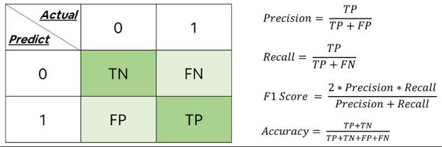

- [余弦相似度（Cos距离）与欧氏距离](#余弦相似度cos距离与欧氏距离)
- [监督学习和无监督学习](#监督学习和无监督学习)
- [熵](#熵求投掷均匀正六面体骰子的熵)
- [评价指标：准确率、精确率、召回率、F1 值等](#混淆矩阵模型度量指标准确率精确率召回率f1-值等)
- [缺失值处理](#如何处理数据中的缺失值)
- [介绍一个完整的机器学习项目流程](#介绍一个完整的机器学习项目流程)

    


## 余弦相似度（Cos距离）与欧氏距离
- 向量空间：欧式距离衡量两点之间的**直线距离**，余弦相似度是向量**夹角**
- **没有归一化时**，欧式距离范围 (0, +∞]，余弦相似度范围 (0, 1]；余弦距离是**相似程度**，而欧氏距离是值的**相同程度**；
- **归一化的情况下**，将空间想象成超球面（三维），欧氏距离是球面上两点的直线距离，余弦值是两点的球面距离，本质上一样；（二维平面想象成圆，欧氏距离是圆周上两点的直线距离，余弦值是两点间的弧长，本质上一样）

## 评估指标（准确率、精确率、召回率、F1 值）

**混淆矩阵**

- True Positive(TP)：正类预测为正类；True Negative(TN)：负类预测为负类.
- False Positive(**FP**)：负类预测为正类 → **误报 (Type I error)**；False Negative(**FN**)：正类预测为负类 → **漏报 (Type II error)**.

    <div align="center"></div>

> **正负样本不平衡**时，准确率有很大的缺陷。如推荐系统：点击数很少，一般只有千分之几，如用acc，即使全部预测成负类，acc 也有 99%，没意义。

### 缺失值处理 ----  2 种情况：

1. **缺失值较多**
   
    - 直接舍弃该列特征，否则可能带来较大的噪声；
1. **缺失值较少**（<10%），填充：

    1. **异常值**填充（比如 0），

        ` data.fillna(0) `

    1. **均值**|**条件均值**填充
       
        > 如果数据不平衡，用条件均值填充 ---- 含缺失值的样本标签相同的样本均值
        >

        `data.fillna(data.mean())`

    1. 相邻数据填充

        ```
        data.fillna(method='pad') # 用前一个数据填充
        data.fillna(method='bfill') # 用后一个数据填充
        ```
        
    1. 插值

        `data.interpolate()`

    1. 拟合
       
        > 将缺失值也作为一个预测问题：将数据分为正常数据和缺失数据，对有值的数据用监督模型拟合，预测缺失数据；


## 完整的ML流程
1. 数学抽象：明确任务目标 ---- 分类？回归？聚类？

1. 预处理、特征工程

    - 预处理/数据清洗 ---- 归一化、离散化、因子化、缺失值处理、去除共线性；这些工作简单可复制，效果稳定；

    - 特征选择 ---- 筛选出显著特征；特征分析： **相关系数、卡方检验、平均互信息、条件熵、后验概率、逻辑回归权重**；

1. 模型训练、调参（超参数）

1. 模型诊断：交叉验证，绘制学习曲线等

    - 过拟合：增加数据量，降低模型复杂度；

    - 欠拟合：增加特征数量、模型复杂度；

1. 模型融合/集成

    分别在模型的前端（特征清洗、预处理、采样模式）与后端（模型融合）。方法标准可复制，效果稳定。

