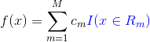
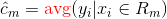
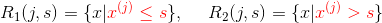
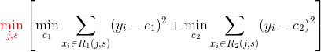
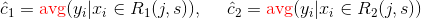
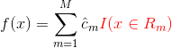
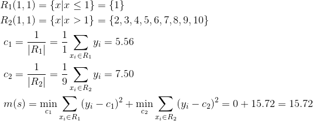
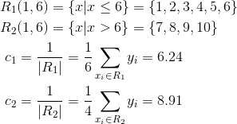
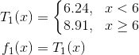

- 训练过程：**特征选择**、**树的生成**、**剪枝**。

- ID3和 C4.5**区别**：前者的特征选择用**信息增益**，后者用**信息增益比**;
- CART 算法：给定输入变量 _`X`_ ，输出 _`Y`_ 的**条件概率分布**。 

- CART 可用于：分类 + 回归；**回归树用**平方误差最小化**准则来选择特征；分类树用**基尼指数最小化**准则；

### CART 回归树

- 一个回归树对应着输入空间/**特征空间**的一个**划分**以及在划分单元上的**输出值**；

- 假设已将输入空间划分为 `M` 个单元：`{R_1,..,R_m,..,R_M}`，并在每个单元上对应有输出值 `c_m`，则该回归树可表示为

  

  > `I(x)` 为指示函数

- **如果已经划分好了输入空间**，通常使用**平方误差**作为损失函数来表示回归树对于训练数据的预测误差，通过最小化损失函数来求解每个划分单元的**最优输出值**。

- 如果使用**平方误差**，易知**最优输出值**即每个划分单元上所有实例的均值

  

  > 选用**平方误差**作为损失的原因

<h3>如何划分输入空间</h3>

- 一个启发式方法是：**以特征向量中的某一个特征为标准进行切分**。

  假设选择**特征向量中第 `j` 个变量**作为**切分变量**，然后选择**某个实例中第 `j` 个值 `s`** 作为**切分点**，则定义如下两个划分单元

  

  > 原书中这里表述不够清楚，需要结合 8.4.2 节中的示例一起看。

- 遍历**每个实例**的第`j`个值`s`，选择满足以下条件的作为**最优切分变量`j`和切分点`s`**

  

  其中输出值 `c1` 和 `c2` 分别为

  

  > 示例: [选择切分变量与切分点](#示例-选择切分变量与切分点)

- 接着，继续对两个子空间重复以上步骤，直到满足条件为止；得到将输入空间划分为`M`个区域的决策树

  

### 示例: 选择切分变量与切分点

> 《统计学习方法》 8.4.2

- 训练集

| x_i  | 1    | 2    | 3    | 4    | 5    | 6    | 7    | 8    | 9    | 10   |
| ---- | ---- | ---- | ---- | ---- | ---- | ---- | ---- | ---- | ---- | ---- |
| y_i  | 5.56 | 5.70 | 5.91 | 6.40 | 6.80 | 7.05 | 8.90 | 8.70 | 9.00 | 9.05 |

- 这里只有一个特征，即`j=1`；然后遍历每个实例的值作为**切分点**

  `s = {1, 2, 3, 4, 5, 6, 7, 8, 9}`

  > 原书使用的切分点为 `{1.5, 2.5, 3.5, 4.5, 5.5, 6.5, 7.5, 8.5, 9.5}`，即相邻两个点的均值；因为切分点并没有参与运算，所以我觉得两者没有区别；
  >
  > 最后一个点无法将数据划分为两个空间，所以不需要

- 以 `s=1` 为例

  
<a href="http://www.codecogs.com/eqnedit.php?latex=\begin{aligned}&space;&R_1(1,1)=\{x|x\le&space;1\}=\{1\}\\&space;&R_2(1,1)=\{x|x>1\}=\{2,3,4,5,6,7,8,9,10\}\\&space;&\&space;c_1=\frac{1}{|R_1|}=\frac{1}{1}\sum_{x_i\in&space;R_1}y_i=5.56\\&space;&\&space;c_2=\frac{1}{|R_2|}=\frac{1}{9}\sum_{x_i\in&space;R_2}y_i=7.50\\&space;&\&space;m(s)=\underset{c_1}{\min}\sum_{x_i\in&space;R_1}(y_i-c_1)^2&plus;\underset{c_2}{\min}\sum_{x_i\in&space;R_2}(y_i-c_2)^2=0&plus;15.72=15.72&space;\end{aligned}"></a>

  所有 `m(s)` 的计算结果如下

  | s    | 1     | 2     | 3    | 4    | 5    | 6    | 7    | 8     | 9     |
  | ---- | ----- | ----- | ---- | ---- | ---- | ---- | ---- | ----- | ----- |
  | m(s) | 15.72 | 12.07 | 8.36 | 5.78 | 3.91 | 1.93 | 8.01 | 11.73 | 15.74 |

- 当 `s=6` 时 `m(s)` 达到最小值，此时

<a href="http://www.codecogs.com/eqnedit.php?latex=\begin{aligned}&space;&R_1(1,6)=\{x|x\le&space;6\}=\{1,2,3,4,5,6\}\\&space;&R_2(1,6)=\{x|x>6\}=\{7,8,9,10\}\\&space;&\&space;c_1=\frac{1}{|R_1|}=\frac{1}{6}\sum_{x_i\in&space;R_1}y_i=6.24\\&space;&\&space;c_2=\frac{1}{|R_2|}=\frac{1}{4}\sum_{x_i\in&space;R_2}y_i=8.91\\&space;\end{aligned}"></a>

- 所以第一棵决策树为

  

