从偏数学的角度来理解NN（假设对NN没有任何背景知识），整理自“**3Blue1Brown - 深度学习系列视频**”三个视频：

- [神经网络的结构](https://www.bilibili.com/video/av15532370)
- [梯度下降法](https://www.bilibili.com/video/av16144388)
- [反向传播算法](https://www.bilibili.com/video/av16577449)

**目录**
---
- [神经网络的结构](#神经网络的结构)
- [梯度下降法](#梯度下降法)
- [反向传播算法（Backpropagation Algorithm, BP）](#反向传播算法backpropagation-algorithm-bp)

# 神经网络（NN）

**示例：手写数字识别NN**（DL领域的 "Hello World".）

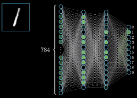

**神经元（隐藏单元）**

  > 输入层也是一组神经元，激活值是输入本身

输入：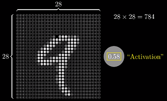

重排（拉平）：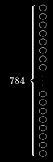

  > NN只能处理向量型输入，所以 28*28 的像素图（矩阵），重排为 784 维向量
  >

- 分类：**输出层**的激活值代表属于该类别的概率
  
  > 如：用 `softmax` 函数，输出每个类别的概率值
  
  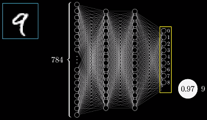

**隐藏层**
- 输入层与输出层之间的网络层

    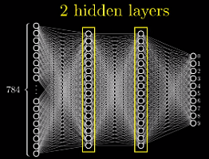

## 神经网络的机制
- NN运作的时候，将隐藏层视为“黑箱”
- 前向传播：用每一层的激活值计算下一层的激活值

    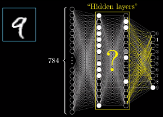

**为什么NN的分层结构能起作用？**
---
- 人是如何初识数字？——**组合**数字的各个部分

    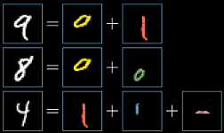

- **理想情况下**，NN倒数第二层的各隐藏单元对应数字的**基本笔画（pattern）**

    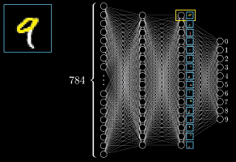

- 类似的，基本笔画也可由更基础的部件构成

    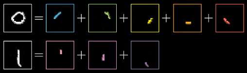
    
    > 从输入层到输出层，**网络的抽象程度越来越高**
    

DL本质：组合简单的概念来表达复杂的事物**
---
- NN是否这么做，不得而知（“黑箱”），但大量实验表明：NN在做类似的工作——**组合简单的概念来表达复杂的事物**

    
    
    > 例 ---- 语音识别：原始音频 → 音素 → 音节 → 单词

**隐藏单元如何被激活？**
---
- 我们需要设计一个机制，这个机制能够把像素拼成边，把边拼成基本图像，把基本图像拼成数字
- 这个机制的基本处理方式是：通过上一层的单元激活下一层的单元

### 权重和偏置
> 网络参数：权重、偏置

  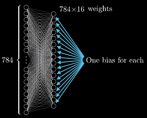
  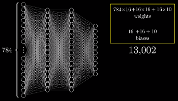

  > 每一层都有权重与偏置，网络有 13002 个参数

## 非线性激活函数
**万能近似定理**

- NN如有至少一个非线性层，只要给予网络足够的隐藏单元，就可以任意精度来近似任何函数；
- 这极大的扩展了NN的表示空间
  

**激活函数——线性整流单元 ReLU**
---
sigmoid 的问题 ----- **饱和现象**：输入是非常大的正值或负值时，函数对输入的微小改变不敏感（斜率接近 0）
- 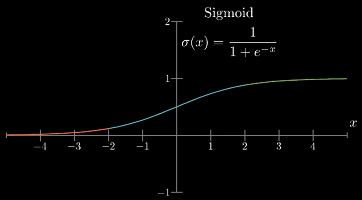

- 饱和现象导致**基于梯度的学习**困难，丢失信息（**梯度消失**）；

**线性整流单元 ReLU**

- [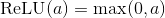](http://www.codecogs.com/eqnedit.php?latex=\text{ReLU}(a)=\max(0,a))

    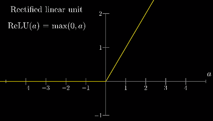

- 优点：使NN更容易训练（**减缓梯度消失**）

# 梯度下降法（Gradient Descent）

- 训练过程：求解微积分问题，寻找函数的（局部）最小值

## 损失函数（Loss Function）
- 显然，随机初始化不会有多好的表现
- 此时需要定义一个“**损失函数**”来告诉计算机：正确的输出应该只有标签对应的那个神经元是被激活的

  - 当网络分类正确时，损失值就越小，如“均方误差”（mean-square error, MSE）
- 用**所有训练样本**的平均损失来评价网络在任务T上的“**糟糕程度**”
  > 在实践中，并不会每次都使用所有训练样本的平均损失来调整梯度 => 随机梯度下降
  >

  实际上**神经网络学习的过程，就是最小化损失函数的过程**

## **如何优化网络参数？**

**只有一个参数的情况**

- 如果函数只有一个极值点，直接用微积分

  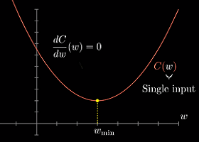
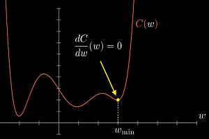
  
- **局部极小值** ----- **启发式思路**：先随机选择一个值；再考虑向左/右使函数值减小（斜率为正就左移，反之右移）；重复上述过程；

**考虑两个参数**

- 输入空间是 XY 平面，代价函数是平面上方的曲面

  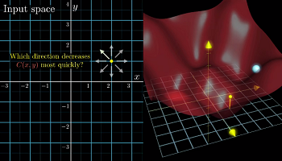
  
- **多元微积分**：

  函数**梯度**指向“**最陡**”增长方向，沿着梯度的方向增长最快；**沿梯度的负方向，函数值下降最快**；

- 直观来看：函数值最终收敛到损失函数图像中的某个“坑”；

  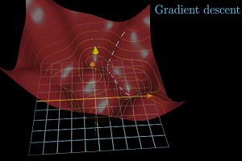

**反向传播算法（BP）**

- GD是寻找局部最小值；计算**损失函数 `L(θ)` 的梯度**，更新网络参数 `θ`

- **反向传播BP**：求解函数梯度；用**链式法则**对每个参数求偏导；

**批大小（batch size）**：

- **较大的批：更精确的梯度估计**
- **较小的批：更好的泛化能力**，泛化误差在批大小为 1 时最好；但梯度估计的**方差大**，需**减小学习率**以保持稳定，**训练时间更长**。
  
  > 原因：小批量可能会引入噪声，有正则化效果 (Wilson and Martinez, 2003)

## 推荐阅读
- Neural Networks and Deep Learning: http://neuralnetworksanddeeplearning.com/
- Chris Olah's blog: http://colah.github.io/
  - [Neural Networks, Manifolds, and Topology](http://colah.github.io/posts/2014-03-NN-Manifolds-Topology/)
  - [Understanding LSTM Networks](http://colah.github.io/posts/2015-08-Understanding-LSTMs/)
- Distill — Latest articles about machine learning https://distill.pub/

# 反向传播算法（BP）

- 阐述 BP 之前，记住[梯度的另一种理解方式](#221-理解梯度下降法的另一种思路不借助空间图像)——

  **梯度向量中的每一项：不仅表示每个参数该增大/减小，还表示调整每个参数的“性价比”**

  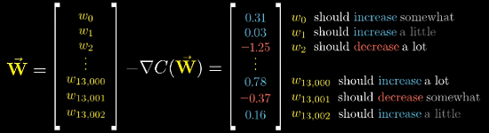

**例：单个训练样本，对参数调整的影响**

- 假设现在网络还没有训练好：输出层的激活值会很随机

- 希望：正确类别对应的激活值应该增大，其他的减小

  > 注：激活值由输入值、权重、偏置决定；NN只改变权重和偏置；

- **直觉**：激活值**变动程度**应该与**当前值和目标值的残差**成正比；

  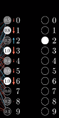
  
- 激活值的计算：

  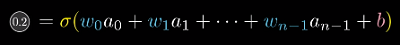
  
- 以 "2" 神经元为例，如需**增大激活值**，可以：
  1. 增大偏置
  1. 增大权重
  1. 调整上一层的激活值

### 相关代码
- mnielsen/neural-networks-and-deep-learning/[network.py](https://github.com/mnielsen/neural-networks-and-deep-learning/blob/master/src/network.py)

## 反向传播的微积分原理

- BP本质上是**用链式法则求导**：

**例：NN每层只有一个神经元**

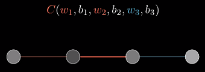

- 从最后两个神经元开始：记最后的激活值 `a^(L)` ，上层的激活值 `a^(L-1)`；

  给定一个训练样本，目标值记 `y`；

  网络对于单个训练样本的 Loss： [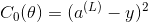](http://www.codecogs.com/eqnedit.php?latex=C_0(\theta)=(a^{(L)}-y)

  其中：

  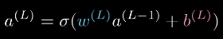

  记加权和 `z`：

  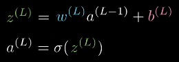

  整个流程：

  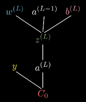
  - 注：最后用 `a` 和目标值 `y` 计算损失

- 理解**代价函数对参数的变化的敏感程度**；实际上是**损失函数对参数的导数**。

  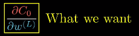
  >  `∂w^(L)` 看作 `w` 的微小扰动，如 0.001；偏导数看作对Loss造成的影响；

- 根据链式法则：

  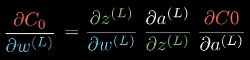

  代入：

  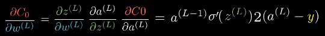

  偏置`b`的偏导，类似：

  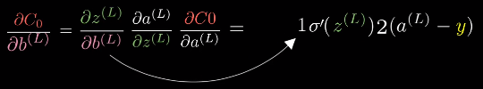

  上层激活值`a^(L-1)`的偏导：

  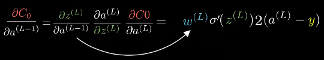

  更上层的权重与偏置：

  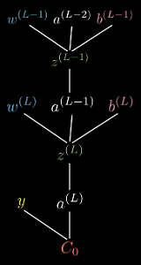

- 实践中，求 mini-batch 样本的平均损失：

  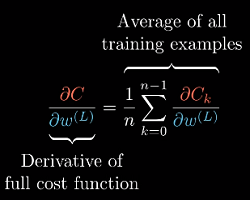

  `∂C/∂w^(L)` 只是梯度向量 `▽C` 的一个分量；梯度向量是 Loss 对每个参数的偏导数：
  
  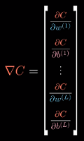

### BP的 4 个基本公式

- 求损失函数**对所有参数的梯度**，可分解为**对每个权重和偏置的偏导**； 4 个公式总结BP过程：

- **标量形式**：

  }}}=\frac{\partial&space;C({\color{Red}&space;a_j^{(L)}},y_j)

  [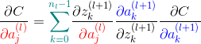](http://www.codecogs.com/eqnedit.php?latex=\begin{aligned}&space;\frac{\partial&space;C}{{\color{Red}&space;\partial&space;a_j^{(l)}}}={\color{Teal}\sum_{k=0}^{n_l-1}}&space;\frac{\partial&space;z_k^{(l&plus;1)}}{{\color{Red}&space;\partial&space;a_j^{(l)}}}&space;\frac{{\color{Blue}&space;\partial&space;a_k^{(l&plus;1)}}}{\partial&space;z_k^{(l&plus;1)}}&space;\frac{\partial&space;C}{{\color{Blue}&space;\partial&space;a_k^{(l&plus;1)}}}&space;\end{aligned})

  [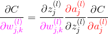](http://www.codecogs.com/eqnedit.php?latex=\begin{aligned}&space;\frac{\partial&space;C}{{\color{Magenta}&space;\partial&space;w_{j,k}^{(l)}}}=\frac{\partial&space;z_j^{(l)}}{{\color{Magenta}&space;\partial&space;w_{j,k}^{(l)}}}\frac{{\color{Red}\partial&space;a_j^{(l)}}}{\partial&space;z_j^{(l)}}\frac{\partial&space;C}{{\color{Red}\partial&space;a_j^{(l)}}}&space;\end{aligned})

  [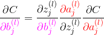](http://www.codecogs.com/eqnedit.php?latex=\begin{aligned}&space;\frac{\partial&space;C}{{\color{Magenta}&space;\partial&space;b_{j}^{(l)}}}=\frac{\partial&space;z_j^{(l)}}{{\color{Magenta}&space;\partial&space;b_{j}^{(l)}}}\frac{{\color{Red}\partial&space;a_j^{(l)}}}{\partial&space;z_j^{(l)}}\frac{\partial&space;C}{{\color{Red}\partial&space;a_j^{(l)}}}&space;\end{aligned})

  > 上标`(L)` ：输出层（最后一层）； `(l)` ：网络的层次；
  >
  > 下标 `j` 和 `k` ：神经元的位置；`w_jk` ： `l` 层第 `j` 个神经元与`(l-1)`层第 `k` 个神经元连接权重；
  
  以 **均方误差（MSE）** 损失函数为例（求损失函数对所有参数的偏导）：

  [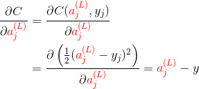](http://www.codecogs.com/eqnedit.php?latex=\begin{aligned}&space;\frac{\partial&space;C}{\partial&space;{\color{Red}&space;a_j^{(L)}}}&=\frac{\partial&space;C({\color{Red}&space;a_j^{(L)}},y_j)
  
- **矢量形式**：修改下标即可

  [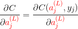](http://www.codecogs.com/eqnedit.php?latex=\begin{aligned}&space;\frac{\partial&space;C}{&space;\partial&space;{\color{Red}&space;a_j^{(L)}}}=\frac{\partial&space;C({\color{Red}&space;a_j^{(L)}},y_j)

  [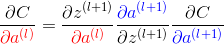](http://www.codecogs.com/eqnedit.php?latex=\begin{aligned}&space;\frac{\partial&space;C}{{\color{Red}&space;\partial&space;a^{(l)}}}=\frac{\partial&space;z^{(l&plus;1)}}{{\color{Red}&space;\partial&space;a^{(l)}}}&space;\frac{{\color{Blue}&space;\partial&space;a^{(l&plus;1)}}}{\partial&space;z^{(l&plus;1)}}&space;\frac{\partial&space;C}{{\color{Blue}&space;\partial&space;a^{(l&plus;1)}}}&space;\end{aligned})
  
  [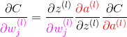](http://www.codecogs.com/eqnedit.php?latex=\begin{aligned}&space;\frac{\partial&space;C}{{\color{Magenta}&space;\partial&space;w_{j}^{(l)}}}=\frac{\partial&space;z^{(l)}}{{\color{Magenta}&space;\partial&space;w_{j}^{(l)}}}\frac{{\color{Red}\partial&space;a^{(l)}}}{\partial&space;z^{(l)}}\frac{\partial&space;C}{{\color{Red}\partial&space;a^{(l)}}}&space;\end{aligned})
  
  [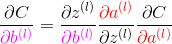](http://www.codecogs.com/eqnedit.php?latex=\begin{aligned}&space;\frac{\partial&space;C}{{\color{Magenta}&space;\partial&space;b^{(l)}}}=\frac{\partial&space;z^{(l)}}{{\color{Magenta}&space;\partial&space;b^{(l)}}}\frac{{\color{Red}\partial&space;a^{(l)}}}{\partial&space;z^{(l)}}\frac{\partial&space;C}{{\color{Red}\partial&space;a^{(l)}}}&space;\end{aligned})
  
  **注**：向量相乘都是**按元素相乘（哈德马积）**，用 `⊙` 符号表示；

- 以上是微积分形式，一些ML书籍上更简洁的形式：

  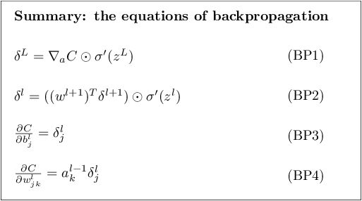
  > [The four fundamental equations behind backpropagation](http://neuralnetworksanddeeplearning.com/chap2.html#the_four_fundamental_equations_behind_backpropagation)

  **注**：前两式为**矢量形式**，后两个具体到单个参数的是**标量形式**。