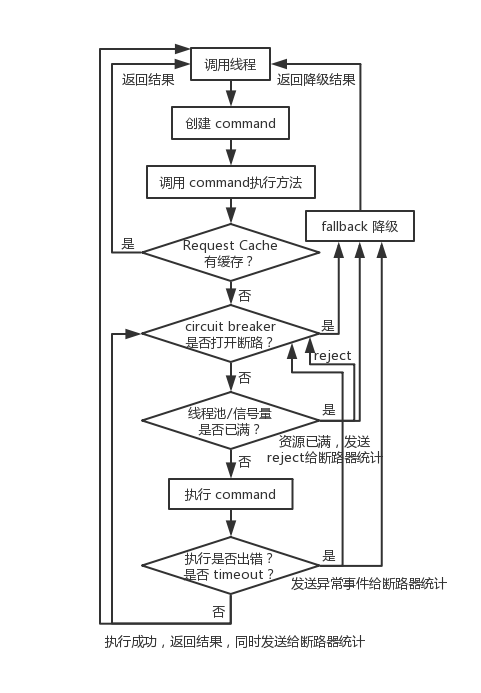

## 深入 Hystrix 线程池隔离与接口限流

前面讲了 Hystrix 的 request cache 请求缓存、fallback 优雅降级、circuit breaker 断路器快速熔断，这一讲，我们来详细说说 Hystrix 的线程池隔离与接口限流。



Hystrix 通过判断线程池或者信号量是否已满，超出容量的请求，直接 Reject 走降级，从而达到限流的作用。

限流是限制对后端的服务的访问量，比如说你对 MySQL、Redis、Zookeeper 以及其它各种后端中间件的资源的访问的限制，其实是为了避免过大的流量直接打死后端的服务。

### 线程池隔离技术的设计

Hystrix 采用了 Bulkhead Partition 舱壁隔离技术，来将外部依赖进行资源隔离，进而避免任何外部依赖的故障导致本服务崩溃。

**舱壁隔离**，是说将船体内部空间区隔划分成若干个隔舱，一旦某几个隔舱发生破损进水，水流不会在其间相互流动，如此一来船舶在受损时，依然能具有足够的浮力和稳定性，进而减低立即沉船的危险。


Hystrix 对每个外部依赖用一个单独的线程池，这样的话，如果对那个外部依赖调用延迟很严重，最多就是耗尽那个依赖自己的线程池而已，不会影响其他的依赖调用。

### Hystrix 应用线程池机制的场景

-   每个服务都会调用几十个后端依赖服务，那些后端依赖服务通常是由很多不同的团队开发的。
-   每个后端依赖服务都会提供它自己的 client 调用库，比如说用 thrift 的话，就会提供对应的 thrift 依赖。
-   client 调用库随时会变更。
-   client 调用库随时可能会增加新的网络请求的逻辑。
-   client 调用库可能会包含诸如自动重试、数据解析、内存中缓存等逻辑。
-   client 调用库一般都对调用者来说是个黑盒，包括实现细节、网络访问、默认配置等等。
-   在真实的生产环境中，经常会出现调用者，突然间惊讶的发现，client 调用库发生了某些变化。
-   即使 client 调用库没有改变，依赖服务本身可能有会发生逻辑上的变化。
-   有些依赖的 client 调用库可能还会拉取其他的依赖库，而且可能那些依赖库配置的不正确。
-   大多数网络请求都是同步调用的。
-   调用失败和延迟，也有可能会发生在 client 调用库本身的代码中，不一定就是发生在网络请求中。

简单来说，就是你必须默认 client 调用库很不靠谱，而且随时可能发生各种变化，所以就要用强制隔离的方式来确保任何服务的故障不会影响当前服务。

### 线程池机制的优点

-   任何一个依赖服务都可以被隔离在自己的线程池内，即使自己的线程池资源填满了，也不会影响任何其他的服务调用。
-   服务可以随时引入一个新的依赖服务，因为即使这个新的依赖服务有问题，也不会影响其他任何服务的调用。
-   当一个故障的依赖服务重新变好的时候，可以通过清理掉线程池，瞬间恢复该服务的调用，而如果是 tomcat 线程池被占满，再恢复就很麻烦。
-   如果一个 client 调用库配置有问题，线程池的健康状况随时会报告，比如成功/失败/拒绝/超时的次数统计，然后可以近实时热修改依赖服务的调用配置，而不用停机。
-   基于线程池的异步本质，可以在同步的调用之上，构建一层异步调用层。

简单来说，最大的好处，就是资源隔离，确保说任何一个依赖服务故障，不会拖垮当前的这个服务。

### 线程池机制的缺点

-   线程池机制最大的缺点就是增加了 CPU 的开销。<br>
    除了 tomcat 本身的调用线程之外，还有 Hystrix 自己管理的线程池。

-   每个 command 的执行都依托一个独立的线程，会进行排队，调度，还有上下文切换。
-   Hystrix 官方自己做了一个多线程异步带来的额外开销统计，通过对比多线程异步调用+同步调用得出，Netflix API 每天通过 Hystrix 执行 10 亿次调用，每个服务实例有 40 个以上的线程池，每个线程池有 10 个左右的线程。）最后发现说，用 Hystrix 的额外开销，就是给请求带来了 3ms 左右的延时，最多延时在 10ms 以内，相比于可用性和稳定性的提升，这是可以接受的。

我们可以用 Hystrix semaphore 技术来实现对某个依赖服务的并发访问量的限制，而不是通过线程池/队列的大小来限制流量。

semaphore 技术可以用来限流和削峰，但是不能用来对调用延迟的服务进行 timeout 和隔离。

`execution.isolation.strategy` 设置为 `SEMAPHORE`，那么 Hystrix 就会用 semaphore 机制来替代线程池机制，来对依赖服务的访问进行限流。如果通过 semaphore 调用的时候，底层的网络调用延迟很严重，那么是无法 timeout 的，只能一直 block 住。一旦请求数量超过了 semaphore 限定的数量之后，就会立即开启限流。

### 接口限流 Demo

假设一个线程池大小为 8，等待队列的大小为 10。timeout 时长我们设置长一些，20s。

在 command 内部，写死代码，做一个 sleep，比如 sleep 3s。

-   withCoreSize：设置线程池大小。
-   withMaxQueueSize：设置等待队列大小。
-   withQueueSizeRejectionThreshold：这个与 withMaxQueueSize 配合使用，等待队列的大小，取得是这两个参数的较小值。

如果只设置了线程池大小，另外两个 queue 相关参数没有设置的话，等待队列是处于关闭的状态。

```java
public class GetProductInfoCommand extends HystrixCommand<ProductInfo> {

    private Long productId;

    private static final HystrixCommandKey KEY = HystrixCommandKey.Factory.asKey("GetProductInfoCommand");

    public GetProductInfoCommand(Long productId) {
        super(Setter.withGroupKey(HystrixCommandGroupKey.Factory.asKey("ProductInfoService"))
                .andCommandKey(KEY)
                // 线程池相关配置信息
                .andThreadPoolPropertiesDefaults(HystrixThreadPoolProperties.Setter()
                        // 设置线程池大小为8
                        .withCoreSize(8)
                        // 设置等待队列大小为10
                        .withMaxQueueSize(10)
                        .withQueueSizeRejectionThreshold(12))
                .andCommandPropertiesDefaults(HystrixCommandProperties.Setter()
                        .withCircuitBreakerEnabled(true)
                        .withCircuitBreakerRequestVolumeThreshold(20)
                        .withCircuitBreakerErrorThresholdPercentage(40)
                        .withCircuitBreakerSleepWindowInMilliseconds(3000)
                        // 设置超时时间
                        .withExecutionTimeoutInMilliseconds(20000)
                        // 设置fallback最大请求并发数
                        .withFallbackIsolationSemaphoreMaxConcurrentRequests(30)));
        this.productId = productId;
    }

    @Override
    protected ProductInfo run() throws Exception {
        System.out.println("调用接口查询商品数据，productId=" + productId);

        if (productId == -1L) {
            throw new Exception();
        }

        // 请求过来，会在这里hang住3秒钟
        if (productId == -2L) {
            TimeUtils.sleep(3);
        }

        String url = "http://localhost:8081/getProductInfo?productId=" + productId;
        String response = HttpClientUtils.sendGetRequest(url);
        System.out.println(response);
        return JSONObject.parseObject(response, ProductInfo.class);
    }

    @Override
    protected ProductInfo getFallback() {
        ProductInfo productInfo = new ProductInfo();
        productInfo.setName("降级商品");
        return productInfo;
    }
}
```

我们模拟 25 个请求。前 8 个请求，调用接口时会直接被 hang 住 3s，那么后面的 10 个请求会先进入等待队列中等待前面的请求执行完毕。最后的 7 个请求过来，会直接被 reject，调用 fallback 降级逻辑。

```java
@SpringBootTest
@RunWith(SpringRunner.class)
public class RejectTest {

    @Test
    public void testReject() {
        for (int i = 0; i < 25; ++i) {
            new Thread(() -> HttpClientUtils.sendGetRequest("http://localhost:8080/getProductInfo?productId=-2")).start();
        }
        // 防止主线程提前结束执行
        TimeUtils.sleep(50);
    }
}
```

从执行结果中，我们可以明显看出一共打印出了 7 个降级商品。这也就是请求数超过线程池+队列的数量而直接被 reject 的结果。

```c
ProductInfo(id=null, name=降级商品, price=null, pictureList=null, specification=null, service=null, color=null, size=null, shopId=null, modifiedTime=null, cityId=null, cityName=null, brandId=null, brandName=null)
ProductInfo(id=null, name=降级商品, price=null, pictureList=null, specification=null, service=null, color=null, size=null, shopId=null, modifiedTime=null, cityId=null, cityName=null, brandId=null, brandName=null)
ProductInfo(id=null, name=降级商品, price=null, pictureList=null, specification=null, service=null, color=null, size=null, shopId=null, modifiedTime=null, cityId=null, cityName=null, brandId=null, brandName=null)
ProductInfo(id=null, name=降级商品, price=null, pictureList=null, specification=null, service=null, color=null, size=null, shopId=null, modifiedTime=null, cityId=null, cityName=null, brandId=null, brandName=null)
ProductInfo(id=null, name=降级商品, price=null, pictureList=null, specification=null, service=null, color=null, size=null, shopId=null, modifiedTime=null, cityId=null, cityName=null, brandId=null, brandName=null)
ProductInfo(id=null, name=降级商品, price=null, pictureList=null, specification=null, service=null, color=null, size=null, shopId=null, modifiedTime=null, cityId=null, cityName=null, brandId=null, brandName=null)
调用接口查询商品数据，productId=-2
调用接口查询商品数据，productId=-2
调用接口查询商品数据，productId=-2
调用接口查询商品数据，productId=-2
调用接口查询商品数据，productId=-2
调用接口查询商品数据，productId=-2
调用接口查询商品数据，productId=-2
调用接口查询商品数据，productId=-2
ProductInfo(id=null, name=降级商品, price=null, pictureList=null, specification=null, service=null, color=null, size=null, shopId=null, modifiedTime=null, cityId=null, cityName=null, brandId=null, brandName=null)
{"id": -2, "name": "iphone7手机", "price": 5599, "pictureList":"a.jpg,b.jpg", "specification": "iphone7的规格", "service": "iphone7的售后服务", "color": "红色,白色,黑色", "size": "5.5", "shopId": 1, "modifiedTime": "2017-01-01 12:00:00", "cityId": 1, "brandId": 1}
// 后面都是一些正常的商品信息，就不贴出来了
// ...
```
