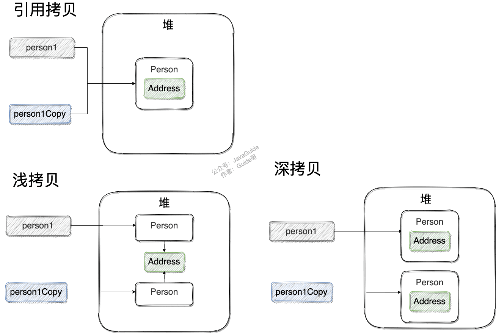

- **浅拷贝**：在堆上创建新对象（不同于引用拷贝）；原对象如有引用类型的属性，则直接引用地址（共用同一个对象）；
- **深拷贝** ：完全复制整个对象，包括内部对象。

**浅拷贝**：实现 `Cloneable` 接口，重写 `clone()` 方法（属于 `Object`类）；

```java
public class Address implements Cloneable{
    private String name;
    @Override
    public Address clone() {
        try {
            return (Address) super.clone();
        } catch (CloneNotSupportedException e) {
            throw new AssertionError();

public class Person implements Cloneable {
    private Address address;
    @Override
    public Person clone() {
        try {
            Person person = (Person) super.clone();
            return person;
        } catch (CloneNotSupportedException e) {
            throw new AssertionError();
```

测试：`person1` 的克隆和 `person1` 用的是同一个 `Address` 对象：

```java
Person person1 = new Person(new Address("武汉"));
Person person1Copy = person1.clone();
System.out.println(person1.getAddress() == person1Copy.getAddress()); // ture：内部对象引用地址相同
```

**深拷贝**：修改`Person` 类的 `clone()` 方法， `Person` 对象内部的 `Address` 对象也要复制。

```java
@Override
public Person clone() {
    try {
        Person person = (Person) super.clone();
        person.setAddress(person.getAddress().clone()); // 内部属性address也要clone
        return person;
    } catch (CloneNotSupportedException e) {
        throw new AssertionError();
```

测试 ：

```java
Person person1 = new Person(new Address("武汉"));
Person person1Copy = person1.clone();
System.out.println(person1.getAddress() == person1Copy.getAddress()); // false
```

**引用拷贝？** 两个不同的引用指向同一个对象。

