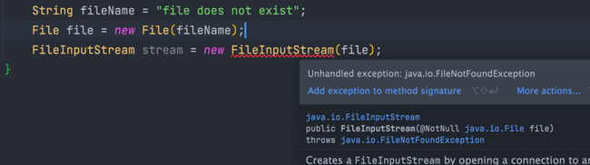

**Java 异常类 --- 层次结构图** ：


### Exception 和 Error ？

都继承 `java.lang` 的 `Throwable` 类。

- **`Exception`** : 用 `catch` 捕获；程序本身可处理；分为 Checked Exception (受检查异常，必须处理) 和 Unchecked Exception (不受检查异常，可不处理)；
- **`Error`** ：程序无法处理；Error 发生时，Java 虚拟机（JVM）线程终止；

### Checked Exception 和 Unchecked Exception ？

- **Checked Exception** ：受检查异常 ；如果没有 `catch`或`throws` 关键字处理，无法编译；



`Exception`类及其子类都属于受检查异常 ：： IO 相关的异常、`ClassNotFoundException` 、`SQLException`...；

- **Unchecked Exception** ：不受检查异常；即使不处理也能编译；包括：`NullPointerException`(空指针错误)、

`ArrayIndexOutOfBoundsException`（数组越界错误）、`ClassCastException`（类型转换错误）、`ArithmeticException`（算术错误）


### Throwable 类的方法？

- `String getMessage()`: 异常的简要描述
- `String toString()`: 异常的详细信息
- `String getLocalizedMessage()`: 异常对象的本地化信息。在 `Throwable` 子类中如果没有重写，则与 `getMessage()`结果相同；
- `void printStackTrace()`: 在控制台上打印 `Throwable` 对象封装的异常信息

### try-catch-finally 使用？

- `try` ： 捕获异常。后接零个或多个 `catch` ，如果没有 `catch` ，则必须跟一个 `finally` ；
- `catch` ： 处理 try 捕获的异常；
- `finally`  ： 始终被执行；如果 `try` 或 `catch` 中遇到 `return` 语句，`finally` 在方法返回前执行；

```java
try {
    System.out.println("Try to do something");
    throw new RuntimeException("RuntimeException");
} catch (Exception e) {
    System.out.println("Catch Exception -> " + e.getMessage());
} finally {
    System.out.println("Finally");
}
```

输出：

```
Try to do something
Catch Exception -> RuntimeException
Finally
```

**注：不要在 finally 中用 return**： 当 try 和 finally 都有 return ，try 的 return 会被忽略；因为 try 的 return 返回值先暂存在一个本地变量中，执行到 finally 的 return，该本地变量的值就变为 finally 的 return 返回值；

```java
public static void main(String[] args) {
    System.out.println(f(2));

public static int f(int value) {
    try {
        return value * value;
    } finally {
        if (value == 2) {
            return 0;
```

输出：

```
0
```

### finally 一定会执行吗？

不一定！虚拟机终止运行时，finally 不执行：

```java
try {
    System.out.println("Try to do something");
    throw new RuntimeException("RuntimeException");
} catch (Exception e) {
    System.out.println("Catch Exception -> " + e.getMessage());
    System.exit(1);    // 终止运行Java虚拟机
} finally {
    System.out.println("Finally");
```

输出：

```
Try to do something
Catch Exception -> RuntimeException
```

以下 2 种特殊情况下，`finally` 也不执行：

1. 线程死亡；
2. 关闭 CPU；
