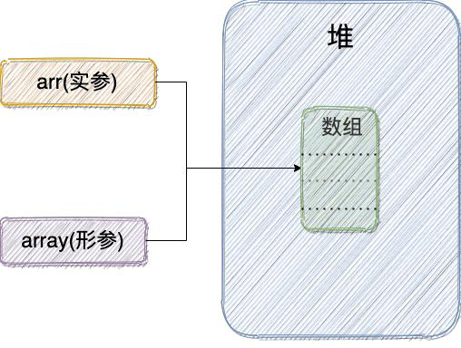

先搞懂两个概念：

- 形参 & 实参

- 值传递 & 引用传递


## 形参 & 实参

- **形参（形式参数）** ：用于定义函数/方法，接收实参；
- **实参（实际参数）** ：传递给函数/方法，有确定的值；
```java
String hello = "Hello!";
sayHello(hello); // 实参：hello
void sayHello(String str) { // 形参：str
    System.out.println(str);
}
```

## 值传递 & 引用传递

- **值传递** ：方法接收的是实参值的 **拷贝（创建副本）**；
- **引用传递** ：方法直接接收**实参对象在堆中的地址（不创建副本）**，形参的修改将影响实参；

## 为什么 Java 只有值传递？

```java
public static void main(String[] args) { // 案例1：基本类型参数
    int num1 = 10;
    int num2 = 20;
    swap(num1, num2);
    System.out.println("num1 = " + num1);
    System.out.println("num2 = " + num2);
}

public static void swap(int a, int b) {
    int temp = a;
    a = b;
    b = temp;
    System.out.println("a = " + a);
    System.out.println("b = " + b);
}
```

 `swap()`  方法`a`、`b` 的值交换不会影响 `num1`、`num2`。因为，`a`、`b` 的值是从 `num1`、`num2` 的副本。

```java
	public static void main(String[] args) { // 案例2：引用类型参数
      int[] arr = { 1, 2, 3, 4, 5 };
      System.out.println(arr[0]);
      change(arr);
      System.out.println(arr[0]);
	}

	public static void change(int[] array) {
      array[0] = 0; // 数组首元素变0
	}
```



这个案例让人觉得 Java 是引用传递，但实际上，这里还是值传递，传递的值是实参的地址： 形参拷贝了  `arr` （实参）的地址，和 `arr` 指向同一个数组对象。

## 总结

Java 将实参传递给 方法/函数 的方式是 **值传递** ：

- 基本类型参数: 很简单，传递字面量值的拷贝（创建副本）；
- 引用类型参数: 传递实参对象在堆中地址的拷贝（也创建副本）；
