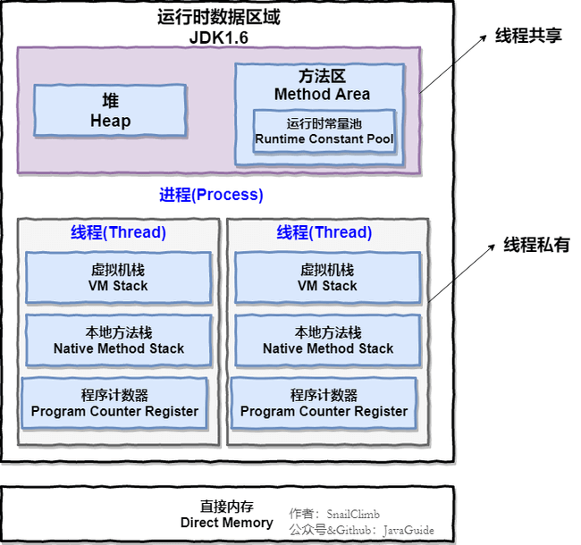

---
Java 内存区域详解
---

> 本文基于《深入理解 Java 虚拟机：JVM 高级特性与最佳实践》；
>
> 面试题 ：
>
> - 介绍下 Java 内存区域（运行时数据区）
>- Java 对象的创建过程（五步：每一步虚拟机做了什么）
> - 对象的访问定位的两种方式（句柄、直接指针）

在JVM自动内存管理机制下，不需要像 C/C++为每一个 new 操作写对应的 delete/free，不易出现内存泄漏和内存溢出问题。正因为内存控制权交给 Java 虚拟机，一旦出现内存泄漏和溢出方面，排查错误将会很难。

## 运行时数据区域

JVM在执行程序时：把内存划分成若干不同的数据区域；

**JDK 1.8 之前** ：

**JDK 1.8** ：

**线程私有：**程序计数器、虚拟机栈、本地方法栈

**线程共享：**堆、方法区、直接内存 (非运行时的数据区)

- JVM对运行时数据区是相当宽松的。以堆为例：堆可以是连续空间，也可不连续。堆的大小可固定，也可在运行时按需扩展 。可用任何垃圾回收算法管理堆，也可不进行垃圾收集；

**程序计数器**：当前线程执行字节码的行号指示器，占用一块较小的内存空间。

- 字节码解释器：通过改变计数器的值，选取下一条字节码执行；分支、循环、跳转、异常处理、线程恢复都依赖程序计数器（实现代码的流程控制）；

- 多线程：线程切换后要恢复到上次运行位置，每个线程都私有程序计数器，各线程之间互不影响，称这类内存为**“线程私有”的内存**；

⚠️ 注 ：程序计数器是**唯一没有 `OutOfMemoryError` 的内存区域，生命周期和线程相同**；

## **Java 虚拟机栈**

也是线程私有，生命周期和线程相同；

- **栈**：JVM 运行时数据区域的核心！所有方法（除了 Native 方法）的调用都用栈实现（与程序计数器配合）；

- 方法调用的数据用**栈**传递：**每次方法调用都有对应的栈帧入栈**，调用结束都有**栈帧弹出**；

栈由栈帧组成，每个栈帧都有：局部变量表、操作数栈、动态链接、方法返回地址；

- **局部变量表**：存放编译期可知的数据类型（boolean、byte、char、short、int、float、long、double）、对象引用（reference 类型，可能是指向对象起始地址的指针，也可能是指向一个代表对象的句柄）；
- **操作数栈** ：方法调用的中转站，存放临时变量、方法的中间计算结果；
- **动态链接** ：在编译后字节码文件中，所有变量和方法都作为符号引用（Symbilic Reference）保存在 Class 文件的常量池；当一个方法要调用其他方法，需将常量池中的符号引用转化为内存地址的直接引用（动态链接：将符号引用转换为直接引用）

栈空间虽然有限，但一般不会出现问题。但如果函数陷入无限循环，会抛出 `StackOverFlowError`错误；

- Java 方法有两种返回方式： return 语句正常返回、抛出异常；两种方式都会导致栈帧弹出（即：**栈帧的生命周期和方法相同；无论方法正常完成/异常完成都算方法结束**） 

- 栈还可能会出现`OutOfMemoryError`错误：如果栈的内存大小可以动态扩展， 虚拟机可能无法申请足够的内存空间；

总结：

- **`StackOverFlowError`：** 若栈内存不允许动态扩展（Hotspot虚拟机），线程请求栈的深度超过 Java 虚拟机栈的最大深度；
- **`OutOfMemoryError`：** 若栈内存可以动态扩展， 可能无法申请到足够的内存空间；

## 本地方法栈

和虚拟机栈作用相似，区别： **虚拟机栈为 JVM 执行 Java方法 （字节码）服务，而本地方法栈则为JVM 执行 Native 方法服务** 

- HotSpot 虚拟机：栈合二为一；

- 本地（Native）方法执行时：也会创建栈帧，存放该方法的局部变量表、操作数栈、动态链接、出口信息；

- 方法执行完：栈帧也会出栈、释放内存空间，也有 `StackOverFlowError` 和 `OutOfMemoryError` 两种错误；