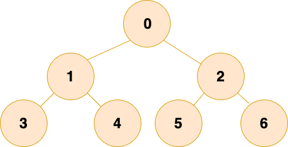
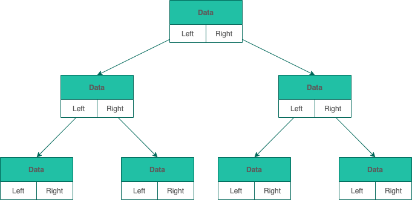
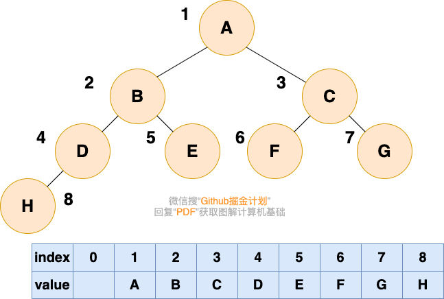
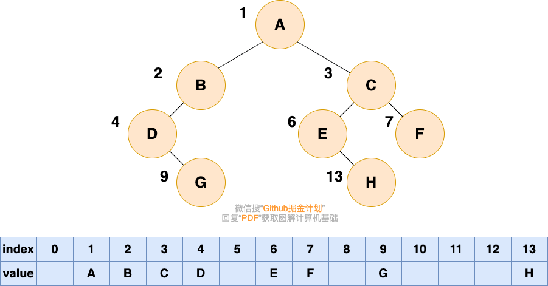

树的特点：

1. 树中任意两结点**有且仅有**一条路径。
2. 树有 n 个结点，则一定恰好**有 n-1 条边**。
3. 树**不包含回路**。

二叉树：

树的常用概念：

- **节点** 、**根节点** 、**父节点** 、**子节点** 、**兄弟节点** ：具有相同父节点、**叶子节点** ：没有子节点
- **节点深度** ：根节点到该节点的路径长度、**节点层数** ：节点的深度+1。
- **节点高度** ：节点到叶节点的最长路径、**树的高度** ：根节点的高度；

### **二叉树**（Binary tree）：

- 每个节点最多只有两个分支（即不存在分支度大于 2 的节点）；
- 分支具有左右次序（左子树、右子树），不能颠倒；
- 第 i 层至多有 `2^(i-1)` 个节点；高度为 k 的二叉树至多有 `2^(k)-1` 个节点（满二叉树）；

### 满二叉树

层数为 k时，结点总数是(2^k) -1：

### 完全二叉树

除最后一层外，每一层都是满的，且最后一层只能是右边缺少若干连续节点；

性质：**父结点和子节点的序号有对应关系。**根节点的值为 1 ，若父结点的序号是 i，则左子节点的序号 2i，右子节点序号 2i+1。用数组存储可极大地节省空间；

### 平衡二叉树

1. 是空树
2. 不是空树：左右两个子树高度差的绝对值 <= 1，且左右两个子树都是平衡二叉树;

实现： **红黑树**、**AVL 树**、**替罪羊树**、**加权平衡树**、**伸展树** 等。

## 二叉树的存储

- **链式存储** 和 **顺序存储** ：

### 链式存储

每个节点包括三个属性：数据、左指针 left、右指针 right；

- JAVA 没有指针！答：直接引用对象

### 顺序存储

用数组存储，每个位置仅存储 data，子节点指针用数组索引：根结点序号 1，对于每个节点下标 i ，左子节点在 2i，右子节点2i+1；

完全二叉树的数组顺序存储：

比较：和完全二叉树的顺序存储有何区别（不是完全二叉树，在数组中会出现空隙，内存利用率降低）

## 二叉树遍历

### 先序遍历

### 中序遍历

### 后序遍历
