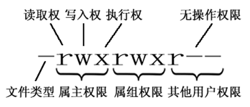
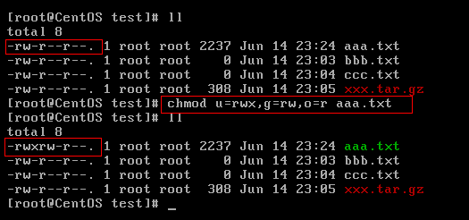

### 操作系统

什么是操作系统：

1. **操作系统（Operating System，OS）：管理计算机硬件与软件资源的程序**
3. **OS屏蔽了硬件层的复杂性** ；
4. **OS的内核（Kernel）：管理内存、硬件设备，文件系统、应用程序**；

> 

**Linux ：免费、开源的类 Unix 操作系统。** 使用 **Linux 内核** ；

### OS的内核（Kernel）

- **内核**（Kernel，核心）：是管理应用程序的数据 I/O 请求的电脑程序，将请求转译为指令并交由CPU处理；
- 使应用程序能安全访问硬件；

### 系统调用

进程在OS上的运行分两个级别：

1. **用户态(user mode)** : 可直接读取用户程序的数据；
2. **系统态(kernel mode)**: 可访问计算机的任何资源，不受限制；

什么是系统调用？

应用程序都运行在用户态，调用系统态级别的子功能需系统调用：文件管理、进程控制、内存管理；向OS提出服务请求，并由OS代为完成；分类：

- **设备管理** ：设备的请求、释放、设备启动；
- **文件管理** ：文件的读、写、创建及删除；
- **进程控制** ：进程的创建、撤销、阻塞、唤醒；
- **进程通信** ：进程之间的消息传递；
- **内存管理** ：内存的分配、回收、获取作业占用内存区大小及地址；


### Linux 简介

- **Linux 本质是指 Linux 内核** ：单独的内核并不是正常工作的操作系统。所以有各种 Linux 发行版。

### Linux 文件系统

- **一切都是文件**：所有被OS管理的资源，如网卡、磁盘驱动器、打印机、IO设备、普通文件或目录；

### inode 介绍

- **inode** 是 linux 文件系统的基础；
- 文件存储在块(block)，还需额外的空间存储文件的 **元信息 metadata** ：文件分成几块、每块的地址、文件拥有者，创建时间，权限，大小； **inode：存储元信息的区域**，译为索引节点：**i（index）+ node**；每个文件都有一个 inode；


块（block）常见大小是 4kb，约为 8 个连续的扇区（每个扇区 512 字节）：

- 一个文件可能会占用多个 block，但一个块只能存放一个文件；

- 块(block)由多个扇区组成；硬盘的最小存储单位是扇区(Sector)；

用 `stat` 命令查看文件的 inode：每个 inode 都有唯一编号，Linux/Unix 操作系统用来区分不同文件；


### Linux 文件类型

- **普通文件（-）**： 存储信息和数据，可根据访问权限进行查看、更改、删除；如：图片、声音、text、视频、源代码；
- **目录文件（d，directory file）** ：目录也是文件，包含一些文件和子目录名；打开目录 == 打开目录文件；
- **符号链接文件（l，symbolic link）** ：指向文件的地址（而不是文件本身）；
- **字符设备（c，char）** ：用来访问字符设备，如键盘；
- **设备文件（b，block）** ： 用来访问块设备，如硬盘、软盘；
- **管道文件(p,pipe)** : 用于进程之间的通信；是一种特殊类型的文件；
- **套接字(s,socket)** ：用于进程间的网络通信；也可用于本机的非网络通信；

### Linux 目录树


- **/bin：** 存放二进制可执行文件：ls、cat、mkdir ；
- **/etc：** 系统管理、配置文件；
- **/home：** 用户主目录，如用户 user 的主目录是/home/user，可用~user 表示；
- **/opt：** 存放应用程序包；如安装 tomcat ；
- **/proc：** 虚拟文件系统目录，是系统内存的映射。可直接访问这个目录来获取系统信息；
- **/sbin:** 二进制可执行文件（系统级的管理命令和程序）；只有 root 才能访问；如 ifconfig；
- **/dev：** 存放设备文件；
- **/lost+found：** 平时是空目录，系统非正常关机而留下“无家可归”的文件；

## Linux 基本命令

### 目录切换

- **`cd ..（或cd../）`：** 切换到上一层目录
- **`cd /`：** 切换到系统根目录
- **`cd ~`：** 切换到用户主目录 home
- **`cd -`：** 切换到上一个操作所在目录

### 目录的操作(增删改查)

- **`mkdir`：** 增加目录。

- **`find 目录 参数`：** 

  ① 列出当前目录及子目录下所有文件和文件夹 `find .`；

  ② 在`/home`目录查找以.txt 结尾的文件:`find /home -name "*.txt"` ；忽略大小写: `find /home -iname "*.txt"` ；

  ③ 当前目录及子目录下以.txt 和.pdf 结尾的文件:`find . -name "*.txt" -o -name "*.pdf"`。

- **`mv 目录名称 新目录名称`：** 重命名；

- **`cp -r 目录名 目标位置`：** 拷贝目录（改），-r 代表递归；

- **`rm [-rf] 目录` :** 删除目录（删）；

### 文件的操作(增删改查)

- **`touch 文件名`:** 文件的创建（增）。
- **`cat/more/less/tail 文件名称`** ：查看文件（查）； `tail -f 文件` 对文件动态监控，如 tomcat 日志文件；
- **`vim 文件`：** 修改文件内容（改）；vim 编辑器是 vi 编辑器的加强版；步骤： `vim 文件-->按i编辑-->按Esc进入底行-->wq/q!` ；
- **`rm -rf 文件`：** 删除文件（删）。

### 压缩文件

一般情况下，打包和压缩是一起的，文件后缀.tar.gz；命令：`tar -zcvf 压缩后的文件名 原文件` ：

- z：调用 gzip 压缩命令；c：打包文件；v：显示运行过程；f：指定文件名；

解压压缩包：`tar [-xvf] 压缩文件`

- x：解压

### Linux 的权限命令

操作系统中每个文件都拥有特定的权限、所属用户和所属组。权限是操作系统用来限制资源访问的机制，在 Linux 中权限一般分为读(readable)、写(writable)和执行(excutable)，分为三组。分别对应文件的属主(owner)，属组(group)和其他用户(other)，通过这样的机制来限制哪些用户、哪些组可以对特定的文件进行什么样的操作。

通过 **`ls -l`** 命令我们可以 查看某个目录下的文件或目录的权限

示例：在随意某个目录下`ls -l`


第一列的内容的信息解释如下：



> 下面将详细讲解文件的类型、Linux 中权限以及文件有所有者、所在组、其它组具体是什么？

**文件的类型：**

- d： 代表目录
- -： 代表文件
- l： 代表软链接（可以认为是 window 中的快捷方式）

**Linux 中权限分为以下几种：**

- r：代表权限是可读，r 也可以用数字 4 表示
- w：代表权限是可写，w 也可以用数字 2 表示
- x：代表权限是可执行，x 也可以用数字 1 表示

**文件和目录权限的区别：**

对文件和目录而言，读写执行表示不同的意义。

对于文件：

| 权限名称 |                  可执行操作 |
| :------- | --------------------------: |
| r        | 可以使用 cat 查看文件的内容 |
| w        |          可以修改文件的内容 |
| x        |    可以将其运行为二进制文件 |

对于目录：

| 权限名称 |               可执行操作 |
| :------- | -----------------------: |
| r        |       可以查看目录下列表 |
| w        | 可以创建和删除目录下文件 |
| x        |     可以使用 cd 进入目录 |

需要注意的是： **超级用户可以无视普通用户的权限，即使文件目录权限是 000，依旧可以访问。**

**在 linux 中的每个用户必须属于一个组，不能独立于组外。在 linux 中每个文件有所有者、所在组、其它组的概念。**

- **所有者(u)** ：一般为文件的创建者，谁创建了该文件，就天然的成为该文件的所有者，用 `ls ‐ahl` 命令可以看到文件的所有者 也可以使用 chown 用户名 文件名来修改文件的所有者 。
- **文件所在组(g)** ：当某个用户创建了一个文件后，这个文件的所在组就是该用户所在的组用 `ls ‐ahl`命令可以看到文件的所有组也可以使用 chgrp 组名 文件名来修改文件所在的组。
- **其它组(o)** ：除开文件的所有者和所在组的用户外，系统的其它用户都是文件的其它组。

> 我们再来看看如何修改文件/目录的权限。

**修改文件/目录的权限的命令：`chmod`**

示例：修改/test 下的 aaa.txt 的权限为文件所有者有全部权限，文件所有者所在的组有读写权限，其他用户只有读的权限。

**`chmod u=rwx,g=rw,o=r aaa.txt`** 或者 **`chmod 764 aaa.txt`**



**补充一个比较常用的东西:**

假如我们装了一个 zookeeper，我们每次开机到要求其自动启动该怎么办？

1. 新建一个脚本 zookeeper
2. 为新建的脚本 zookeeper 添加可执行权限，命令是:`chmod +x zookeeper`
3. 把 zookeeper 这个脚本添加到开机启动项里面，命令是：`chkconfig --add zookeeper`
4. 如果想看看是否添加成功，命令是：`chkconfig --list`

### Linux 用户管理

Linux 系统是一个多用户多任务的分时操作系统，任何一个要使用系统资源的用户，都必须首先向系统管理员申请一个账号，然后以这个账号的身份进入系统。

用户的账号一方面可以帮助系统管理员对使用系统的用户进行跟踪，并控制他们对系统资源的访问；另一方面也可以帮助用户组织文件，并为用户提供安全性保护。

**Linux 用户管理相关命令:**

- `useradd 选项 用户名`:添加用户账号
- `userdel 选项 用户名`:删除用户帐号
- `usermod 选项 用户名`:修改帐号
- `passwd 用户名`:更改或创建用户的密码
- `passwd -S 用户名` :显示用户账号密码信息
- `passwd -d 用户名`: 清除用户密码

`useradd` 命令用于 Linux 中创建的新的系统用户。`useradd`可用来建立用户帐号。帐号建好之后，再用`passwd`设定帐号的密码．而可用`userdel`删除帐号。使用`useradd`指令所建立的帐号，实际上是保存在 `/etc/passwd`文本文件中。

`passwd`命令用于设置用户的认证信息，包括用户密码、密码过期时间等。系统管理者则能用它管理系统用户的密码。只有管理者可以指定用户名称，一般用户只能变更自己的密码。

### Linux 系统用户组的管理

每个用户都有一个用户组，系统可以对一个用户组中的所有用户进行集中管理。不同 Linux 系统对用户组的规定有所不同，如 Linux 下的用户属于与它同名的用户组，这个用户组在创建用户时同时创建。

用户组的管理涉及用户组的添加、删除和修改。组的增加、删除和修改实际上就是对`/etc/group`文件的更新。

**Linux 系统用户组的管理相关命令:**

- `groupadd 选项 用户组` :增加一个新的用户组
- `groupdel 用户组`:要删除一个已有的用户组
- `groupmod 选项 用户组` : 修改用户组的属性

### 其他常用命令

- **`pwd`：** 显示当前所在位置

- `sudo + 其他命令`：以系统管理者的身份执行指令，也就是说，经由 sudo 所执行的指令就好像是 root 亲自执行。

- **`grep 要搜索的字符串 要搜索的文件 --color`：** 搜索命令，--color 代表高亮显示

- **`ps -ef`/`ps -aux`：** 这两个命令都是查看当前系统正在运行进程，两者的区别是展示格式不同。如果想要查看特定的进程可以使用这样的格式：**`ps aux|grep redis`** （查看包括 redis 字符串的进程），也可使用 `pgrep redis -a`。

  注意：如果直接用 ps（（Process Status））命令，会显示所有进程的状态，通常结合 grep 命令查看某进程的状态。

- **`kill -9 进程的pid`：** 杀死进程（-9 表示强制终止。）

  先用 ps 查找进程，然后用 kill 杀掉

- **网络通信命令：**
  - 查看当前系统的网卡信息：ifconfig
  - 查看与某台机器的连接情况：ping
  - 查看当前系统的端口使用：netstat -an
- **net-tools 和 iproute2 ：**
  `net-tools`起源于 BSD 的 TCP/IP 工具箱，后来成为老版本 LinuxLinux 中配置网络功能的工具。但自 2001 年起，Linux 社区已经对其停止维护。同时，一些 Linux 发行版比如 Arch Linux 和 CentOS/RHEL 7 则已经完全抛弃了 net-tools，只支持`iproute2`。linux ip 命令类似于 ifconfig，但功能更强大，旨在替代它。更多详情请阅读[如何在 Linux 中使用 IP 命令和示例](https://linoxide.com/linux-command/use-ip-command-linux)
- **`shutdown`：** `shutdown -h now`： 指定现在立即关机；`shutdown +5 "System will shutdown after 5 minutes"`：指定 5 分钟后关机，同时送出警告信息给登入用户。

- **`reboot`：** **`reboot`：** 重开机。**`reboot -w`：** 做个重开机的模拟（只有纪录并不会真的重开机）。

## Linux 环境变量

在 Linux 系统中，环境变量是用来定义系统运行环境的一些参数，比如每个用户不同的主目录（HOME）。

### 环境变量分类

按照作用域来分，环境变量可以简单的分成:

- 用户级别环境变量 : `~/.bashrc`、`~/.bash_profile`。
- 系统级别环境变量 : `/etc/bashrc`、`/etc/environment`、`/etc/profile`、`/etc/profile.d`。

上述配置文件执行先后顺序为：`/etc/enviroment` –> `/etc/profile` –> `/etc/profile.d` –> `~/.bash_profile` –> `/etc/bashrc` –> `~/.bashrc`

如果要修改系统级别环境变量文件，需要管理员具备对该文件的写入权限。

建议用户级别环境变量在 `~/.bash_profile`中配置，系统级别环境变量在 `/etc/profile.d` 中配置。

按照生命周期来分，环境变量可以简单的分成:

- 永久的：需要用户修改相关的配置文件，变量永久生效。
- 临时的：用户利用 `export` 命令，在当前终端下声明环境变量，关闭 shell 终端失效。

### 读取环境变量

通过 `export` 命令可以输出当前系统定义的所有环境变量。

```bash
# 列出当前的环境变量值
export -p
```

除了 `export` 命令之外， `env` 命令也可以列出所有环境变量。

`echo` 命令可以输出指定环境变量的值。

```bash
# 输出当前的PATH环境变量的值
echo $PATH
# 输出当前的HOME环境变量的值
echo $HOME
```

### 环境变量修改

通过 `export`命令可以修改指定的环境变量。不过，这种方式修改环境变量仅仅对当前 shell 终端生效，关闭 shell 终端就会失效。修改完成之后，立即生效。

```bash
export CLASSPATH=./JAVA_HOME/lib;$JAVA_HOME/jre/lib
```

通过 `vim` 命令修改环境变量配置文件。这种方式修改环境变量永久有效。

```bash
vim ~/.bash_profile
```

如果修改的是系统级别环境变量则对所有用户生效，如果修改的是用户级别环境变量则仅对当前用户生效。

修改完成之后，需要 `source` 命令让其生效或者关闭 shell 终端重新登录。

```bash
source /etc/profile
```
