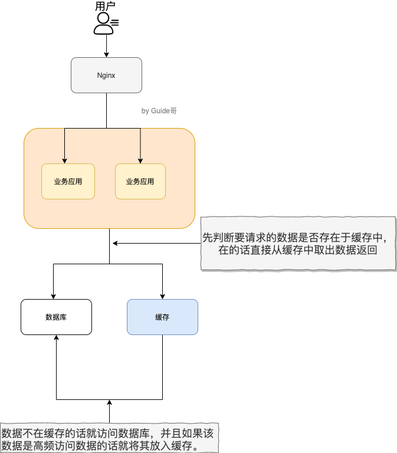

与传统数据库不同， **Redis 是内存数据库，数据存储于内存**，读写速度快；

- **用途：缓存、分布式锁、消息队列。**

- **支持事务 、持久化、Lua 脚本、多种集群方案。**

### 分布式缓存

- 解决单机缓存受服务器限制、无法保存共用信息的问题：本地缓存只在当前服务器有效，不同服务器的缓存无法共通；

###  Redis 和 Memcached 的区别和共同点

**共同点** ：都基于内存，可用作缓存数据库；都有过期策略；读写速度快；

**区别** ：

- Redis 数据类型丰富（支持多种应用场景）：简单的 k/v 类型，还有 list，set，zset，hash 等数据结构；Memcached 只支持 k/v ；

- Redis 支持数据的持久化：讲内存中的数据保存到磁盘，重启时可再次加载；
- Memcached 没有原生的集群模式，靠客户端来实现往集群中分片写入数据；但 Redis 原生支持 cluster 模式
- Memcached 多线程，非阻塞 IO；Redis 单线程，多路 IO  
- Redis 支持发布订阅模型、Lua 脚本、事务等功能，而 Memcached 不支持
- Memcached 过期删除策略只用了惰性删除，而 Redis 同时使用了惰性删除与定期删除；

### 缓存处理流程

1. 用户请求数据，在缓存中：直接返回
2. 缓存中不存在：看数据库中是否存在
3. 数据库中存在：更新缓存中的数据
4. 数据库中不存在：返回空数据

### 为什么用 Redis/为什么用缓存？

“高性能”和“高并发”：

**高性能** ：

对照上面 👆 我画的图。我们设想这样的场景：

假如用户第一次访问数据库中的某些数据的话，这个过程是比较慢，毕竟是从硬盘中读取的。但是，如果说，用户访问的数据属于高频数据并且不会经常改变的话，那么我们就可以很放心地将该用户访问的数据存在缓存中。

**这样有什么好处呢？** 那就是保证用户下一次再访问这些数据的时候就可以直接从缓存中获取了。操作缓存就是直接操作内存，所以速度相当快。

不过，要保持数据库和缓存中的数据的一致性。 如果数据库中的对应数据改变的之后，同步改变缓存中相应的数据即可！

**高并发：**

一般像 MySQL 这类的数据库的 QPS 大概都在 1w 左右（4 核 8g） ，但是使用 Redis 缓存之后很容易达到 10w+，甚至最高能达到 30w+（就单机 redis 的情况，redis 集群的话会更高）。

> QPS（Query Per Second）：服务器每秒可以执行的查询次数；

由此可见，直接操作缓存能够承受的数据库请求数量是远远大于直接访问数据库的，所以我们可以考虑把数据库中的部分数据转移到缓存中去，这样用户的一部分请求会直接到缓存这里而不用经过数据库。进而，我们也就提高了系统整体的并发。

### Redis 除了做缓存，还能做什么？

- **分布式锁** ： 通过 Redis 来做分布式锁是一种比较常见的方式。通常情况下，我们都是基于 Redisson 来实现分布式锁。相关阅读：[《分布式锁中的王者方案 - Redisson》](https://mp.weixin.qq.com/s/CbnPRfvq4m1sqo2uKI6qQw)。
- **限流** ：一般是通过 Redis + Lua 脚本的方式来实现限流。相关阅读：[《我司用了 6 年的 Redis 分布式限流器，可以说是非常厉害了！》](https://mp.weixin.qq.com/s/kyFAWH3mVNJvurQDt4vchA)。
- **消息队列** ：Redis 自带的 list 数据结构可以作为一个简单的队列使用。Redis 5.0 中增加的 Stream 类型的数据结构更加适合用来做消息队列。它比较类似于 Kafka，有主题和消费组的概念，支持消息持久化以及 ACK 机制。
- **复杂业务场景** ：通过 Redis 以及 Redis 扩展（比如 Redisson）提供的数据结构，我们可以很方便地完成很多复杂的业务场景比如通过 bitmap 统计活跃用户、通过 sorted set 维护排行榜。
- ......

### Redis 可以做消息队列么？

Redis 5.0 新增加的一个数据结构 `Stream` 可以用来做消息队列，`Stream` 支持：

- 发布 / 订阅模式
- 按照消费者组进行消费
- 消息持久化（ RDB 和 AOF）

不过，和专业的消息队列相比，还是有很多欠缺的地方比如消息丢失和堆积问题不好解决。因此，我们通常建议是不使用 Redis 来做消息队列的，你完全可以选择市面上比较成熟的一些消息队列比如 RocketMQ、Kafka。
